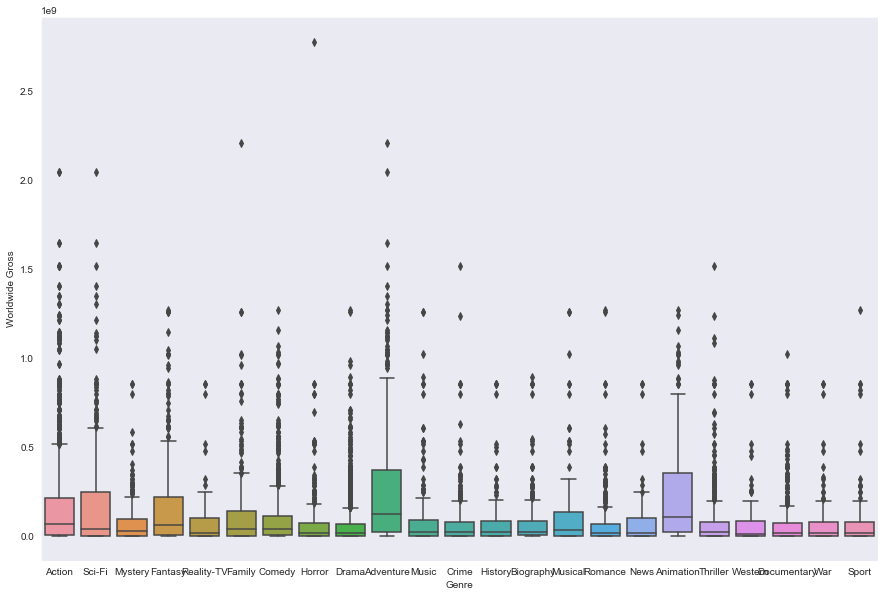
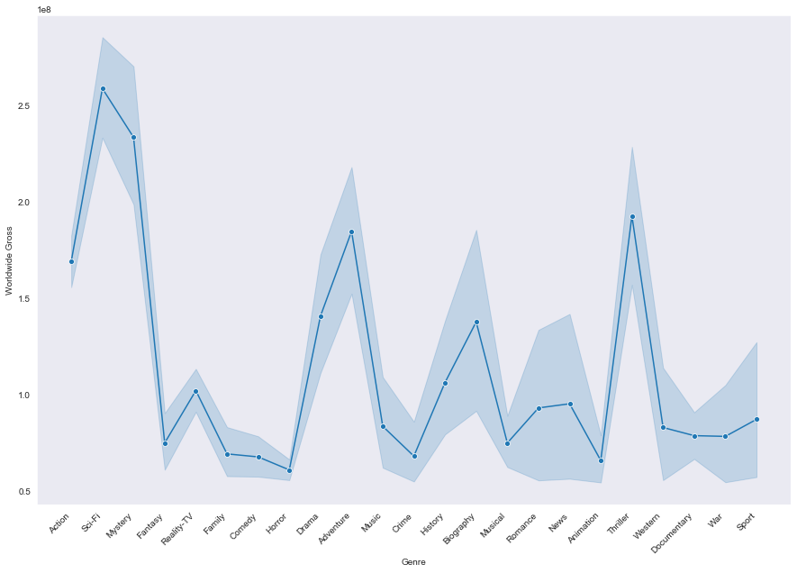
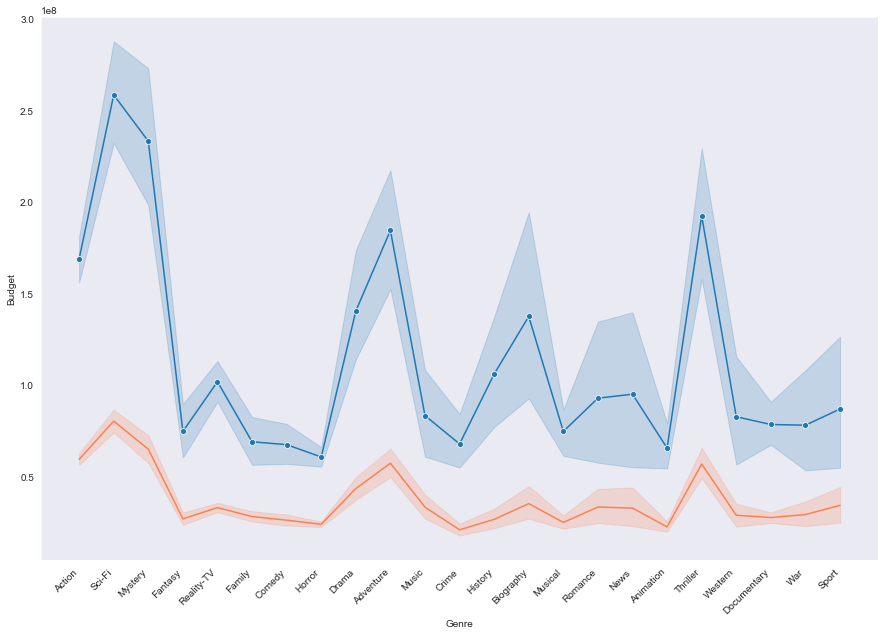
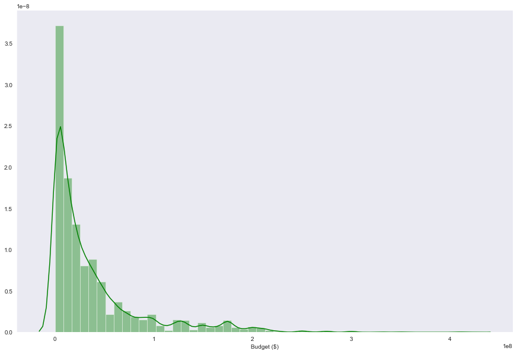
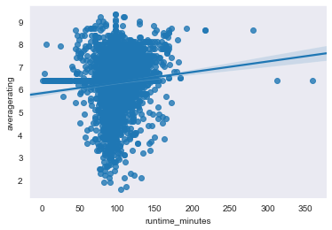
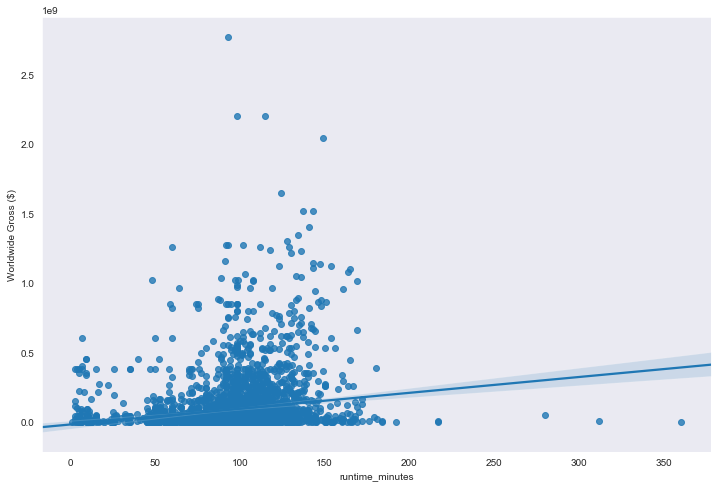
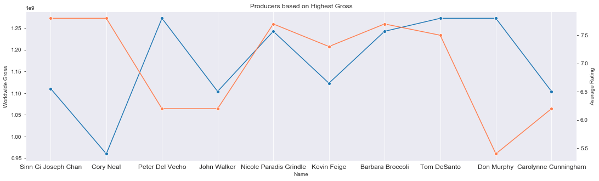

# Final Project Submission

Please fill out:
* Student name: Neha Patel
* Student pace: part time
* Scheduled project review date/time: 13 June, 2020/4:00pm CST
* Instructor name: James Irwing
* Blog post URL: https://nehap92.github.io/dealing_with_string-grouped_data


# Business Case

Microsoft is exploring to enter the movie industry with its own production house. To be successful it is imperative that the industry is explored and a strategy made for a debut. This includes analyzing all aspects ranging from the genre to the cast and release time.

This analysis includes significant recommendations based on the comparative revenue analysis, and the growing trends for genre, movie runtime, makers (director and producer), the best time to release Microsoft's movie debut and critical insights on the competition.

Other factors under consideration include but are not limited to analyzing the region and different cultures, languages to expand the scope of out target audience, demographic analysis, and a getting a deeper insight on casts and the makers based on the finalized genre.

# Exploring the Provided Data #

### Accessing the provided files/tables ###


```python
# Your code here - remember to use markdown cells for comments as well!
```


```python
import os, glob
```


```python
#Viewing list of files and folders in the repo
os.listdir()
```


    ['.git',
     '.gitignore',
     '.ipynb_checkpoints',
     '.learn',
     'awesome.gif',
     'budget.png',
     'bud_gross.png',
     'CONTRIBUTING.md',
     'genre.png',
     'gross.png',
     'LICENSE.md',
     'module1_project_rubric.pdf',
     'presentation images.zip',
     'Presentation.pdf',
     'README.md',
     'README_old.md',
     'student.ipynb',
     'time_gross.png',
     'time_rate.png',
     'zippedData']


```python
#Exploring the folder "zippedData"
os.listdir('zippedData/')
```


    ['bom.movie_gross.csv.gz',
     'imdb.name.basics.csv.gz',
     'imdb.title.akas.csv.gz',
     'imdb.title.basics.csv.gz',
     'imdb.title.crew.csv.gz',
     'imdb.title.principals.csv.gz',
     'imdb.title.ratings.csv.gz',
     'rt.movie_info.tsv.gz',
     'rt.reviews.tsv.gz',
     'tmdb.movies.csv.gz',
     'tn.movie_budgets.csv.gz']


```python
#Path for a file
glob.glob('zippedData/')
```


    ['zippedData/']


```python
#Listing path for each file in zippedData
files = glob.glob('zippedData/*')
files
```


    ['zippedData\\bom.movie_gross.csv.gz',
     'zippedData\\imdb.name.basics.csv.gz',
     'zippedData\\imdb.title.akas.csv.gz',
     'zippedData\\imdb.title.basics.csv.gz',
     'zippedData\\imdb.title.crew.csv.gz',
     'zippedData\\imdb.title.principals.csv.gz',
     'zippedData\\imdb.title.ratings.csv.gz',
     'zippedData\\rt.movie_info.tsv.gz',
     'zippedData\\rt.reviews.tsv.gz',
     'zippedData\\tmdb.movies.csv.gz',
     'zippedData\\tn.movie_budgets.csv.gz']


### Exploring the Given Tables ###


```python
#Importing all necessary libraries that would be needed for the project
import pandas as pd
import numpy as np
import matplotlib.pyplot as plt
import seaborn as sns
import matplotlib as mpl
import plotly.express as px
%matplotlib inline
```

#### Converting csv Files to Workable Pandas Data Frames ####

Starting with an example to convert a csv file to pandas data frame, and then using it in a for loop to create a dictionary of informational and workable tables.


```python
#example for extracting file name
files[0].split('\\')[-1]
```


    'bom.movie_gross.csv.gz'


```python
#example for converting into pandas dataframe
pd.read_csv(files[6], encoding = 'Latin-1')
```


<div>
<style scoped>
    .dataframe tbody tr th:only-of-type {
        vertical-align: middle;
    }

    .dataframe tbody tr th {
        vertical-align: top;
    }

    .dataframe thead th {
        text-align: right;
    }
</style>
<table border="1" class="dataframe">
  <thead>
    <tr style="text-align: right;">
      <th></th>
      <th>tconst</th>
      <th>averagerating</th>
      <th>numvotes</th>
    </tr>
  </thead>
  <tbody>
    <tr>
      <td>0</td>
      <td>tt10356526</td>
      <td>8.3</td>
      <td>31</td>
    </tr>
    <tr>
      <td>1</td>
      <td>tt10384606</td>
      <td>8.9</td>
      <td>559</td>
    </tr>
    <tr>
      <td>2</td>
      <td>tt1042974</td>
      <td>6.4</td>
      <td>20</td>
    </tr>
    <tr>
      <td>3</td>
      <td>tt1043726</td>
      <td>4.2</td>
      <td>50352</td>
    </tr>
    <tr>
      <td>4</td>
      <td>tt1060240</td>
      <td>6.5</td>
      <td>21</td>
    </tr>
    <tr>
      <td>...</td>
      <td>...</td>
      <td>...</td>
      <td>...</td>
    </tr>
    <tr>
      <td>73851</td>
      <td>tt9805820</td>
      <td>8.1</td>
      <td>25</td>
    </tr>
    <tr>
      <td>73852</td>
      <td>tt9844256</td>
      <td>7.5</td>
      <td>24</td>
    </tr>
    <tr>
      <td>73853</td>
      <td>tt9851050</td>
      <td>4.7</td>
      <td>14</td>
    </tr>
    <tr>
      <td>73854</td>
      <td>tt9886934</td>
      <td>7.0</td>
      <td>5</td>
    </tr>
    <tr>
      <td>73855</td>
      <td>tt9894098</td>
      <td>6.3</td>
      <td>128</td>
    </tr>
  </tbody>
</table>
<p>73856 rows × 3 columns</p>
</div>


Since some of the tables in the files are tsv, instead of csv, we could use a try/except method in the for loop to avoid running into errors. Also note the use of Latin-1 encoding to run into uf-8 encoding error.


```python
#Creating a dictionary of data tables
data_tables = {}
for file in files:
    key = file.split('\\')[-1]
    try:
        df= pd.read_csv(file, encoding = 'Latin-1')
    except:
        df= pd.read_csv(file, sep='\t',encoding='Latin-1')
    data_tables[key] = df

#total number of data tables
len(data_tables)
```


    11


```python
#dispaying all the data tables with their names for review
for key,value in data_tables.items():
    print(key)
    display(value)
    print('\n')
```

    bom.movie_gross.csv.gz
    


<div>
<style scoped>
    .dataframe tbody tr th:only-of-type {
        vertical-align: middle;
    }

    .dataframe tbody tr th {
        vertical-align: top;
    }

    .dataframe thead th {
        text-align: right;
    }
</style>
<table border="1" class="dataframe">
  <thead>
    <tr style="text-align: right;">
      <th></th>
      <th>title</th>
      <th>studio</th>
      <th>domestic_gross</th>
      <th>foreign_gross</th>
      <th>year</th>
    </tr>
  </thead>
  <tbody>
    <tr>
      <td>0</td>
      <td>Toy Story 3</td>
      <td>BV</td>
      <td>415000000.0</td>
      <td>652000000</td>
      <td>2010</td>
    </tr>
    <tr>
      <td>1</td>
      <td>Alice in Wonderland (2010)</td>
      <td>BV</td>
      <td>334200000.0</td>
      <td>691300000</td>
      <td>2010</td>
    </tr>
    <tr>
      <td>2</td>
      <td>Harry Potter and the Deathly Hallows Part 1</td>
      <td>WB</td>
      <td>296000000.0</td>
      <td>664300000</td>
      <td>2010</td>
    </tr>
    <tr>
      <td>3</td>
      <td>Inception</td>
      <td>WB</td>
      <td>292600000.0</td>
      <td>535700000</td>
      <td>2010</td>
    </tr>
    <tr>
      <td>4</td>
      <td>Shrek Forever After</td>
      <td>P/DW</td>
      <td>238700000.0</td>
      <td>513900000</td>
      <td>2010</td>
    </tr>
    <tr>
      <td>...</td>
      <td>...</td>
      <td>...</td>
      <td>...</td>
      <td>...</td>
      <td>...</td>
    </tr>
    <tr>
      <td>3382</td>
      <td>The Quake</td>
      <td>Magn.</td>
      <td>6200.0</td>
      <td>NaN</td>
      <td>2018</td>
    </tr>
    <tr>
      <td>3383</td>
      <td>Edward II (2018 re-release)</td>
      <td>FM</td>
      <td>4800.0</td>
      <td>NaN</td>
      <td>2018</td>
    </tr>
    <tr>
      <td>3384</td>
      <td>El Pacto</td>
      <td>Sony</td>
      <td>2500.0</td>
      <td>NaN</td>
      <td>2018</td>
    </tr>
    <tr>
      <td>3385</td>
      <td>The Swan</td>
      <td>Synergetic</td>
      <td>2400.0</td>
      <td>NaN</td>
      <td>2018</td>
    </tr>
    <tr>
      <td>3386</td>
      <td>An Actor Prepares</td>
      <td>Grav.</td>
      <td>1700.0</td>
      <td>NaN</td>
      <td>2018</td>
    </tr>
  </tbody>
</table>
<p>3387 rows × 5 columns</p>
</div>


    
    
    imdb.name.basics.csv.gz
    


<div>
<style scoped>
    .dataframe tbody tr th:only-of-type {
        vertical-align: middle;
    }

    .dataframe tbody tr th {
        vertical-align: top;
    }

    .dataframe thead th {
        text-align: right;
    }
</style>
<table border="1" class="dataframe">
  <thead>
    <tr style="text-align: right;">
      <th></th>
      <th>nconst</th>
      <th>primary_name</th>
      <th>birth_year</th>
      <th>death_year</th>
      <th>primary_profession</th>
      <th>known_for_titles</th>
    </tr>
  </thead>
  <tbody>
    <tr>
      <td>0</td>
      <td>nm0061671</td>
      <td>Mary Ellen Bauder</td>
      <td>NaN</td>
      <td>NaN</td>
      <td>miscellaneous,production_manager,producer</td>
      <td>tt0837562,tt2398241,tt0844471,tt0118553</td>
    </tr>
    <tr>
      <td>1</td>
      <td>nm0061865</td>
      <td>Joseph Bauer</td>
      <td>NaN</td>
      <td>NaN</td>
      <td>composer,music_department,sound_department</td>
      <td>tt0896534,tt6791238,tt0287072,tt1682940</td>
    </tr>
    <tr>
      <td>2</td>
      <td>nm0062070</td>
      <td>Bruce Baum</td>
      <td>NaN</td>
      <td>NaN</td>
      <td>miscellaneous,actor,writer</td>
      <td>tt1470654,tt0363631,tt0104030,tt0102898</td>
    </tr>
    <tr>
      <td>3</td>
      <td>nm0062195</td>
      <td>Axel Baumann</td>
      <td>NaN</td>
      <td>NaN</td>
      <td>camera_department,cinematographer,art_department</td>
      <td>tt0114371,tt2004304,tt1618448,tt1224387</td>
    </tr>
    <tr>
      <td>4</td>
      <td>nm0062798</td>
      <td>Pete Baxter</td>
      <td>NaN</td>
      <td>NaN</td>
      <td>production_designer,art_department,set_decorator</td>
      <td>tt0452644,tt0452692,tt3458030,tt2178256</td>
    </tr>
    <tr>
      <td>...</td>
      <td>...</td>
      <td>...</td>
      <td>...</td>
      <td>...</td>
      <td>...</td>
      <td>...</td>
    </tr>
    <tr>
      <td>606643</td>
      <td>nm9990381</td>
      <td>Susan Grobes</td>
      <td>NaN</td>
      <td>NaN</td>
      <td>actress</td>
      <td>NaN</td>
    </tr>
    <tr>
      <td>606644</td>
      <td>nm9990690</td>
      <td>Joo Yeon So</td>
      <td>NaN</td>
      <td>NaN</td>
      <td>actress</td>
      <td>tt9090932,tt8737130</td>
    </tr>
    <tr>
      <td>606645</td>
      <td>nm9991320</td>
      <td>Madeline Smith</td>
      <td>NaN</td>
      <td>NaN</td>
      <td>actress</td>
      <td>tt8734436,tt9615610</td>
    </tr>
    <tr>
      <td>606646</td>
      <td>nm9991786</td>
      <td>Michelle Modigliani</td>
      <td>NaN</td>
      <td>NaN</td>
      <td>producer</td>
      <td>NaN</td>
    </tr>
    <tr>
      <td>606647</td>
      <td>nm9993380</td>
      <td>Pegasus Envoyé</td>
      <td>NaN</td>
      <td>NaN</td>
      <td>director,actor,writer</td>
      <td>tt8743182</td>
    </tr>
  </tbody>
</table>
<p>606648 rows × 6 columns</p>
</div>


    
    
    imdb.title.akas.csv.gz
    


<div>
<style scoped>
    .dataframe tbody tr th:only-of-type {
        vertical-align: middle;
    }

    .dataframe tbody tr th {
        vertical-align: top;
    }

    .dataframe thead th {
        text-align: right;
    }
</style>
<table border="1" class="dataframe">
  <thead>
    <tr style="text-align: right;">
      <th></th>
      <th>title_id</th>
      <th>ordering</th>
      <th>title</th>
      <th>region</th>
      <th>language</th>
      <th>types</th>
      <th>attributes</th>
      <th>is_original_title</th>
    </tr>
  </thead>
  <tbody>
    <tr>
      <td>0</td>
      <td>tt0369610</td>
      <td>10</td>
      <td>Джурасик свят</td>
      <td>BG</td>
      <td>bg</td>
      <td>NaN</td>
      <td>NaN</td>
      <td>0.0</td>
    </tr>
    <tr>
      <td>1</td>
      <td>tt0369610</td>
      <td>11</td>
      <td>Jurashikku warudo</td>
      <td>JP</td>
      <td>NaN</td>
      <td>imdbDisplay</td>
      <td>NaN</td>
      <td>0.0</td>
    </tr>
    <tr>
      <td>2</td>
      <td>tt0369610</td>
      <td>12</td>
      <td>Jurassic World: O Mundo dos Dinossauros</td>
      <td>BR</td>
      <td>NaN</td>
      <td>imdbDisplay</td>
      <td>NaN</td>
      <td>0.0</td>
    </tr>
    <tr>
      <td>3</td>
      <td>tt0369610</td>
      <td>13</td>
      <td>O Mundo dos Dinossauros</td>
      <td>BR</td>
      <td>NaN</td>
      <td>NaN</td>
      <td>short title</td>
      <td>0.0</td>
    </tr>
    <tr>
      <td>4</td>
      <td>tt0369610</td>
      <td>14</td>
      <td>Jurassic World</td>
      <td>FR</td>
      <td>NaN</td>
      <td>imdbDisplay</td>
      <td>NaN</td>
      <td>0.0</td>
    </tr>
    <tr>
      <td>...</td>
      <td>...</td>
      <td>...</td>
      <td>...</td>
      <td>...</td>
      <td>...</td>
      <td>...</td>
      <td>...</td>
      <td>...</td>
    </tr>
    <tr>
      <td>331698</td>
      <td>tt9827784</td>
      <td>2</td>
      <td>Sayonara kuchibiru</td>
      <td>NaN</td>
      <td>NaN</td>
      <td>original</td>
      <td>NaN</td>
      <td>1.0</td>
    </tr>
    <tr>
      <td>331699</td>
      <td>tt9827784</td>
      <td>3</td>
      <td>Farewell Song</td>
      <td>XWW</td>
      <td>en</td>
      <td>imdbDisplay</td>
      <td>NaN</td>
      <td>0.0</td>
    </tr>
    <tr>
      <td>331700</td>
      <td>tt9880178</td>
      <td>1</td>
      <td>La atención</td>
      <td>NaN</td>
      <td>NaN</td>
      <td>original</td>
      <td>NaN</td>
      <td>1.0</td>
    </tr>
    <tr>
      <td>331701</td>
      <td>tt9880178</td>
      <td>2</td>
      <td>La atención</td>
      <td>ES</td>
      <td>NaN</td>
      <td>NaN</td>
      <td>NaN</td>
      <td>0.0</td>
    </tr>
    <tr>
      <td>331702</td>
      <td>tt9880178</td>
      <td>3</td>
      <td>The Attention</td>
      <td>XWW</td>
      <td>en</td>
      <td>imdbDisplay</td>
      <td>NaN</td>
      <td>0.0</td>
    </tr>
  </tbody>
</table>
<p>331703 rows × 8 columns</p>
</div>


    
    
    imdb.title.basics.csv.gz
    


<div>
<style scoped>
    .dataframe tbody tr th:only-of-type {
        vertical-align: middle;
    }

    .dataframe tbody tr th {
        vertical-align: top;
    }

    .dataframe thead th {
        text-align: right;
    }
</style>
<table border="1" class="dataframe">
  <thead>
    <tr style="text-align: right;">
      <th></th>
      <th>tconst</th>
      <th>primary_title</th>
      <th>original_title</th>
      <th>start_year</th>
      <th>runtime_minutes</th>
      <th>genres</th>
    </tr>
  </thead>
  <tbody>
    <tr>
      <td>0</td>
      <td>tt0063540</td>
      <td>Sunghursh</td>
      <td>Sunghursh</td>
      <td>2013</td>
      <td>175.0</td>
      <td>Action,Crime,Drama</td>
    </tr>
    <tr>
      <td>1</td>
      <td>tt0066787</td>
      <td>One Day Before the Rainy Season</td>
      <td>Ashad Ka Ek Din</td>
      <td>2019</td>
      <td>114.0</td>
      <td>Biography,Drama</td>
    </tr>
    <tr>
      <td>2</td>
      <td>tt0069049</td>
      <td>The Other Side of the Wind</td>
      <td>The Other Side of the Wind</td>
      <td>2018</td>
      <td>122.0</td>
      <td>Drama</td>
    </tr>
    <tr>
      <td>3</td>
      <td>tt0069204</td>
      <td>Sabse Bada Sukh</td>
      <td>Sabse Bada Sukh</td>
      <td>2018</td>
      <td>NaN</td>
      <td>Comedy,Drama</td>
    </tr>
    <tr>
      <td>4</td>
      <td>tt0100275</td>
      <td>The Wandering Soap Opera</td>
      <td>La Telenovela Errante</td>
      <td>2017</td>
      <td>80.0</td>
      <td>Comedy,Drama,Fantasy</td>
    </tr>
    <tr>
      <td>...</td>
      <td>...</td>
      <td>...</td>
      <td>...</td>
      <td>...</td>
      <td>...</td>
      <td>...</td>
    </tr>
    <tr>
      <td>146139</td>
      <td>tt9916538</td>
      <td>Kuambil Lagi Hatiku</td>
      <td>Kuambil Lagi Hatiku</td>
      <td>2019</td>
      <td>123.0</td>
      <td>Drama</td>
    </tr>
    <tr>
      <td>146140</td>
      <td>tt9916622</td>
      <td>Rodolpho Teóphilo - O Legado de um Pioneiro</td>
      <td>Rodolpho Teóphilo - O Legado de um Pioneiro</td>
      <td>2015</td>
      <td>NaN</td>
      <td>Documentary</td>
    </tr>
    <tr>
      <td>146141</td>
      <td>tt9916706</td>
      <td>Dankyavar Danka</td>
      <td>Dankyavar Danka</td>
      <td>2013</td>
      <td>NaN</td>
      <td>Comedy</td>
    </tr>
    <tr>
      <td>146142</td>
      <td>tt9916730</td>
      <td>6 Gunn</td>
      <td>6 Gunn</td>
      <td>2017</td>
      <td>116.0</td>
      <td>NaN</td>
    </tr>
    <tr>
      <td>146143</td>
      <td>tt9916754</td>
      <td>Chico Albuquerque - Revelações</td>
      <td>Chico Albuquerque - Revelações</td>
      <td>2013</td>
      <td>NaN</td>
      <td>Documentary</td>
    </tr>
  </tbody>
</table>
<p>146144 rows × 6 columns</p>
</div>


    
    
    imdb.title.crew.csv.gz
    


<div>
<style scoped>
    .dataframe tbody tr th:only-of-type {
        vertical-align: middle;
    }

    .dataframe tbody tr th {
        vertical-align: top;
    }

    .dataframe thead th {
        text-align: right;
    }
</style>
<table border="1" class="dataframe">
  <thead>
    <tr style="text-align: right;">
      <th></th>
      <th>tconst</th>
      <th>directors</th>
      <th>writers</th>
    </tr>
  </thead>
  <tbody>
    <tr>
      <td>0</td>
      <td>tt0285252</td>
      <td>nm0899854</td>
      <td>nm0899854</td>
    </tr>
    <tr>
      <td>1</td>
      <td>tt0438973</td>
      <td>NaN</td>
      <td>nm0175726,nm1802864</td>
    </tr>
    <tr>
      <td>2</td>
      <td>tt0462036</td>
      <td>nm1940585</td>
      <td>nm1940585</td>
    </tr>
    <tr>
      <td>3</td>
      <td>tt0835418</td>
      <td>nm0151540</td>
      <td>nm0310087,nm0841532</td>
    </tr>
    <tr>
      <td>4</td>
      <td>tt0878654</td>
      <td>nm0089502,nm2291498,nm2292011</td>
      <td>nm0284943</td>
    </tr>
    <tr>
      <td>...</td>
      <td>...</td>
      <td>...</td>
      <td>...</td>
    </tr>
    <tr>
      <td>146139</td>
      <td>tt8999974</td>
      <td>nm10122357</td>
      <td>nm10122357</td>
    </tr>
    <tr>
      <td>146140</td>
      <td>tt9001390</td>
      <td>nm6711477</td>
      <td>nm6711477</td>
    </tr>
    <tr>
      <td>146141</td>
      <td>tt9001494</td>
      <td>nm10123242,nm10123248</td>
      <td>NaN</td>
    </tr>
    <tr>
      <td>146142</td>
      <td>tt9004986</td>
      <td>nm4993825</td>
      <td>nm4993825</td>
    </tr>
    <tr>
      <td>146143</td>
      <td>tt9010172</td>
      <td>NaN</td>
      <td>nm8352242</td>
    </tr>
  </tbody>
</table>
<p>146144 rows × 3 columns</p>
</div>


    
    
    imdb.title.principals.csv.gz
    


<div>
<style scoped>
    .dataframe tbody tr th:only-of-type {
        vertical-align: middle;
    }

    .dataframe tbody tr th {
        vertical-align: top;
    }

    .dataframe thead th {
        text-align: right;
    }
</style>
<table border="1" class="dataframe">
  <thead>
    <tr style="text-align: right;">
      <th></th>
      <th>tconst</th>
      <th>ordering</th>
      <th>nconst</th>
      <th>category</th>
      <th>job</th>
      <th>characters</th>
    </tr>
  </thead>
  <tbody>
    <tr>
      <td>0</td>
      <td>tt0111414</td>
      <td>1</td>
      <td>nm0246005</td>
      <td>actor</td>
      <td>NaN</td>
      <td>["The Man"]</td>
    </tr>
    <tr>
      <td>1</td>
      <td>tt0111414</td>
      <td>2</td>
      <td>nm0398271</td>
      <td>director</td>
      <td>NaN</td>
      <td>NaN</td>
    </tr>
    <tr>
      <td>2</td>
      <td>tt0111414</td>
      <td>3</td>
      <td>nm3739909</td>
      <td>producer</td>
      <td>producer</td>
      <td>NaN</td>
    </tr>
    <tr>
      <td>3</td>
      <td>tt0323808</td>
      <td>10</td>
      <td>nm0059247</td>
      <td>editor</td>
      <td>NaN</td>
      <td>NaN</td>
    </tr>
    <tr>
      <td>4</td>
      <td>tt0323808</td>
      <td>1</td>
      <td>nm3579312</td>
      <td>actress</td>
      <td>NaN</td>
      <td>["Beth Boothby"]</td>
    </tr>
    <tr>
      <td>...</td>
      <td>...</td>
      <td>...</td>
      <td>...</td>
      <td>...</td>
      <td>...</td>
      <td>...</td>
    </tr>
    <tr>
      <td>1028181</td>
      <td>tt9692684</td>
      <td>1</td>
      <td>nm0186469</td>
      <td>actor</td>
      <td>NaN</td>
      <td>["Ebenezer Scrooge"]</td>
    </tr>
    <tr>
      <td>1028182</td>
      <td>tt9692684</td>
      <td>2</td>
      <td>nm4929530</td>
      <td>self</td>
      <td>NaN</td>
      <td>["Herself","Regan"]</td>
    </tr>
    <tr>
      <td>1028183</td>
      <td>tt9692684</td>
      <td>3</td>
      <td>nm10441594</td>
      <td>director</td>
      <td>NaN</td>
      <td>NaN</td>
    </tr>
    <tr>
      <td>1028184</td>
      <td>tt9692684</td>
      <td>4</td>
      <td>nm6009913</td>
      <td>writer</td>
      <td>writer</td>
      <td>NaN</td>
    </tr>
    <tr>
      <td>1028185</td>
      <td>tt9692684</td>
      <td>5</td>
      <td>nm10441595</td>
      <td>producer</td>
      <td>producer</td>
      <td>NaN</td>
    </tr>
  </tbody>
</table>
<p>1028186 rows × 6 columns</p>
</div>


    
    
    imdb.title.ratings.csv.gz
    


<div>
<style scoped>
    .dataframe tbody tr th:only-of-type {
        vertical-align: middle;
    }

    .dataframe tbody tr th {
        vertical-align: top;
    }

    .dataframe thead th {
        text-align: right;
    }
</style>
<table border="1" class="dataframe">
  <thead>
    <tr style="text-align: right;">
      <th></th>
      <th>tconst</th>
      <th>averagerating</th>
      <th>numvotes</th>
    </tr>
  </thead>
  <tbody>
    <tr>
      <td>0</td>
      <td>tt10356526</td>
      <td>8.3</td>
      <td>31</td>
    </tr>
    <tr>
      <td>1</td>
      <td>tt10384606</td>
      <td>8.9</td>
      <td>559</td>
    </tr>
    <tr>
      <td>2</td>
      <td>tt1042974</td>
      <td>6.4</td>
      <td>20</td>
    </tr>
    <tr>
      <td>3</td>
      <td>tt1043726</td>
      <td>4.2</td>
      <td>50352</td>
    </tr>
    <tr>
      <td>4</td>
      <td>tt1060240</td>
      <td>6.5</td>
      <td>21</td>
    </tr>
    <tr>
      <td>...</td>
      <td>...</td>
      <td>...</td>
      <td>...</td>
    </tr>
    <tr>
      <td>73851</td>
      <td>tt9805820</td>
      <td>8.1</td>
      <td>25</td>
    </tr>
    <tr>
      <td>73852</td>
      <td>tt9844256</td>
      <td>7.5</td>
      <td>24</td>
    </tr>
    <tr>
      <td>73853</td>
      <td>tt9851050</td>
      <td>4.7</td>
      <td>14</td>
    </tr>
    <tr>
      <td>73854</td>
      <td>tt9886934</td>
      <td>7.0</td>
      <td>5</td>
    </tr>
    <tr>
      <td>73855</td>
      <td>tt9894098</td>
      <td>6.3</td>
      <td>128</td>
    </tr>
  </tbody>
</table>
<p>73856 rows × 3 columns</p>
</div>


    
    
    rt.movie_info.tsv.gz
    


<div>
<style scoped>
    .dataframe tbody tr th:only-of-type {
        vertical-align: middle;
    }

    .dataframe tbody tr th {
        vertical-align: top;
    }

    .dataframe thead th {
        text-align: right;
    }
</style>
<table border="1" class="dataframe">
  <thead>
    <tr style="text-align: right;">
      <th></th>
      <th>id</th>
      <th>synopsis</th>
      <th>rating</th>
      <th>genre</th>
      <th>director</th>
      <th>writer</th>
      <th>theater_date</th>
      <th>dvd_date</th>
      <th>currency</th>
      <th>box_office</th>
      <th>runtime</th>
      <th>studio</th>
    </tr>
  </thead>
  <tbody>
    <tr>
      <td>0</td>
      <td>1</td>
      <td>This gritty, fast-paced, and innovative police...</td>
      <td>R</td>
      <td>Action and Adventure|Classics|Drama</td>
      <td>William Friedkin</td>
      <td>Ernest Tidyman</td>
      <td>Oct 9, 1971</td>
      <td>Sep 25, 2001</td>
      <td>NaN</td>
      <td>NaN</td>
      <td>104 minutes</td>
      <td>NaN</td>
    </tr>
    <tr>
      <td>1</td>
      <td>3</td>
      <td>New York City, not-too-distant-future: Eric Pa...</td>
      <td>R</td>
      <td>Drama|Science Fiction and Fantasy</td>
      <td>David Cronenberg</td>
      <td>David Cronenberg|Don DeLillo</td>
      <td>Aug 17, 2012</td>
      <td>Jan 1, 2013</td>
      <td>$</td>
      <td>600,000</td>
      <td>108 minutes</td>
      <td>Entertainment One</td>
    </tr>
    <tr>
      <td>2</td>
      <td>5</td>
      <td>Illeana Douglas delivers a superb performance ...</td>
      <td>R</td>
      <td>Drama|Musical and Performing Arts</td>
      <td>Allison Anders</td>
      <td>Allison Anders</td>
      <td>Sep 13, 1996</td>
      <td>Apr 18, 2000</td>
      <td>NaN</td>
      <td>NaN</td>
      <td>116 minutes</td>
      <td>NaN</td>
    </tr>
    <tr>
      <td>3</td>
      <td>6</td>
      <td>Michael Douglas runs afoul of a treacherous su...</td>
      <td>R</td>
      <td>Drama|Mystery and Suspense</td>
      <td>Barry Levinson</td>
      <td>Paul Attanasio|Michael Crichton</td>
      <td>Dec 9, 1994</td>
      <td>Aug 27, 1997</td>
      <td>NaN</td>
      <td>NaN</td>
      <td>128 minutes</td>
      <td>NaN</td>
    </tr>
    <tr>
      <td>4</td>
      <td>7</td>
      <td>NaN</td>
      <td>NR</td>
      <td>Drama|Romance</td>
      <td>Rodney Bennett</td>
      <td>Giles Cooper</td>
      <td>NaN</td>
      <td>NaN</td>
      <td>NaN</td>
      <td>NaN</td>
      <td>200 minutes</td>
      <td>NaN</td>
    </tr>
    <tr>
      <td>...</td>
      <td>...</td>
      <td>...</td>
      <td>...</td>
      <td>...</td>
      <td>...</td>
      <td>...</td>
      <td>...</td>
      <td>...</td>
      <td>...</td>
      <td>...</td>
      <td>...</td>
      <td>...</td>
    </tr>
    <tr>
      <td>1555</td>
      <td>1996</td>
      <td>Forget terrorists or hijackers -- there's a ha...</td>
      <td>R</td>
      <td>Action and Adventure|Horror|Mystery and Suspense</td>
      <td>NaN</td>
      <td>NaN</td>
      <td>Aug 18, 2006</td>
      <td>Jan 2, 2007</td>
      <td>$</td>
      <td>33,886,034</td>
      <td>106 minutes</td>
      <td>New Line Cinema</td>
    </tr>
    <tr>
      <td>1556</td>
      <td>1997</td>
      <td>The popular Saturday Night Live sketch was exp...</td>
      <td>PG</td>
      <td>Comedy|Science Fiction and Fantasy</td>
      <td>Steve Barron</td>
      <td>Terry Turner|Tom Davis|Dan Aykroyd|Bonnie Turner</td>
      <td>Jul 23, 1993</td>
      <td>Apr 17, 2001</td>
      <td>NaN</td>
      <td>NaN</td>
      <td>88 minutes</td>
      <td>Paramount Vantage</td>
    </tr>
    <tr>
      <td>1557</td>
      <td>1998</td>
      <td>Based on a novel by Richard Powell, when the l...</td>
      <td>G</td>
      <td>Classics|Comedy|Drama|Musical and Performing Arts</td>
      <td>Gordon Douglas</td>
      <td>NaN</td>
      <td>Jan 1, 1962</td>
      <td>May 11, 2004</td>
      <td>NaN</td>
      <td>NaN</td>
      <td>111 minutes</td>
      <td>NaN</td>
    </tr>
    <tr>
      <td>1558</td>
      <td>1999</td>
      <td>The Sandlot is a coming-of-age story about a g...</td>
      <td>PG</td>
      <td>Comedy|Drama|Kids and Family|Sports and Fitness</td>
      <td>David Mickey Evans</td>
      <td>David Mickey Evans|Robert Gunter</td>
      <td>Apr 1, 1993</td>
      <td>Jan 29, 2002</td>
      <td>NaN</td>
      <td>NaN</td>
      <td>101 minutes</td>
      <td>NaN</td>
    </tr>
    <tr>
      <td>1559</td>
      <td>2000</td>
      <td>Suspended from the force, Paris cop Hubert is ...</td>
      <td>R</td>
      <td>Action and Adventure|Art House and Internation...</td>
      <td>NaN</td>
      <td>Luc Besson</td>
      <td>Sep 27, 2001</td>
      <td>Feb 11, 2003</td>
      <td>NaN</td>
      <td>NaN</td>
      <td>94 minutes</td>
      <td>Columbia Pictures</td>
    </tr>
  </tbody>
</table>
<p>1560 rows × 12 columns</p>
</div>


    
    
    rt.reviews.tsv.gz
    


<div>
<style scoped>
    .dataframe tbody tr th:only-of-type {
        vertical-align: middle;
    }

    .dataframe tbody tr th {
        vertical-align: top;
    }

    .dataframe thead th {
        text-align: right;
    }
</style>
<table border="1" class="dataframe">
  <thead>
    <tr style="text-align: right;">
      <th></th>
      <th>id</th>
      <th>review</th>
      <th>rating</th>
      <th>fresh</th>
      <th>critic</th>
      <th>top_critic</th>
      <th>publisher</th>
      <th>date</th>
    </tr>
  </thead>
  <tbody>
    <tr>
      <td>0</td>
      <td>3</td>
      <td>A distinctly gallows take on contemporary fina...</td>
      <td>3/5</td>
      <td>fresh</td>
      <td>PJ Nabarro</td>
      <td>0</td>
      <td>Patrick Nabarro</td>
      <td>November 10, 2018</td>
    </tr>
    <tr>
      <td>1</td>
      <td>3</td>
      <td>It's an allegory in search of a meaning that n...</td>
      <td>NaN</td>
      <td>rotten</td>
      <td>Annalee Newitz</td>
      <td>0</td>
      <td>io9.com</td>
      <td>May 23, 2018</td>
    </tr>
    <tr>
      <td>2</td>
      <td>3</td>
      <td>... life lived in a bubble in financial dealin...</td>
      <td>NaN</td>
      <td>fresh</td>
      <td>Sean Axmaker</td>
      <td>0</td>
      <td>Stream on Demand</td>
      <td>January 4, 2018</td>
    </tr>
    <tr>
      <td>3</td>
      <td>3</td>
      <td>Continuing along a line introduced in last yea...</td>
      <td>NaN</td>
      <td>fresh</td>
      <td>Daniel Kasman</td>
      <td>0</td>
      <td>MUBI</td>
      <td>November 16, 2017</td>
    </tr>
    <tr>
      <td>4</td>
      <td>3</td>
      <td>... a perverse twist on neorealism...</td>
      <td>NaN</td>
      <td>fresh</td>
      <td>NaN</td>
      <td>0</td>
      <td>Cinema Scope</td>
      <td>October 12, 2017</td>
    </tr>
    <tr>
      <td>...</td>
      <td>...</td>
      <td>...</td>
      <td>...</td>
      <td>...</td>
      <td>...</td>
      <td>...</td>
      <td>...</td>
      <td>...</td>
    </tr>
    <tr>
      <td>54427</td>
      <td>2000</td>
      <td>The real charm of this trifle is the deadpan c...</td>
      <td>NaN</td>
      <td>fresh</td>
      <td>Laura Sinagra</td>
      <td>1</td>
      <td>Village Voice</td>
      <td>September 24, 2002</td>
    </tr>
    <tr>
      <td>54428</td>
      <td>2000</td>
      <td>NaN</td>
      <td>1/5</td>
      <td>rotten</td>
      <td>Michael Szymanski</td>
      <td>0</td>
      <td>Zap2it.com</td>
      <td>September 21, 2005</td>
    </tr>
    <tr>
      <td>54429</td>
      <td>2000</td>
      <td>NaN</td>
      <td>2/5</td>
      <td>rotten</td>
      <td>Emanuel Levy</td>
      <td>0</td>
      <td>EmanuelLevy.Com</td>
      <td>July 17, 2005</td>
    </tr>
    <tr>
      <td>54430</td>
      <td>2000</td>
      <td>NaN</td>
      <td>2.5/5</td>
      <td>rotten</td>
      <td>Christopher Null</td>
      <td>0</td>
      <td>Filmcritic.com</td>
      <td>September 7, 2003</td>
    </tr>
    <tr>
      <td>54431</td>
      <td>2000</td>
      <td>NaN</td>
      <td>3/5</td>
      <td>fresh</td>
      <td>Nicolas Lacroix</td>
      <td>0</td>
      <td>Showbizz.net</td>
      <td>November 12, 2002</td>
    </tr>
  </tbody>
</table>
<p>54432 rows × 8 columns</p>
</div>


    
    
    tmdb.movies.csv.gz
    


<div>
<style scoped>
    .dataframe tbody tr th:only-of-type {
        vertical-align: middle;
    }

    .dataframe tbody tr th {
        vertical-align: top;
    }

    .dataframe thead th {
        text-align: right;
    }
</style>
<table border="1" class="dataframe">
  <thead>
    <tr style="text-align: right;">
      <th></th>
      <th>Unnamed: 0</th>
      <th>genre_ids</th>
      <th>id</th>
      <th>original_language</th>
      <th>original_title</th>
      <th>popularity</th>
      <th>release_date</th>
      <th>title</th>
      <th>vote_average</th>
      <th>vote_count</th>
    </tr>
  </thead>
  <tbody>
    <tr>
      <td>0</td>
      <td>0</td>
      <td>[12, 14, 10751]</td>
      <td>12444</td>
      <td>en</td>
      <td>Harry Potter and the Deathly Hallows: Part 1</td>
      <td>33.533</td>
      <td>2010-11-19</td>
      <td>Harry Potter and the Deathly Hallows: Part 1</td>
      <td>7.7</td>
      <td>10788</td>
    </tr>
    <tr>
      <td>1</td>
      <td>1</td>
      <td>[14, 12, 16, 10751]</td>
      <td>10191</td>
      <td>en</td>
      <td>How to Train Your Dragon</td>
      <td>28.734</td>
      <td>2010-03-26</td>
      <td>How to Train Your Dragon</td>
      <td>7.7</td>
      <td>7610</td>
    </tr>
    <tr>
      <td>2</td>
      <td>2</td>
      <td>[12, 28, 878]</td>
      <td>10138</td>
      <td>en</td>
      <td>Iron Man 2</td>
      <td>28.515</td>
      <td>2010-05-07</td>
      <td>Iron Man 2</td>
      <td>6.8</td>
      <td>12368</td>
    </tr>
    <tr>
      <td>3</td>
      <td>3</td>
      <td>[16, 35, 10751]</td>
      <td>862</td>
      <td>en</td>
      <td>Toy Story</td>
      <td>28.005</td>
      <td>1995-11-22</td>
      <td>Toy Story</td>
      <td>7.9</td>
      <td>10174</td>
    </tr>
    <tr>
      <td>4</td>
      <td>4</td>
      <td>[28, 878, 12]</td>
      <td>27205</td>
      <td>en</td>
      <td>Inception</td>
      <td>27.920</td>
      <td>2010-07-16</td>
      <td>Inception</td>
      <td>8.3</td>
      <td>22186</td>
    </tr>
    <tr>
      <td>...</td>
      <td>...</td>
      <td>...</td>
      <td>...</td>
      <td>...</td>
      <td>...</td>
      <td>...</td>
      <td>...</td>
      <td>...</td>
      <td>...</td>
      <td>...</td>
    </tr>
    <tr>
      <td>26512</td>
      <td>26512</td>
      <td>[27, 18]</td>
      <td>488143</td>
      <td>en</td>
      <td>Laboratory Conditions</td>
      <td>0.600</td>
      <td>2018-10-13</td>
      <td>Laboratory Conditions</td>
      <td>0.0</td>
      <td>1</td>
    </tr>
    <tr>
      <td>26513</td>
      <td>26513</td>
      <td>[18, 53]</td>
      <td>485975</td>
      <td>en</td>
      <td>_EXHIBIT_84xxx_</td>
      <td>0.600</td>
      <td>2018-05-01</td>
      <td>_EXHIBIT_84xxx_</td>
      <td>0.0</td>
      <td>1</td>
    </tr>
    <tr>
      <td>26514</td>
      <td>26514</td>
      <td>[14, 28, 12]</td>
      <td>381231</td>
      <td>en</td>
      <td>The Last One</td>
      <td>0.600</td>
      <td>2018-10-01</td>
      <td>The Last One</td>
      <td>0.0</td>
      <td>1</td>
    </tr>
    <tr>
      <td>26515</td>
      <td>26515</td>
      <td>[10751, 12, 28]</td>
      <td>366854</td>
      <td>en</td>
      <td>Trailer Made</td>
      <td>0.600</td>
      <td>2018-06-22</td>
      <td>Trailer Made</td>
      <td>0.0</td>
      <td>1</td>
    </tr>
    <tr>
      <td>26516</td>
      <td>26516</td>
      <td>[53, 27]</td>
      <td>309885</td>
      <td>en</td>
      <td>The Church</td>
      <td>0.600</td>
      <td>2018-10-05</td>
      <td>The Church</td>
      <td>0.0</td>
      <td>1</td>
    </tr>
  </tbody>
</table>
<p>26517 rows × 10 columns</p>
</div>


    
    
    tn.movie_budgets.csv.gz
    


<div>
<style scoped>
    .dataframe tbody tr th:only-of-type {
        vertical-align: middle;
    }

    .dataframe tbody tr th {
        vertical-align: top;
    }

    .dataframe thead th {
        text-align: right;
    }
</style>
<table border="1" class="dataframe">
  <thead>
    <tr style="text-align: right;">
      <th></th>
      <th>id</th>
      <th>release_date</th>
      <th>movie</th>
      <th>production_budget</th>
      <th>domestic_gross</th>
      <th>worldwide_gross</th>
    </tr>
  </thead>
  <tbody>
    <tr>
      <td>0</td>
      <td>1</td>
      <td>Dec 18, 2009</td>
      <td>Avatar</td>
      <td>$425,000,000</td>
      <td>$760,507,625</td>
      <td>$2,776,345,279</td>
    </tr>
    <tr>
      <td>1</td>
      <td>2</td>
      <td>May 20, 2011</td>
      <td>Pirates of the Caribbean: On Stranger Tides</td>
      <td>$410,600,000</td>
      <td>$241,063,875</td>
      <td>$1,045,663,875</td>
    </tr>
    <tr>
      <td>2</td>
      <td>3</td>
      <td>Jun 7, 2019</td>
      <td>Dark Phoenix</td>
      <td>$350,000,000</td>
      <td>$42,762,350</td>
      <td>$149,762,350</td>
    </tr>
    <tr>
      <td>3</td>
      <td>4</td>
      <td>May 1, 2015</td>
      <td>Avengers: Age of Ultron</td>
      <td>$330,600,000</td>
      <td>$459,005,868</td>
      <td>$1,403,013,963</td>
    </tr>
    <tr>
      <td>4</td>
      <td>5</td>
      <td>Dec 15, 2017</td>
      <td>Star Wars Ep. VIII: The Last Jedi</td>
      <td>$317,000,000</td>
      <td>$620,181,382</td>
      <td>$1,316,721,747</td>
    </tr>
    <tr>
      <td>...</td>
      <td>...</td>
      <td>...</td>
      <td>...</td>
      <td>...</td>
      <td>...</td>
      <td>...</td>
    </tr>
    <tr>
      <td>5777</td>
      <td>78</td>
      <td>Dec 31, 2018</td>
      <td>Red 11</td>
      <td>$7,000</td>
      <td>$0</td>
      <td>$0</td>
    </tr>
    <tr>
      <td>5778</td>
      <td>79</td>
      <td>Apr 2, 1999</td>
      <td>Following</td>
      <td>$6,000</td>
      <td>$48,482</td>
      <td>$240,495</td>
    </tr>
    <tr>
      <td>5779</td>
      <td>80</td>
      <td>Jul 13, 2005</td>
      <td>Return to the Land of Wonders</td>
      <td>$5,000</td>
      <td>$1,338</td>
      <td>$1,338</td>
    </tr>
    <tr>
      <td>5780</td>
      <td>81</td>
      <td>Sep 29, 2015</td>
      <td>A Plague So Pleasant</td>
      <td>$1,400</td>
      <td>$0</td>
      <td>$0</td>
    </tr>
    <tr>
      <td>5781</td>
      <td>82</td>
      <td>Aug 5, 2005</td>
      <td>My Date With Drew</td>
      <td>$1,100</td>
      <td>$181,041</td>
      <td>$181,041</td>
    </tr>
  </tbody>
</table>
<p>5782 rows × 6 columns</p>
</div>


    
    
    

#### Data Table Analysis ####

In order to start analysis, it is important to understand and view the table columns and the way they are related to each other. The following lines of codes simplifies and makes it easy to read and understand this relationship.


```python
#creating a class to modify/format/stylize the output for simplified visual analysis
class color:
   PURPLE = '\033[95m'
   CYAN = '\033[96m'
   DARKCYAN = '\033[36m'
   BLUE = '\033[94m'
   GREEN = '\033[92m'
   YELLOW = '\033[93m'
   RED = '\033[91m'
   BOLD = '\033[1m'
   UNDERLINE = '\033[4m'
   END = '\033[0m'

#Viewing column names
for key,value in data_tables.items():
    print(color.UNDERLINE + key + color.END)
    print(value.columns)
    print('\n')
```

    bom.movie_gross.csv.gz
    Index(['title', 'studio', 'domestic_gross', 'foreign_gross', 'year'], dtype='object')
    
    
    imdb.name.basics.csv.gz
    Index(['nconst', 'primary_name', 'birth_year', 'death_year',
           'primary_profession', 'known_for_titles'],
          dtype='object')
    
    
    imdb.title.akas.csv.gz
    Index(['title_id', 'ordering', 'title', 'region', 'language', 'types',
           'attributes', 'is_original_title'],
          dtype='object')
    
    
    imdb.title.basics.csv.gz
    Index(['tconst', 'primary_title', 'original_title', 'start_year',
           'runtime_minutes', 'genres'],
          dtype='object')
    
    
    imdb.title.crew.csv.gz
    Index(['tconst', 'directors', 'writers'], dtype='object')
    
    
    imdb.title.principals.csv.gz
    Index(['tconst', 'ordering', 'nconst', 'category', 'job', 'characters'], dtype='object')
    
    
    imdb.title.ratings.csv.gz
    Index(['tconst', 'averagerating', 'numvotes'], dtype='object')
    
    
    rt.movie_info.tsv.gz
    Index(['id', 'synopsis', 'rating', 'genre', 'director', 'writer',
           'theater_date', 'dvd_date', 'currency', 'box_office', 'runtime',
           'studio'],
          dtype='object')
    
    
    rt.reviews.tsv.gz
    Index(['id', 'review', 'rating', 'fresh', 'critic', 'top_critic', 'publisher',
           'date'],
          dtype='object')
    
    
    tmdb.movies.csv.gz
    Index(['Unnamed: 0', 'genre_ids', 'id', 'original_language', 'original_title',
           'popularity', 'release_date', 'title', 'vote_average', 'vote_count'],
          dtype='object')
    
    
    tn.movie_budgets.csv.gz
    Index(['id', 'release_date', 'movie', 'production_budget', 'domestic_gross',
           'worldwide_gross'],
          dtype='object')
    
    
    

##### Extracting Common Column Names to Generate Relationship #####

Begin by first working on a single element and then creating a function to make a dictionary of common columns in each table.


```python
#example to extract common column names
data_tables['bom.movie_gross.csv.gz'].columns[(data_tables['bom.movie_gross.csv.gz'].columns).isin(data_tables['imdb.title.akas.csv.gz'].columns)]
```


    Index(['title'], dtype='object')


```python
#creating a function that takes two variables, a table and dictionary of tables and returns the
#common column names that each table in the dictionary share with the table to compare.
def common_columns (df_1, df_dict):
    """Takes a table (df_1) and a dictionary of tables (df_dict) to return
    common column names that df_1 share with each table in Df_dict"""
    common_columns = {}
    for key, df in df_dict.items():
        if (((df_1.columns).isin(df.columns)).any()) and (list(df_1.columns)!= list(df.columns)):
            common_columns[key]= df_1.columns[(df_1.columns).isin(df.columns)]
    return common_columns
```


```python
#testing the function
common_columns(data_tables['imdb.title.basics.csv.gz'], data_tables)
```


    {'imdb.title.crew.csv.gz': Index(['tconst'], dtype='object'),
     'imdb.title.principals.csv.gz': Index(['tconst'], dtype='object'),
     'imdb.title.ratings.csv.gz': Index(['tconst'], dtype='object'),
     'tmdb.movies.csv.gz': Index(['original_title'], dtype='object')}


```python
#creating a view of all tables and the common columns it shares with the other 10 tables
for title, table in data_tables.items():
    if common_columns(table, data_tables):
        print(color.BOLD + title + color.END)
        print(f' {color.UNDERLINE}Table Columns{color.END} = {table.columns}')
        print('')
        print(f'{color.UNDERLINE}Common Columns{color.END} ={common_columns(table, data_tables)}')
        print('\n')
```

    bom.movie_gross.csv.gz
     Table Columns = Index(['title', 'studio', 'domestic_gross', 'foreign_gross', 'year'], dtype='object')
    
    Common Columns ={'imdb.title.akas.csv.gz': Index(['title'], dtype='object'), 'rt.movie_info.tsv.gz': Index(['studio'], dtype='object'), 'tmdb.movies.csv.gz': Index(['title'], dtype='object'), 'tn.movie_budgets.csv.gz': Index(['domestic_gross'], dtype='object')}
    
    
    imdb.name.basics.csv.gz
     Table Columns = Index(['nconst', 'primary_name', 'birth_year', 'death_year',
           'primary_profession', 'known_for_titles'],
          dtype='object')
    
    Common Columns ={'imdb.title.principals.csv.gz': Index(['nconst'], dtype='object')}
    
    
    imdb.title.akas.csv.gz
     Table Columns = Index(['title_id', 'ordering', 'title', 'region', 'language', 'types',
           'attributes', 'is_original_title'],
          dtype='object')
    
    Common Columns ={'bom.movie_gross.csv.gz': Index(['title'], dtype='object'), 'imdb.title.principals.csv.gz': Index(['ordering'], dtype='object'), 'tmdb.movies.csv.gz': Index(['title'], dtype='object')}
    
    
    imdb.title.basics.csv.gz
     Table Columns = Index(['tconst', 'primary_title', 'original_title', 'start_year',
           'runtime_minutes', 'genres'],
          dtype='object')
    
    Common Columns ={'imdb.title.crew.csv.gz': Index(['tconst'], dtype='object'), 'imdb.title.principals.csv.gz': Index(['tconst'], dtype='object'), 'imdb.title.ratings.csv.gz': Index(['tconst'], dtype='object'), 'tmdb.movies.csv.gz': Index(['original_title'], dtype='object')}
    
    
    imdb.title.crew.csv.gz
     Table Columns = Index(['tconst', 'directors', 'writers'], dtype='object')
    
    Common Columns ={'imdb.title.basics.csv.gz': Index(['tconst'], dtype='object'), 'imdb.title.principals.csv.gz': Index(['tconst'], dtype='object'), 'imdb.title.ratings.csv.gz': Index(['tconst'], dtype='object')}
    
    
    imdb.title.principals.csv.gz
     Table Columns = Index(['tconst', 'ordering', 'nconst', 'category', 'job', 'characters'], dtype='object')
    
    Common Columns ={'imdb.name.basics.csv.gz': Index(['nconst'], dtype='object'), 'imdb.title.akas.csv.gz': Index(['ordering'], dtype='object'), 'imdb.title.basics.csv.gz': Index(['tconst'], dtype='object'), 'imdb.title.crew.csv.gz': Index(['tconst'], dtype='object'), 'imdb.title.ratings.csv.gz': Index(['tconst'], dtype='object')}
    
    
    imdb.title.ratings.csv.gz
     Table Columns = Index(['tconst', 'averagerating', 'numvotes'], dtype='object')
    
    Common Columns ={'imdb.title.basics.csv.gz': Index(['tconst'], dtype='object'), 'imdb.title.crew.csv.gz': Index(['tconst'], dtype='object'), 'imdb.title.principals.csv.gz': Index(['tconst'], dtype='object')}
    
    
    rt.movie_info.tsv.gz
     Table Columns = Index(['id', 'synopsis', 'rating', 'genre', 'director', 'writer',
           'theater_date', 'dvd_date', 'currency', 'box_office', 'runtime',
           'studio'],
          dtype='object')
    
    Common Columns ={'bom.movie_gross.csv.gz': Index(['studio'], dtype='object'), 'rt.reviews.tsv.gz': Index(['id', 'rating'], dtype='object'), 'tmdb.movies.csv.gz': Index(['id'], dtype='object'), 'tn.movie_budgets.csv.gz': Index(['id'], dtype='object')}
    
    
    rt.reviews.tsv.gz
     Table Columns = Index(['id', 'review', 'rating', 'fresh', 'critic', 'top_critic', 'publisher',
           'date'],
          dtype='object')
    
    Common Columns ={'rt.movie_info.tsv.gz': Index(['id', 'rating'], dtype='object'), 'tmdb.movies.csv.gz': Index(['id'], dtype='object'), 'tn.movie_budgets.csv.gz': Index(['id'], dtype='object')}
    
    
    tmdb.movies.csv.gz
     Table Columns = Index(['Unnamed: 0', 'genre_ids', 'id', 'original_language', 'original_title',
           'popularity', 'release_date', 'title', 'vote_average', 'vote_count'],
          dtype='object')
    
    Common Columns ={'bom.movie_gross.csv.gz': Index(['title'], dtype='object'), 'imdb.title.akas.csv.gz': Index(['title'], dtype='object'), 'imdb.title.basics.csv.gz': Index(['original_title'], dtype='object'), 'rt.movie_info.tsv.gz': Index(['id'], dtype='object'), 'rt.reviews.tsv.gz': Index(['id'], dtype='object'), 'tn.movie_budgets.csv.gz': Index(['id', 'release_date'], dtype='object')}
    
    
    tn.movie_budgets.csv.gz
     Table Columns = Index(['id', 'release_date', 'movie', 'production_budget', 'domestic_gross',
           'worldwide_gross'],
          dtype='object')
    
    Common Columns ={'bom.movie_gross.csv.gz': Index(['domestic_gross'], dtype='object'), 'rt.movie_info.tsv.gz': Index(['id'], dtype='object'), 'rt.reviews.tsv.gz': Index(['id'], dtype='object'), 'tmdb.movies.csv.gz': Index(['id', 'release_date'], dtype='object')}
    
    
    

The visual above, helps determine the relationship between each data table and will be helpful while deciding and creating data merges/joins

#### Aspects to Explore for Project Analysis and Appropriate Data Table Creation ####

- genre to runtime/box office/rating
- runtime to avg rating
- language to box office
- region to box office
- genre to domestiic and foreign gross
- rating to box office
- time of the year, with gross/box office, or/and with genre
- Actors to boxoffice/rating
    -based on genres??
- audience
    -age group
    -genre
- director/rating

##### Merging DataFrames ####


```python
title_basics_df = data_tables['imdb.title.basics.csv.gz']
title_ratings_df = data_tables['imdb.title.ratings.csv.gz']
```


```python
#merging the two tables on common value "tconst"
trial = title_basics_df.merge(title_ratings_df, how ='left', on='tconst')
trial
```


<div>
<style scoped>
    .dataframe tbody tr th:only-of-type {
        vertical-align: middle;
    }

    .dataframe tbody tr th {
        vertical-align: top;
    }

    .dataframe thead th {
        text-align: right;
    }
</style>
<table border="1" class="dataframe">
  <thead>
    <tr style="text-align: right;">
      <th></th>
      <th>tconst</th>
      <th>primary_title</th>
      <th>original_title</th>
      <th>start_year</th>
      <th>runtime_minutes</th>
      <th>genres</th>
      <th>averagerating</th>
      <th>numvotes</th>
    </tr>
  </thead>
  <tbody>
    <tr>
      <td>0</td>
      <td>tt0063540</td>
      <td>Sunghursh</td>
      <td>Sunghursh</td>
      <td>2013</td>
      <td>175.0</td>
      <td>Action,Crime,Drama</td>
      <td>7.0</td>
      <td>77.0</td>
    </tr>
    <tr>
      <td>1</td>
      <td>tt0066787</td>
      <td>One Day Before the Rainy Season</td>
      <td>Ashad Ka Ek Din</td>
      <td>2019</td>
      <td>114.0</td>
      <td>Biography,Drama</td>
      <td>7.2</td>
      <td>43.0</td>
    </tr>
    <tr>
      <td>2</td>
      <td>tt0069049</td>
      <td>The Other Side of the Wind</td>
      <td>The Other Side of the Wind</td>
      <td>2018</td>
      <td>122.0</td>
      <td>Drama</td>
      <td>6.9</td>
      <td>4517.0</td>
    </tr>
    <tr>
      <td>3</td>
      <td>tt0069204</td>
      <td>Sabse Bada Sukh</td>
      <td>Sabse Bada Sukh</td>
      <td>2018</td>
      <td>NaN</td>
      <td>Comedy,Drama</td>
      <td>6.1</td>
      <td>13.0</td>
    </tr>
    <tr>
      <td>4</td>
      <td>tt0100275</td>
      <td>The Wandering Soap Opera</td>
      <td>La Telenovela Errante</td>
      <td>2017</td>
      <td>80.0</td>
      <td>Comedy,Drama,Fantasy</td>
      <td>6.5</td>
      <td>119.0</td>
    </tr>
    <tr>
      <td>...</td>
      <td>...</td>
      <td>...</td>
      <td>...</td>
      <td>...</td>
      <td>...</td>
      <td>...</td>
      <td>...</td>
      <td>...</td>
    </tr>
    <tr>
      <td>146139</td>
      <td>tt9916538</td>
      <td>Kuambil Lagi Hatiku</td>
      <td>Kuambil Lagi Hatiku</td>
      <td>2019</td>
      <td>123.0</td>
      <td>Drama</td>
      <td>NaN</td>
      <td>NaN</td>
    </tr>
    <tr>
      <td>146140</td>
      <td>tt9916622</td>
      <td>Rodolpho Teóphilo - O Legado de um Pioneiro</td>
      <td>Rodolpho Teóphilo - O Legado de um Pioneiro</td>
      <td>2015</td>
      <td>NaN</td>
      <td>Documentary</td>
      <td>NaN</td>
      <td>NaN</td>
    </tr>
    <tr>
      <td>146141</td>
      <td>tt9916706</td>
      <td>Dankyavar Danka</td>
      <td>Dankyavar Danka</td>
      <td>2013</td>
      <td>NaN</td>
      <td>Comedy</td>
      <td>NaN</td>
      <td>NaN</td>
    </tr>
    <tr>
      <td>146142</td>
      <td>tt9916730</td>
      <td>6 Gunn</td>
      <td>6 Gunn</td>
      <td>2017</td>
      <td>116.0</td>
      <td>NaN</td>
      <td>NaN</td>
      <td>NaN</td>
    </tr>
    <tr>
      <td>146143</td>
      <td>tt9916754</td>
      <td>Chico Albuquerque - Revelações</td>
      <td>Chico Albuquerque - Revelações</td>
      <td>2013</td>
      <td>NaN</td>
      <td>Documentary</td>
      <td>NaN</td>
      <td>NaN</td>
    </tr>
  </tbody>
</table>
<p>146144 rows × 8 columns</p>
</div>


```python
#exploring the 3rd table to join
tn_movie_bud = data_tables['tn.movie_budgets.csv.gz']
tn_movie_bud
```


<div>
<style scoped>
    .dataframe tbody tr th:only-of-type {
        vertical-align: middle;
    }

    .dataframe tbody tr th {
        vertical-align: top;
    }

    .dataframe thead th {
        text-align: right;
    }
</style>
<table border="1" class="dataframe">
  <thead>
    <tr style="text-align: right;">
      <th></th>
      <th>id</th>
      <th>release_date</th>
      <th>movie</th>
      <th>production_budget</th>
      <th>domestic_gross</th>
      <th>worldwide_gross</th>
    </tr>
  </thead>
  <tbody>
    <tr>
      <td>0</td>
      <td>1</td>
      <td>Dec 18, 2009</td>
      <td>Avatar</td>
      <td>$425,000,000</td>
      <td>$760,507,625</td>
      <td>$2,776,345,279</td>
    </tr>
    <tr>
      <td>1</td>
      <td>2</td>
      <td>May 20, 2011</td>
      <td>Pirates of the Caribbean: On Stranger Tides</td>
      <td>$410,600,000</td>
      <td>$241,063,875</td>
      <td>$1,045,663,875</td>
    </tr>
    <tr>
      <td>2</td>
      <td>3</td>
      <td>Jun 7, 2019</td>
      <td>Dark Phoenix</td>
      <td>$350,000,000</td>
      <td>$42,762,350</td>
      <td>$149,762,350</td>
    </tr>
    <tr>
      <td>3</td>
      <td>4</td>
      <td>May 1, 2015</td>
      <td>Avengers: Age of Ultron</td>
      <td>$330,600,000</td>
      <td>$459,005,868</td>
      <td>$1,403,013,963</td>
    </tr>
    <tr>
      <td>4</td>
      <td>5</td>
      <td>Dec 15, 2017</td>
      <td>Star Wars Ep. VIII: The Last Jedi</td>
      <td>$317,000,000</td>
      <td>$620,181,382</td>
      <td>$1,316,721,747</td>
    </tr>
    <tr>
      <td>...</td>
      <td>...</td>
      <td>...</td>
      <td>...</td>
      <td>...</td>
      <td>...</td>
      <td>...</td>
    </tr>
    <tr>
      <td>5777</td>
      <td>78</td>
      <td>Dec 31, 2018</td>
      <td>Red 11</td>
      <td>$7,000</td>
      <td>$0</td>
      <td>$0</td>
    </tr>
    <tr>
      <td>5778</td>
      <td>79</td>
      <td>Apr 2, 1999</td>
      <td>Following</td>
      <td>$6,000</td>
      <td>$48,482</td>
      <td>$240,495</td>
    </tr>
    <tr>
      <td>5779</td>
      <td>80</td>
      <td>Jul 13, 2005</td>
      <td>Return to the Land of Wonders</td>
      <td>$5,000</td>
      <td>$1,338</td>
      <td>$1,338</td>
    </tr>
    <tr>
      <td>5780</td>
      <td>81</td>
      <td>Sep 29, 2015</td>
      <td>A Plague So Pleasant</td>
      <td>$1,400</td>
      <td>$0</td>
      <td>$0</td>
    </tr>
    <tr>
      <td>5781</td>
      <td>82</td>
      <td>Aug 5, 2005</td>
      <td>My Date With Drew</td>
      <td>$1,100</td>
      <td>$181,041</td>
      <td>$181,041</td>
    </tr>
  </tbody>
</table>
<p>5782 rows × 6 columns</p>
</div>


##### A common Table that will be used for most analysis #####
 - main data frame : df_bud_genre


```python
df_bud_genre = tn_movie_bud.merge(trial, left_on = 'movie', right_on = 'primary_title', how = 'inner')
df_bud_genre
```


<div>
<style scoped>
    .dataframe tbody tr th:only-of-type {
        vertical-align: middle;
    }

    .dataframe tbody tr th {
        vertical-align: top;
    }

    .dataframe thead th {
        text-align: right;
    }
</style>
<table border="1" class="dataframe">
  <thead>
    <tr style="text-align: right;">
      <th></th>
      <th>id</th>
      <th>release_date</th>
      <th>movie</th>
      <th>production_budget</th>
      <th>domestic_gross</th>
      <th>worldwide_gross</th>
      <th>tconst</th>
      <th>primary_title</th>
      <th>original_title</th>
      <th>start_year</th>
      <th>runtime_minutes</th>
      <th>genres</th>
      <th>averagerating</th>
      <th>numvotes</th>
    </tr>
  </thead>
  <tbody>
    <tr>
      <td>0</td>
      <td>1</td>
      <td>Dec 18, 2009</td>
      <td>Avatar</td>
      <td>$425,000,000</td>
      <td>$760,507,625</td>
      <td>$2,776,345,279</td>
      <td>tt1775309</td>
      <td>Avatar</td>
      <td>Abatâ</td>
      <td>2011</td>
      <td>93.0</td>
      <td>Horror</td>
      <td>6.1</td>
      <td>43.0</td>
    </tr>
    <tr>
      <td>1</td>
      <td>2</td>
      <td>May 20, 2011</td>
      <td>Pirates of the Caribbean: On Stranger Tides</td>
      <td>$410,600,000</td>
      <td>$241,063,875</td>
      <td>$1,045,663,875</td>
      <td>tt1298650</td>
      <td>Pirates of the Caribbean: On Stranger Tides</td>
      <td>Pirates of the Caribbean: On Stranger Tides</td>
      <td>2011</td>
      <td>136.0</td>
      <td>Action,Adventure,Fantasy</td>
      <td>6.6</td>
      <td>447624.0</td>
    </tr>
    <tr>
      <td>2</td>
      <td>3</td>
      <td>Jun 7, 2019</td>
      <td>Dark Phoenix</td>
      <td>$350,000,000</td>
      <td>$42,762,350</td>
      <td>$149,762,350</td>
      <td>tt6565702</td>
      <td>Dark Phoenix</td>
      <td>Dark Phoenix</td>
      <td>2019</td>
      <td>113.0</td>
      <td>Action,Adventure,Sci-Fi</td>
      <td>6.0</td>
      <td>24451.0</td>
    </tr>
    <tr>
      <td>3</td>
      <td>4</td>
      <td>May 1, 2015</td>
      <td>Avengers: Age of Ultron</td>
      <td>$330,600,000</td>
      <td>$459,005,868</td>
      <td>$1,403,013,963</td>
      <td>tt2395427</td>
      <td>Avengers: Age of Ultron</td>
      <td>Avengers: Age of Ultron</td>
      <td>2015</td>
      <td>141.0</td>
      <td>Action,Adventure,Sci-Fi</td>
      <td>7.3</td>
      <td>665594.0</td>
    </tr>
    <tr>
      <td>4</td>
      <td>7</td>
      <td>Apr 27, 2018</td>
      <td>Avengers: Infinity War</td>
      <td>$300,000,000</td>
      <td>$678,815,482</td>
      <td>$2,048,134,200</td>
      <td>tt4154756</td>
      <td>Avengers: Infinity War</td>
      <td>Avengers: Infinity War</td>
      <td>2018</td>
      <td>149.0</td>
      <td>Action,Adventure,Sci-Fi</td>
      <td>8.5</td>
      <td>670926.0</td>
    </tr>
    <tr>
      <td>...</td>
      <td>...</td>
      <td>...</td>
      <td>...</td>
      <td>...</td>
      <td>...</td>
      <td>...</td>
      <td>...</td>
      <td>...</td>
      <td>...</td>
      <td>...</td>
      <td>...</td>
      <td>...</td>
      <td>...</td>
      <td>...</td>
    </tr>
    <tr>
      <td>3810</td>
      <td>68</td>
      <td>Jul 6, 2001</td>
      <td>Cure</td>
      <td>$10,000</td>
      <td>$94,596</td>
      <td>$94,596</td>
      <td>tt5936960</td>
      <td>Cure</td>
      <td>Cure</td>
      <td>2014</td>
      <td>NaN</td>
      <td>NaN</td>
      <td>NaN</td>
      <td>NaN</td>
    </tr>
    <tr>
      <td>3811</td>
      <td>70</td>
      <td>Apr 1, 1996</td>
      <td>Bang</td>
      <td>$10,000</td>
      <td>$527</td>
      <td>$527</td>
      <td>tt6616538</td>
      <td>Bang</td>
      <td>Bang</td>
      <td>2015</td>
      <td>NaN</td>
      <td>NaN</td>
      <td>NaN</td>
      <td>NaN</td>
    </tr>
    <tr>
      <td>3812</td>
      <td>73</td>
      <td>Jan 13, 2012</td>
      <td>Newlyweds</td>
      <td>$9,000</td>
      <td>$4,584</td>
      <td>$4,584</td>
      <td>tt1880418</td>
      <td>Newlyweds</td>
      <td>Newlyweds</td>
      <td>2011</td>
      <td>95.0</td>
      <td>Comedy,Drama</td>
      <td>6.4</td>
      <td>1436.0</td>
    </tr>
    <tr>
      <td>3813</td>
      <td>78</td>
      <td>Dec 31, 2018</td>
      <td>Red 11</td>
      <td>$7,000</td>
      <td>$0</td>
      <td>$0</td>
      <td>tt7837402</td>
      <td>Red 11</td>
      <td>Red 11</td>
      <td>2019</td>
      <td>77.0</td>
      <td>Horror,Sci-Fi,Thriller</td>
      <td>5.6</td>
      <td>43.0</td>
    </tr>
    <tr>
      <td>3814</td>
      <td>81</td>
      <td>Sep 29, 2015</td>
      <td>A Plague So Pleasant</td>
      <td>$1,400</td>
      <td>$0</td>
      <td>$0</td>
      <td>tt2107644</td>
      <td>A Plague So Pleasant</td>
      <td>A Plague So Pleasant</td>
      <td>2013</td>
      <td>76.0</td>
      <td>Drama,Horror,Thriller</td>
      <td>5.4</td>
      <td>72.0</td>
    </tr>
  </tbody>
</table>
<p>3815 rows × 14 columns</p>
</div>


#### Exploring the Main Data Table ####

##### Checking for duplicates #####


```python
df_bud_genre[df_bud_genre.duplicated(subset=['tconst','start_year'],keep=False)]
```


<div>
<style scoped>
    .dataframe tbody tr th:only-of-type {
        vertical-align: middle;
    }

    .dataframe tbody tr th {
        vertical-align: top;
    }

    .dataframe thead th {
        text-align: right;
    }
</style>
<table border="1" class="dataframe">
  <thead>
    <tr style="text-align: right;">
      <th></th>
      <th>id</th>
      <th>release_date</th>
      <th>movie</th>
      <th>production_budget</th>
      <th>domestic_gross</th>
      <th>worldwide_gross</th>
      <th>tconst</th>
      <th>primary_title</th>
      <th>original_title</th>
      <th>start_year</th>
      <th>runtime_minutes</th>
      <th>genres</th>
      <th>averagerating</th>
      <th>numvotes</th>
    </tr>
  </thead>
  <tbody>
    <tr>
      <td>19</td>
      <td>27</td>
      <td>May 4, 2012</td>
      <td>The Avengers</td>
      <td>$225,000,000</td>
      <td>$623,279,547</td>
      <td>$1,517,935,897</td>
      <td>tt0848228</td>
      <td>The Avengers</td>
      <td>The Avengers</td>
      <td>2012</td>
      <td>143.0</td>
      <td>Action,Adventure,Sci-Fi</td>
      <td>8.1</td>
      <td>1183655.0</td>
    </tr>
    <tr>
      <td>20</td>
      <td>35</td>
      <td>Aug 14, 1998</td>
      <td>The Avengers</td>
      <td>$60,000,000</td>
      <td>$23,385,416</td>
      <td>$48,585,416</td>
      <td>tt0848228</td>
      <td>The Avengers</td>
      <td>The Avengers</td>
      <td>2012</td>
      <td>143.0</td>
      <td>Action,Adventure,Sci-Fi</td>
      <td>8.1</td>
      <td>1183655.0</td>
    </tr>
    <tr>
      <td>28</td>
      <td>39</td>
      <td>May 14, 2010</td>
      <td>Robin Hood</td>
      <td>$210,000,000</td>
      <td>$105,487,148</td>
      <td>$322,459,006</td>
      <td>tt0955308</td>
      <td>Robin Hood</td>
      <td>Robin Hood</td>
      <td>2010</td>
      <td>140.0</td>
      <td>Action,Adventure,Drama</td>
      <td>6.6</td>
      <td>239480.0</td>
    </tr>
    <tr>
      <td>29</td>
      <td>39</td>
      <td>May 14, 2010</td>
      <td>Robin Hood</td>
      <td>$210,000,000</td>
      <td>$105,487,148</td>
      <td>$322,459,006</td>
      <td>tt2363363</td>
      <td>Robin Hood</td>
      <td>Robin Hood</td>
      <td>2013</td>
      <td>92.0</td>
      <td>Action,Drama</td>
      <td>6.3</td>
      <td>78.0</td>
    </tr>
    <tr>
      <td>30</td>
      <td>39</td>
      <td>May 14, 2010</td>
      <td>Robin Hood</td>
      <td>$210,000,000</td>
      <td>$105,487,148</td>
      <td>$322,459,006</td>
      <td>tt4532826</td>
      <td>Robin Hood</td>
      <td>Robin Hood</td>
      <td>2018</td>
      <td>116.0</td>
      <td>Action,Adventure,Thriller</td>
      <td>5.3</td>
      <td>41588.0</td>
    </tr>
    <tr>
      <td>...</td>
      <td>...</td>
      <td>...</td>
      <td>...</td>
      <td>...</td>
      <td>...</td>
      <td>...</td>
      <td>...</td>
      <td>...</td>
      <td>...</td>
      <td>...</td>
      <td>...</td>
      <td>...</td>
      <td>...</td>
      <td>...</td>
    </tr>
    <tr>
      <td>3335</td>
      <td>10</td>
      <td>Apr 9, 2010</td>
      <td>The Square</td>
      <td>$1,900,000</td>
      <td>$406,216</td>
      <td>$740,932</td>
      <td>tt5511124</td>
      <td>The Square</td>
      <td>The Square</td>
      <td>2016</td>
      <td>75.0</td>
      <td>Family</td>
      <td>NaN</td>
      <td>NaN</td>
    </tr>
    <tr>
      <td>3336</td>
      <td>100</td>
      <td>Oct 25, 2013</td>
      <td>The Square</td>
      <td>$1,500,000</td>
      <td>$124,244</td>
      <td>$176,262</td>
      <td>tt2486682</td>
      <td>The Square</td>
      <td>Al midan</td>
      <td>2013</td>
      <td>108.0</td>
      <td>Documentary,Drama,History</td>
      <td>8.1</td>
      <td>7998.0</td>
    </tr>
    <tr>
      <td>3337</td>
      <td>100</td>
      <td>Oct 25, 2013</td>
      <td>The Square</td>
      <td>$1,500,000</td>
      <td>$124,244</td>
      <td>$176,262</td>
      <td>tt3753108</td>
      <td>The Square</td>
      <td>A tér</td>
      <td>2013</td>
      <td>52.0</td>
      <td>Documentary</td>
      <td>NaN</td>
      <td>NaN</td>
    </tr>
    <tr>
      <td>3338</td>
      <td>100</td>
      <td>Oct 25, 2013</td>
      <td>The Square</td>
      <td>$1,500,000</td>
      <td>$124,244</td>
      <td>$176,262</td>
      <td>tt4995790</td>
      <td>The Square</td>
      <td>The Square</td>
      <td>2017</td>
      <td>151.0</td>
      <td>Comedy,Drama</td>
      <td>7.2</td>
      <td>44239.0</td>
    </tr>
    <tr>
      <td>3339</td>
      <td>100</td>
      <td>Oct 25, 2013</td>
      <td>The Square</td>
      <td>$1,500,000</td>
      <td>$124,244</td>
      <td>$176,262</td>
      <td>tt5511124</td>
      <td>The Square</td>
      <td>The Square</td>
      <td>2016</td>
      <td>75.0</td>
      <td>Family</td>
      <td>NaN</td>
      <td>NaN</td>
    </tr>
  </tbody>
</table>
<p>392 rows × 14 columns</p>
</div>


There are certain duplicates seen in the table, however, their release dates are different. It may be possible that the movie was either released again, or there is a remake. Hence, we checked for duplicates accross all columns which gave us 0 rows:


```python
df_bud_genre[df_bud_genre.duplicated(keep=False)]
```


<div>
<style scoped>
    .dataframe tbody tr th:only-of-type {
        vertical-align: middle;
    }

    .dataframe tbody tr th {
        vertical-align: top;
    }

    .dataframe thead th {
        text-align: right;
    }
</style>
<table border="1" class="dataframe">
  <thead>
    <tr style="text-align: right;">
      <th></th>
      <th>id</th>
      <th>release_date</th>
      <th>movie</th>
      <th>production_budget</th>
      <th>domestic_gross</th>
      <th>worldwide_gross</th>
      <th>tconst</th>
      <th>primary_title</th>
      <th>original_title</th>
      <th>start_year</th>
      <th>runtime_minutes</th>
      <th>genres</th>
      <th>averagerating</th>
      <th>numvotes</th>
    </tr>
  </thead>
  <tbody>
  </tbody>
</table>
</div>


##### Checking for null values #####


```python
df_bud_genre.isna().sum()
```


    id                     0
    release_date           0
    movie                  0
    production_budget      0
    domestic_gross         0
    worldwide_gross        0
    tconst                 0
    primary_title          0
    original_title         1
    start_year             0
    runtime_minutes      487
    genres                72
    averagerating        940
    numvotes             940
    dtype: int64


```python
# !pip install missingno
import missingno as ms
```


```python
#graphical presentation for null values
ms.matrix(df_bud_genre)
```


    <matplotlib.axes._subplots.AxesSubplot at 0x1ab833452b0>


##### Convert Object numbers to Float #####

The numbers corresponding to Budget, Gross, are in the form of objects. In order to make accurate analysis, these need to be converted to float values first. We also note that these values also have a $ symbol in the string, which needs to be eliminated for data type conversion to float. We begin with a trial on single element and then make a function to convert all numbers in object type to float type.


```python
#example eliment
test_value = df_bud_genre['production_budget'][0]
test_value
```


    '$425,000,000'


```python
#eliminating "$" and "," , followed by converting the vaue into a float
float(test_value.replace('$','').replace(',',''))
```


    425000000.0


```python
def to_float(series):
    """Takes a pandas series having financial values and converts its type to float"""
    return series.map(lambda x: float(x.replace('$','').replace(',','')))
```

And now using this function, we convert all relevant tables into float values:


```python
df_bud_genre['production_budget'] = to_float(df_bud_genre['production_budget'])
```


```python
df_bud_genre['domestic_gross']=to_float(df_bud_genre['domestic_gross'])
```


```python
df_bud_genre['worldwide_gross'] = to_float(df_bud_genre['worldwide_gross'])
```


```python
#testing the data types
df_bud_genre.info()
```

    <class 'pandas.core.frame.DataFrame'>
    Int64Index: 3815 entries, 0 to 3814
    Data columns (total 14 columns):
    id                   3815 non-null int64
    release_date         3815 non-null object
    movie                3815 non-null object
    production_budget    3815 non-null float64
    domestic_gross       3815 non-null float64
    worldwide_gross      3815 non-null float64
    tconst               3815 non-null object
    primary_title        3815 non-null object
    original_title       3814 non-null object
    start_year           3815 non-null int64
    runtime_minutes      3328 non-null float64
    genres               3743 non-null object
    averagerating        2875 non-null float64
    numvotes             2875 non-null float64
    dtypes: float64(6), int64(2), object(6)
    memory usage: 607.1+ KB
    

##### Initial analysis of the main data frame using Scatter Matrix #####


```python
pd.plotting.scatter_matrix(df_bud_genre, figsize=(15,15));
```


# Data Analysis #

## What Genre to Debut in?

### Budget and Gross with Genre ###
table_1

#### Separating Movies into Different Genres ####

##### Making a List of Total Genres #####

Exploring the genre string on one element and then creating a for loop to create a list of unique genres


```python
#Separating the Genre String into separate genres
df_bud_genre['genres'][1].split(',')
```


    ['Action', 'Adventure', 'Fantasy']


```python
#Creating a list of unique Genres
all_genres = []
for genre in df_bud_genre['genres']:
    #Avoid null values of genre by using if statement
    if genre:
        #Avoid running into error where type(Genre) != string using another if statement
        if type(genre)==str:
            genres = genre.split(',')
            #add all genres for each movie in list all_genres
            for i in range(len(genres)):
                all_genres.append(genres[i])
#list out the unique genres
unique_genres = set(all_genres)
unique_genres
```


    {'Action',
     'Adventure',
     'Animation',
     'Biography',
     'Comedy',
     'Crime',
     'Documentary',
     'Drama',
     'Family',
     'Fantasy',
     'History',
     'Horror',
     'Music',
     'Musical',
     'Mystery',
     'News',
     'Reality-TV',
     'Romance',
     'Sci-Fi',
     'Sport',
     'Thriller',
     'War',
     'Western'}


```python
df_bud_genre['genres'].str.contains('Action').sum()
```


    710


##### Making a table for budget and gross: separate for each genre#####

We will be creating a function similar to "Vlookup" where we will go down and check for a particular genre, go right to the index of that row, and print out the value of budget, and gross for that row.


```python
# Checking if index is in continuous numerical order
a = df_bud_genre['genres']
list_=[valu for valu, no in enumerate(a)]
b = list(df_bud_genre.index)
b==list_
```


    True


Try for one genre and then build a function based on this so as to use across all genres:


```python
#A dictionary with budgets, and gross values for genre "Action"
action_budget_gross = {}

#Creating dictionary value as a list of budgets for dictionary key "Budget"
action_budget_gross['Budget']=[]
for index, genre in enumerate(df_bud_genre['genres'].str.contains('Action')):
    if genre:
        action_budget_gross['Budget'].append(df_bud_genre['production_budget'][index])

#Creating dictionary value as a list of Worldwide Gross for dictionary key "Worldwide Gross"
action_budget_gross['Worldwide Gross']=[]
for index, genre in enumerate(df_bud_genre['genres'].str.contains('Action')):
    if genre:
        action_budget_gross['Worldwide Gross'].append(df_bud_genre['worldwide_gross'][index])

#Creating dictionary value as a list of Domestic Gross for dictionary key "Domestic Gross"
action_budget_gross['Domestic Gross']=[]
for index, genre in enumerate(df_bud_genre['genres'].str.contains('Action')):
    if genre:
        action_budget_gross['Domestic Gross'].append(df_bud_genre['domestic_gross'][index])

#Converting our dictionary into pandas dataframe
df_action_bg = pd.DataFrame(action_budget_gross)
df_action_bg
```


<div>
<style scoped>
    .dataframe tbody tr th:only-of-type {
        vertical-align: middle;
    }

    .dataframe tbody tr th {
        vertical-align: top;
    }

    .dataframe thead th {
        text-align: right;
    }
</style>
<table border="1" class="dataframe">
  <thead>
    <tr style="text-align: right;">
      <th></th>
      <th>Budget</th>
      <th>Worldwide Gross</th>
      <th>Domestic Gross</th>
    </tr>
  </thead>
  <tbody>
    <tr>
      <td>0</td>
      <td>410600000.0</td>
      <td>1.045664e+09</td>
      <td>241063875.0</td>
    </tr>
    <tr>
      <td>1</td>
      <td>350000000.0</td>
      <td>1.497624e+08</td>
      <td>42762350.0</td>
    </tr>
    <tr>
      <td>2</td>
      <td>330600000.0</td>
      <td>1.403014e+09</td>
      <td>459005868.0</td>
    </tr>
    <tr>
      <td>3</td>
      <td>300000000.0</td>
      <td>2.048134e+09</td>
      <td>678815482.0</td>
    </tr>
    <tr>
      <td>4</td>
      <td>300000000.0</td>
      <td>6.559452e+08</td>
      <td>229024295.0</td>
    </tr>
    <tr>
      <td>...</td>
      <td>...</td>
      <td>...</td>
      <td>...</td>
    </tr>
    <tr>
      <td>777</td>
      <td>75000.0</td>
      <td>0.000000e+00</td>
      <td>0.0</td>
    </tr>
    <tr>
      <td>778</td>
      <td>70000.0</td>
      <td>3.031200e+04</td>
      <td>30312.0</td>
    </tr>
    <tr>
      <td>779</td>
      <td>25000.0</td>
      <td>4.897920e+05</td>
      <td>0.0</td>
    </tr>
    <tr>
      <td>780</td>
      <td>10000.0</td>
      <td>9.459600e+04</td>
      <td>94596.0</td>
    </tr>
    <tr>
      <td>781</td>
      <td>10000.0</td>
      <td>5.270000e+02</td>
      <td>527.0</td>
    </tr>
  </tbody>
</table>
<p>782 rows × 3 columns</p>
</div>


And now, creating a function with the above for loop:


```python
def genre_bg(a_genre = ''):
    """Takes a genre and returns a DF with data of budget and gross values"""
    
    budget_gross = {}
    budget_gross['Genre']=a_genre
    
    budget_gross['Budget']=[]
    for index, genre in enumerate(df_bud_genre['genres'].str.contains(a_genre)):
        if genre:
            budget_gross['Budget'].append(df_bud_genre['production_budget'][index])


    budget_gross['Worldwide Gross']=[]
    for index, genre in enumerate(df_bud_genre['genres'].str.contains(a_genre)):
        if genre:
            budget_gross['Worldwide Gross'].append(df_bud_genre['worldwide_gross'][index])


    budget_gross['Domestic Gross']=[]
    for index, genre in enumerate(df_bud_genre['genres'].str.contains(a_genre)):
        if genre:
            budget_gross['Domestic Gross'].append(df_bud_genre['domestic_gross'][index])


    budget_gross = pd.DataFrame(budget_gross)
    return budget_gross
```


```python
#testing the function
genre_bg(a_genre = 'Action')
```


<div>
<style scoped>
    .dataframe tbody tr th:only-of-type {
        vertical-align: middle;
    }

    .dataframe tbody tr th {
        vertical-align: top;
    }

    .dataframe thead th {
        text-align: right;
    }
</style>
<table border="1" class="dataframe">
  <thead>
    <tr style="text-align: right;">
      <th></th>
      <th>Genre</th>
      <th>Budget</th>
      <th>Worldwide Gross</th>
      <th>Domestic Gross</th>
    </tr>
  </thead>
  <tbody>
    <tr>
      <td>0</td>
      <td>Action</td>
      <td>410600000.0</td>
      <td>1.045664e+09</td>
      <td>241063875.0</td>
    </tr>
    <tr>
      <td>1</td>
      <td>Action</td>
      <td>350000000.0</td>
      <td>1.497624e+08</td>
      <td>42762350.0</td>
    </tr>
    <tr>
      <td>2</td>
      <td>Action</td>
      <td>330600000.0</td>
      <td>1.403014e+09</td>
      <td>459005868.0</td>
    </tr>
    <tr>
      <td>3</td>
      <td>Action</td>
      <td>300000000.0</td>
      <td>2.048134e+09</td>
      <td>678815482.0</td>
    </tr>
    <tr>
      <td>4</td>
      <td>Action</td>
      <td>300000000.0</td>
      <td>6.559452e+08</td>
      <td>229024295.0</td>
    </tr>
    <tr>
      <td>...</td>
      <td>...</td>
      <td>...</td>
      <td>...</td>
      <td>...</td>
    </tr>
    <tr>
      <td>777</td>
      <td>Action</td>
      <td>75000.0</td>
      <td>0.000000e+00</td>
      <td>0.0</td>
    </tr>
    <tr>
      <td>778</td>
      <td>Action</td>
      <td>70000.0</td>
      <td>3.031200e+04</td>
      <td>30312.0</td>
    </tr>
    <tr>
      <td>779</td>
      <td>Action</td>
      <td>25000.0</td>
      <td>4.897920e+05</td>
      <td>0.0</td>
    </tr>
    <tr>
      <td>780</td>
      <td>Action</td>
      <td>10000.0</td>
      <td>9.459600e+04</td>
      <td>94596.0</td>
    </tr>
    <tr>
      <td>781</td>
      <td>Action</td>
      <td>10000.0</td>
      <td>5.270000e+02</td>
      <td>527.0</td>
    </tr>
  </tbody>
</table>
<p>782 rows × 4 columns</p>
</div>


Displaying separate tables for all unique genres:


```python
for x in unique_genres:
    df_1 = genre_bg(a_genre = x)
#     df_1['Genre'] = x
    df_1 = df_1[['Genre', 'Budget', 'Worldwide Gross', 'Domestic Gross']]
    print(color.BOLD + color.UNDERLINE + x + color.END)
    display(df_1)
```

    Family
    


<div>
<style scoped>
    .dataframe tbody tr th:only-of-type {
        vertical-align: middle;
    }

    .dataframe tbody tr th {
        vertical-align: top;
    }

    .dataframe thead th {
        text-align: right;
    }
</style>
<table border="1" class="dataframe">
  <thead>
    <tr style="text-align: right;">
      <th></th>
      <th>Genre</th>
      <th>Budget</th>
      <th>Worldwide Gross</th>
      <th>Domestic Gross</th>
    </tr>
  </thead>
  <tbody>
    <tr>
      <td>0</td>
      <td>Family</td>
      <td>250000000.0</td>
      <td>1.017004e+09</td>
      <td>303003568.0</td>
    </tr>
    <tr>
      <td>1</td>
      <td>Family</td>
      <td>210000000.0</td>
      <td>3.224590e+08</td>
      <td>105487148.0</td>
    </tr>
    <tr>
      <td>2</td>
      <td>Family</td>
      <td>99000000.0</td>
      <td>8.474744e+07</td>
      <td>30824628.0</td>
    </tr>
    <tr>
      <td>3</td>
      <td>Family</td>
      <td>200000000.0</td>
      <td>2.208208e+09</td>
      <td>659363944.0</td>
    </tr>
    <tr>
      <td>4</td>
      <td>Family</td>
      <td>200000000.0</td>
      <td>1.025491e+09</td>
      <td>334191110.0</td>
    </tr>
    <tr>
      <td>...</td>
      <td>...</td>
      <td>...</td>
      <td>...</td>
      <td>...</td>
    </tr>
    <tr>
      <td>271</td>
      <td>Family</td>
      <td>100000.0</td>
      <td>0.000000e+00</td>
      <td>0.0</td>
    </tr>
    <tr>
      <td>272</td>
      <td>Family</td>
      <td>70000.0</td>
      <td>3.031200e+04</td>
      <td>30312.0</td>
    </tr>
    <tr>
      <td>273</td>
      <td>Family</td>
      <td>25000.0</td>
      <td>4.897920e+05</td>
      <td>0.0</td>
    </tr>
    <tr>
      <td>274</td>
      <td>Family</td>
      <td>10000.0</td>
      <td>9.459600e+04</td>
      <td>94596.0</td>
    </tr>
    <tr>
      <td>275</td>
      <td>Family</td>
      <td>10000.0</td>
      <td>5.270000e+02</td>
      <td>527.0</td>
    </tr>
  </tbody>
</table>
<p>276 rows × 4 columns</p>
</div>


    Adventure
    


<div>
<style scoped>
    .dataframe tbody tr th:only-of-type {
        vertical-align: middle;
    }

    .dataframe tbody tr th {
        vertical-align: top;
    }

    .dataframe thead th {
        text-align: right;
    }
</style>
<table border="1" class="dataframe">
  <thead>
    <tr style="text-align: right;">
      <th></th>
      <th>Genre</th>
      <th>Budget</th>
      <th>Worldwide Gross</th>
      <th>Domestic Gross</th>
    </tr>
  </thead>
  <tbody>
    <tr>
      <td>0</td>
      <td>Adventure</td>
      <td>410600000.0</td>
      <td>1.045664e+09</td>
      <td>241063875.0</td>
    </tr>
    <tr>
      <td>1</td>
      <td>Adventure</td>
      <td>350000000.0</td>
      <td>1.497624e+08</td>
      <td>42762350.0</td>
    </tr>
    <tr>
      <td>2</td>
      <td>Adventure</td>
      <td>330600000.0</td>
      <td>1.403014e+09</td>
      <td>459005868.0</td>
    </tr>
    <tr>
      <td>3</td>
      <td>Adventure</td>
      <td>300000000.0</td>
      <td>2.048134e+09</td>
      <td>678815482.0</td>
    </tr>
    <tr>
      <td>4</td>
      <td>Adventure</td>
      <td>300000000.0</td>
      <td>6.559452e+08</td>
      <td>229024295.0</td>
    </tr>
    <tr>
      <td>...</td>
      <td>...</td>
      <td>...</td>
      <td>...</td>
      <td>...</td>
    </tr>
    <tr>
      <td>557</td>
      <td>Adventure</td>
      <td>70000.0</td>
      <td>3.031200e+04</td>
      <td>30312.0</td>
    </tr>
    <tr>
      <td>558</td>
      <td>Adventure</td>
      <td>25000.0</td>
      <td>4.897920e+05</td>
      <td>0.0</td>
    </tr>
    <tr>
      <td>559</td>
      <td>Adventure</td>
      <td>25000.0</td>
      <td>0.000000e+00</td>
      <td>0.0</td>
    </tr>
    <tr>
      <td>560</td>
      <td>Adventure</td>
      <td>10000.0</td>
      <td>9.459600e+04</td>
      <td>94596.0</td>
    </tr>
    <tr>
      <td>561</td>
      <td>Adventure</td>
      <td>10000.0</td>
      <td>5.270000e+02</td>
      <td>527.0</td>
    </tr>
  </tbody>
</table>
<p>562 rows × 4 columns</p>
</div>


    Thriller
    


<div>
<style scoped>
    .dataframe tbody tr th:only-of-type {
        vertical-align: middle;
    }

    .dataframe tbody tr th {
        vertical-align: top;
    }

    .dataframe thead th {
        text-align: right;
    }
</style>
<table border="1" class="dataframe">
  <thead>
    <tr style="text-align: right;">
      <th></th>
      <th>Genre</th>
      <th>Budget</th>
      <th>Worldwide Gross</th>
      <th>Domestic Gross</th>
    </tr>
  </thead>
  <tbody>
    <tr>
      <td>0</td>
      <td>Thriller</td>
      <td>300000000.0</td>
      <td>8.796209e+08</td>
      <td>200074175.0</td>
    </tr>
    <tr>
      <td>1</td>
      <td>Thriller</td>
      <td>275000000.0</td>
      <td>1.084439e+09</td>
      <td>448139099.0</td>
    </tr>
    <tr>
      <td>2</td>
      <td>Thriller</td>
      <td>250000000.0</td>
      <td>1.234846e+09</td>
      <td>225764765.0</td>
    </tr>
    <tr>
      <td>3</td>
      <td>Thriller</td>
      <td>210000000.0</td>
      <td>3.224590e+08</td>
      <td>105487148.0</td>
    </tr>
    <tr>
      <td>4</td>
      <td>Thriller</td>
      <td>210000000.0</td>
      <td>3.224590e+08</td>
      <td>105487148.0</td>
    </tr>
    <tr>
      <td>...</td>
      <td>...</td>
      <td>...</td>
      <td>...</td>
      <td>...</td>
    </tr>
    <tr>
      <td>661</td>
      <td>Thriller</td>
      <td>17300.0</td>
      <td>0.000000e+00</td>
      <td>0.0</td>
    </tr>
    <tr>
      <td>662</td>
      <td>Thriller</td>
      <td>10000.0</td>
      <td>9.459600e+04</td>
      <td>94596.0</td>
    </tr>
    <tr>
      <td>663</td>
      <td>Thriller</td>
      <td>10000.0</td>
      <td>5.270000e+02</td>
      <td>527.0</td>
    </tr>
    <tr>
      <td>664</td>
      <td>Thriller</td>
      <td>7000.0</td>
      <td>0.000000e+00</td>
      <td>0.0</td>
    </tr>
    <tr>
      <td>665</td>
      <td>Thriller</td>
      <td>1400.0</td>
      <td>0.000000e+00</td>
      <td>0.0</td>
    </tr>
  </tbody>
</table>
<p>666 rows × 4 columns</p>
</div>


    Sport
    


<div>
<style scoped>
    .dataframe tbody tr th:only-of-type {
        vertical-align: middle;
    }

    .dataframe tbody tr th {
        vertical-align: top;
    }

    .dataframe thead th {
        text-align: right;
    }
</style>
<table border="1" class="dataframe">
  <thead>
    <tr style="text-align: right;">
      <th></th>
      <th>Genre</th>
      <th>Budget</th>
      <th>Worldwide Gross</th>
      <th>Domestic Gross</th>
    </tr>
  </thead>
  <tbody>
    <tr>
      <td>0</td>
      <td>Sport</td>
      <td>210000000.0</td>
      <td>322459006.0</td>
      <td>105487148.0</td>
    </tr>
    <tr>
      <td>1</td>
      <td>Sport</td>
      <td>99000000.0</td>
      <td>84747441.0</td>
      <td>30824628.0</td>
    </tr>
    <tr>
      <td>2</td>
      <td>Sport</td>
      <td>175000000.0</td>
      <td>854235992.0</td>
      <td>356461711.0</td>
    </tr>
    <tr>
      <td>3</td>
      <td>Sport</td>
      <td>175000000.0</td>
      <td>854235992.0</td>
      <td>356461711.0</td>
    </tr>
    <tr>
      <td>4</td>
      <td>Sport</td>
      <td>175000000.0</td>
      <td>798008101.0</td>
      <td>209726015.0</td>
    </tr>
    <tr>
      <td>...</td>
      <td>...</td>
      <td>...</td>
      <td>...</td>
      <td>...</td>
    </tr>
    <tr>
      <td>142</td>
      <td>Sport</td>
      <td>100000.0</td>
      <td>0.0</td>
      <td>0.0</td>
    </tr>
    <tr>
      <td>143</td>
      <td>Sport</td>
      <td>70000.0</td>
      <td>30312.0</td>
      <td>30312.0</td>
    </tr>
    <tr>
      <td>144</td>
      <td>Sport</td>
      <td>25000.0</td>
      <td>489792.0</td>
      <td>0.0</td>
    </tr>
    <tr>
      <td>145</td>
      <td>Sport</td>
      <td>10000.0</td>
      <td>94596.0</td>
      <td>94596.0</td>
    </tr>
    <tr>
      <td>146</td>
      <td>Sport</td>
      <td>10000.0</td>
      <td>527.0</td>
      <td>527.0</td>
    </tr>
  </tbody>
</table>
<p>147 rows × 4 columns</p>
</div>


    Drama
    


<div>
<style scoped>
    .dataframe tbody tr th:only-of-type {
        vertical-align: middle;
    }

    .dataframe tbody tr th {
        vertical-align: top;
    }

    .dataframe thead th {
        text-align: right;
    }
</style>
<table border="1" class="dataframe">
  <thead>
    <tr style="text-align: right;">
      <th></th>
      <th>Genre</th>
      <th>Budget</th>
      <th>Worldwide Gross</th>
      <th>Domestic Gross</th>
    </tr>
  </thead>
  <tbody>
    <tr>
      <td>0</td>
      <td>Drama</td>
      <td>210000000.0</td>
      <td>322459006.0</td>
      <td>105487148.0</td>
    </tr>
    <tr>
      <td>1</td>
      <td>Drama</td>
      <td>210000000.0</td>
      <td>322459006.0</td>
      <td>105487148.0</td>
    </tr>
    <tr>
      <td>2</td>
      <td>Drama</td>
      <td>210000000.0</td>
      <td>322459006.0</td>
      <td>105487148.0</td>
    </tr>
    <tr>
      <td>3</td>
      <td>Drama</td>
      <td>99000000.0</td>
      <td>84747441.0</td>
      <td>30824628.0</td>
    </tr>
    <tr>
      <td>4</td>
      <td>Drama</td>
      <td>99000000.0</td>
      <td>84747441.0</td>
      <td>30824628.0</td>
    </tr>
    <tr>
      <td>...</td>
      <td>...</td>
      <td>...</td>
      <td>...</td>
      <td>...</td>
    </tr>
    <tr>
      <td>1884</td>
      <td>Drama</td>
      <td>10000.0</td>
      <td>94596.0</td>
      <td>94596.0</td>
    </tr>
    <tr>
      <td>1885</td>
      <td>Drama</td>
      <td>10000.0</td>
      <td>94596.0</td>
      <td>94596.0</td>
    </tr>
    <tr>
      <td>1886</td>
      <td>Drama</td>
      <td>10000.0</td>
      <td>527.0</td>
      <td>527.0</td>
    </tr>
    <tr>
      <td>1887</td>
      <td>Drama</td>
      <td>9000.0</td>
      <td>4584.0</td>
      <td>4584.0</td>
    </tr>
    <tr>
      <td>1888</td>
      <td>Drama</td>
      <td>1400.0</td>
      <td>0.0</td>
      <td>0.0</td>
    </tr>
  </tbody>
</table>
<p>1889 rows × 4 columns</p>
</div>


    Reality-TV
    


<div>
<style scoped>
    .dataframe tbody tr th:only-of-type {
        vertical-align: middle;
    }

    .dataframe tbody tr th {
        vertical-align: top;
    }

    .dataframe thead th {
        text-align: right;
    }
</style>
<table border="1" class="dataframe">
  <thead>
    <tr style="text-align: right;">
      <th></th>
      <th>Genre</th>
      <th>Budget</th>
      <th>Worldwide Gross</th>
      <th>Domestic Gross</th>
    </tr>
  </thead>
  <tbody>
    <tr>
      <td>0</td>
      <td>Reality-TV</td>
      <td>210000000.0</td>
      <td>322459006.0</td>
      <td>105487148.0</td>
    </tr>
    <tr>
      <td>1</td>
      <td>Reality-TV</td>
      <td>99000000.0</td>
      <td>84747441.0</td>
      <td>30824628.0</td>
    </tr>
    <tr>
      <td>2</td>
      <td>Reality-TV</td>
      <td>175000000.0</td>
      <td>854235992.0</td>
      <td>356461711.0</td>
    </tr>
    <tr>
      <td>3</td>
      <td>Reality-TV</td>
      <td>175000000.0</td>
      <td>854235992.0</td>
      <td>356461711.0</td>
    </tr>
    <tr>
      <td>4</td>
      <td>Reality-TV</td>
      <td>175000000.0</td>
      <td>798008101.0</td>
      <td>209726015.0</td>
    </tr>
    <tr>
      <td>...</td>
      <td>...</td>
      <td>...</td>
      <td>...</td>
      <td>...</td>
    </tr>
    <tr>
      <td>68</td>
      <td>Reality-TV</td>
      <td>100000.0</td>
      <td>0.0</td>
      <td>0.0</td>
    </tr>
    <tr>
      <td>69</td>
      <td>Reality-TV</td>
      <td>70000.0</td>
      <td>30312.0</td>
      <td>30312.0</td>
    </tr>
    <tr>
      <td>70</td>
      <td>Reality-TV</td>
      <td>25000.0</td>
      <td>489792.0</td>
      <td>0.0</td>
    </tr>
    <tr>
      <td>71</td>
      <td>Reality-TV</td>
      <td>10000.0</td>
      <td>94596.0</td>
      <td>94596.0</td>
    </tr>
    <tr>
      <td>72</td>
      <td>Reality-TV</td>
      <td>10000.0</td>
      <td>527.0</td>
      <td>527.0</td>
    </tr>
  </tbody>
</table>
<p>73 rows × 4 columns</p>
</div>


    Animation
    


<div>
<style scoped>
    .dataframe tbody tr th:only-of-type {
        vertical-align: middle;
    }

    .dataframe tbody tr th {
        vertical-align: top;
    }

    .dataframe thead th {
        text-align: right;
    }
</style>
<table border="1" class="dataframe">
  <thead>
    <tr style="text-align: right;">
      <th></th>
      <th>Genre</th>
      <th>Budget</th>
      <th>Worldwide Gross</th>
      <th>Domestic Gross</th>
    </tr>
  </thead>
  <tbody>
    <tr>
      <td>0</td>
      <td>Animation</td>
      <td>260000000.0</td>
      <td>5.864772e+08</td>
      <td>200821936.0</td>
    </tr>
    <tr>
      <td>1</td>
      <td>Animation</td>
      <td>210000000.0</td>
      <td>3.224590e+08</td>
      <td>105487148.0</td>
    </tr>
    <tr>
      <td>2</td>
      <td>Animation</td>
      <td>99000000.0</td>
      <td>8.474744e+07</td>
      <td>30824628.0</td>
    </tr>
    <tr>
      <td>3</td>
      <td>Animation</td>
      <td>200000000.0</td>
      <td>1.242521e+09</td>
      <td>608581744.0</td>
    </tr>
    <tr>
      <td>4</td>
      <td>Animation</td>
      <td>200000000.0</td>
      <td>1.021215e+09</td>
      <td>486295561.0</td>
    </tr>
    <tr>
      <td>...</td>
      <td>...</td>
      <td>...</td>
      <td>...</td>
      <td>...</td>
    </tr>
    <tr>
      <td>215</td>
      <td>Animation</td>
      <td>100000.0</td>
      <td>0.000000e+00</td>
      <td>0.0</td>
    </tr>
    <tr>
      <td>216</td>
      <td>Animation</td>
      <td>70000.0</td>
      <td>3.031200e+04</td>
      <td>30312.0</td>
    </tr>
    <tr>
      <td>217</td>
      <td>Animation</td>
      <td>25000.0</td>
      <td>4.897920e+05</td>
      <td>0.0</td>
    </tr>
    <tr>
      <td>218</td>
      <td>Animation</td>
      <td>10000.0</td>
      <td>9.459600e+04</td>
      <td>94596.0</td>
    </tr>
    <tr>
      <td>219</td>
      <td>Animation</td>
      <td>10000.0</td>
      <td>5.270000e+02</td>
      <td>527.0</td>
    </tr>
  </tbody>
</table>
<p>220 rows × 4 columns</p>
</div>


    History
    


<div>
<style scoped>
    .dataframe tbody tr th:only-of-type {
        vertical-align: middle;
    }

    .dataframe tbody tr th {
        vertical-align: top;
    }

    .dataframe thead th {
        text-align: right;
    }
</style>
<table border="1" class="dataframe">
  <thead>
    <tr style="text-align: right;">
      <th></th>
      <th>Genre</th>
      <th>Budget</th>
      <th>Worldwide Gross</th>
      <th>Domestic Gross</th>
    </tr>
  </thead>
  <tbody>
    <tr>
      <td>0</td>
      <td>History</td>
      <td>210000000.0</td>
      <td>322459006.0</td>
      <td>105487148.0</td>
    </tr>
    <tr>
      <td>1</td>
      <td>History</td>
      <td>210000000.0</td>
      <td>322459006.0</td>
      <td>105487148.0</td>
    </tr>
    <tr>
      <td>2</td>
      <td>History</td>
      <td>99000000.0</td>
      <td>84747441.0</td>
      <td>30824628.0</td>
    </tr>
    <tr>
      <td>3</td>
      <td>History</td>
      <td>99000000.0</td>
      <td>84747441.0</td>
      <td>30824628.0</td>
    </tr>
    <tr>
      <td>4</td>
      <td>History</td>
      <td>175000000.0</td>
      <td>854235992.0</td>
      <td>356461711.0</td>
    </tr>
    <tr>
      <td>...</td>
      <td>...</td>
      <td>...</td>
      <td>...</td>
      <td>...</td>
    </tr>
    <tr>
      <td>163</td>
      <td>History</td>
      <td>100000.0</td>
      <td>0.0</td>
      <td>0.0</td>
    </tr>
    <tr>
      <td>164</td>
      <td>History</td>
      <td>70000.0</td>
      <td>30312.0</td>
      <td>30312.0</td>
    </tr>
    <tr>
      <td>165</td>
      <td>History</td>
      <td>25000.0</td>
      <td>489792.0</td>
      <td>0.0</td>
    </tr>
    <tr>
      <td>166</td>
      <td>History</td>
      <td>10000.0</td>
      <td>94596.0</td>
      <td>94596.0</td>
    </tr>
    <tr>
      <td>167</td>
      <td>History</td>
      <td>10000.0</td>
      <td>527.0</td>
      <td>527.0</td>
    </tr>
  </tbody>
</table>
<p>168 rows × 4 columns</p>
</div>


    Crime
    


<div>
<style scoped>
    .dataframe tbody tr th:only-of-type {
        vertical-align: middle;
    }

    .dataframe tbody tr th {
        vertical-align: top;
    }

    .dataframe thead th {
        text-align: right;
    }
</style>
<table border="1" class="dataframe">
  <thead>
    <tr style="text-align: right;">
      <th></th>
      <th>Genre</th>
      <th>Budget</th>
      <th>Worldwide Gross</th>
      <th>Domestic Gross</th>
    </tr>
  </thead>
  <tbody>
    <tr>
      <td>0</td>
      <td>Crime</td>
      <td>250000000.0</td>
      <td>1.234846e+09</td>
      <td>225764765.0</td>
    </tr>
    <tr>
      <td>1</td>
      <td>Crime</td>
      <td>210000000.0</td>
      <td>3.224590e+08</td>
      <td>105487148.0</td>
    </tr>
    <tr>
      <td>2</td>
      <td>Crime</td>
      <td>99000000.0</td>
      <td>8.474744e+07</td>
      <td>30824628.0</td>
    </tr>
    <tr>
      <td>3</td>
      <td>Crime</td>
      <td>190000000.0</td>
      <td>1.518723e+09</td>
      <td>353007020.0</td>
    </tr>
    <tr>
      <td>4</td>
      <td>Crime</td>
      <td>175000000.0</td>
      <td>8.542360e+08</td>
      <td>356461711.0</td>
    </tr>
    <tr>
      <td>...</td>
      <td>...</td>
      <td>...</td>
      <td>...</td>
      <td>...</td>
    </tr>
    <tr>
      <td>465</td>
      <td>Crime</td>
      <td>50000.0</td>
      <td>0.000000e+00</td>
      <td>0.0</td>
    </tr>
    <tr>
      <td>466</td>
      <td>Crime</td>
      <td>25000.0</td>
      <td>4.897920e+05</td>
      <td>0.0</td>
    </tr>
    <tr>
      <td>467</td>
      <td>Crime</td>
      <td>25000.0</td>
      <td>0.000000e+00</td>
      <td>0.0</td>
    </tr>
    <tr>
      <td>468</td>
      <td>Crime</td>
      <td>10000.0</td>
      <td>9.459600e+04</td>
      <td>94596.0</td>
    </tr>
    <tr>
      <td>469</td>
      <td>Crime</td>
      <td>10000.0</td>
      <td>5.270000e+02</td>
      <td>527.0</td>
    </tr>
  </tbody>
</table>
<p>470 rows × 4 columns</p>
</div>


    Sci-Fi
    


<div>
<style scoped>
    .dataframe tbody tr th:only-of-type {
        vertical-align: middle;
    }

    .dataframe tbody tr th {
        vertical-align: top;
    }

    .dataframe thead th {
        text-align: right;
    }
</style>
<table border="1" class="dataframe">
  <thead>
    <tr style="text-align: right;">
      <th></th>
      <th>Genre</th>
      <th>Budget</th>
      <th>Worldwide Gross</th>
      <th>Domestic Gross</th>
    </tr>
  </thead>
  <tbody>
    <tr>
      <td>0</td>
      <td>Sci-Fi</td>
      <td>350000000.0</td>
      <td>1.497624e+08</td>
      <td>42762350.0</td>
    </tr>
    <tr>
      <td>1</td>
      <td>Sci-Fi</td>
      <td>330600000.0</td>
      <td>1.403014e+09</td>
      <td>459005868.0</td>
    </tr>
    <tr>
      <td>2</td>
      <td>Sci-Fi</td>
      <td>300000000.0</td>
      <td>2.048134e+09</td>
      <td>678815482.0</td>
    </tr>
    <tr>
      <td>3</td>
      <td>Sci-Fi</td>
      <td>275000000.0</td>
      <td>2.827781e+08</td>
      <td>73058679.0</td>
    </tr>
    <tr>
      <td>4</td>
      <td>Sci-Fi</td>
      <td>250000000.0</td>
      <td>1.140069e+09</td>
      <td>408084349.0</td>
    </tr>
    <tr>
      <td>...</td>
      <td>...</td>
      <td>...</td>
      <td>...</td>
      <td>...</td>
    </tr>
    <tr>
      <td>296</td>
      <td>Sci-Fi</td>
      <td>25000.0</td>
      <td>4.897920e+05</td>
      <td>0.0</td>
    </tr>
    <tr>
      <td>297</td>
      <td>Sci-Fi</td>
      <td>20000.0</td>
      <td>0.000000e+00</td>
      <td>0.0</td>
    </tr>
    <tr>
      <td>298</td>
      <td>Sci-Fi</td>
      <td>10000.0</td>
      <td>9.459600e+04</td>
      <td>94596.0</td>
    </tr>
    <tr>
      <td>299</td>
      <td>Sci-Fi</td>
      <td>10000.0</td>
      <td>5.270000e+02</td>
      <td>527.0</td>
    </tr>
    <tr>
      <td>300</td>
      <td>Sci-Fi</td>
      <td>7000.0</td>
      <td>0.000000e+00</td>
      <td>0.0</td>
    </tr>
  </tbody>
</table>
<p>301 rows × 4 columns</p>
</div>


    News
    


<div>
<style scoped>
    .dataframe tbody tr th:only-of-type {
        vertical-align: middle;
    }

    .dataframe tbody tr th {
        vertical-align: top;
    }

    .dataframe thead th {
        text-align: right;
    }
</style>
<table border="1" class="dataframe">
  <thead>
    <tr style="text-align: right;">
      <th></th>
      <th>Genre</th>
      <th>Budget</th>
      <th>Worldwide Gross</th>
      <th>Domestic Gross</th>
    </tr>
  </thead>
  <tbody>
    <tr>
      <td>0</td>
      <td>News</td>
      <td>210000000.0</td>
      <td>322459006.0</td>
      <td>105487148.0</td>
    </tr>
    <tr>
      <td>1</td>
      <td>News</td>
      <td>99000000.0</td>
      <td>84747441.0</td>
      <td>30824628.0</td>
    </tr>
    <tr>
      <td>2</td>
      <td>News</td>
      <td>175000000.0</td>
      <td>854235992.0</td>
      <td>356461711.0</td>
    </tr>
    <tr>
      <td>3</td>
      <td>News</td>
      <td>175000000.0</td>
      <td>854235992.0</td>
      <td>356461711.0</td>
    </tr>
    <tr>
      <td>4</td>
      <td>News</td>
      <td>175000000.0</td>
      <td>798008101.0</td>
      <td>209726015.0</td>
    </tr>
    <tr>
      <td>...</td>
      <td>...</td>
      <td>...</td>
      <td>...</td>
      <td>...</td>
    </tr>
    <tr>
      <td>74</td>
      <td>News</td>
      <td>100000.0</td>
      <td>0.0</td>
      <td>0.0</td>
    </tr>
    <tr>
      <td>75</td>
      <td>News</td>
      <td>70000.0</td>
      <td>30312.0</td>
      <td>30312.0</td>
    </tr>
    <tr>
      <td>76</td>
      <td>News</td>
      <td>25000.0</td>
      <td>489792.0</td>
      <td>0.0</td>
    </tr>
    <tr>
      <td>77</td>
      <td>News</td>
      <td>10000.0</td>
      <td>94596.0</td>
      <td>94596.0</td>
    </tr>
    <tr>
      <td>78</td>
      <td>News</td>
      <td>10000.0</td>
      <td>527.0</td>
      <td>527.0</td>
    </tr>
  </tbody>
</table>
<p>79 rows × 4 columns</p>
</div>


    Biography
    


<div>
<style scoped>
    .dataframe tbody tr th:only-of-type {
        vertical-align: middle;
    }

    .dataframe tbody tr th {
        vertical-align: top;
    }

    .dataframe thead th {
        text-align: right;
    }
</style>
<table border="1" class="dataframe">
  <thead>
    <tr style="text-align: right;">
      <th></th>
      <th>Genre</th>
      <th>Budget</th>
      <th>Worldwide Gross</th>
      <th>Domestic Gross</th>
    </tr>
  </thead>
  <tbody>
    <tr>
      <td>0</td>
      <td>Biography</td>
      <td>210000000.0</td>
      <td>322459006.0</td>
      <td>105487148.0</td>
    </tr>
    <tr>
      <td>1</td>
      <td>Biography</td>
      <td>99000000.0</td>
      <td>84747441.0</td>
      <td>30824628.0</td>
    </tr>
    <tr>
      <td>2</td>
      <td>Biography</td>
      <td>175000000.0</td>
      <td>854235992.0</td>
      <td>356461711.0</td>
    </tr>
    <tr>
      <td>3</td>
      <td>Biography</td>
      <td>175000000.0</td>
      <td>854235992.0</td>
      <td>356461711.0</td>
    </tr>
    <tr>
      <td>4</td>
      <td>Biography</td>
      <td>175000000.0</td>
      <td>854235992.0</td>
      <td>356461711.0</td>
    </tr>
    <tr>
      <td>...</td>
      <td>...</td>
      <td>...</td>
      <td>...</td>
      <td>...</td>
    </tr>
    <tr>
      <td>315</td>
      <td>Biography</td>
      <td>50000.0</td>
      <td>0.0</td>
      <td>0.0</td>
    </tr>
    <tr>
      <td>316</td>
      <td>Biography</td>
      <td>25000.0</td>
      <td>489792.0</td>
      <td>0.0</td>
    </tr>
    <tr>
      <td>317</td>
      <td>Biography</td>
      <td>20000.0</td>
      <td>0.0</td>
      <td>0.0</td>
    </tr>
    <tr>
      <td>318</td>
      <td>Biography</td>
      <td>10000.0</td>
      <td>94596.0</td>
      <td>94596.0</td>
    </tr>
    <tr>
      <td>319</td>
      <td>Biography</td>
      <td>10000.0</td>
      <td>527.0</td>
      <td>527.0</td>
    </tr>
  </tbody>
</table>
<p>320 rows × 4 columns</p>
</div>


    War
    


<div>
<style scoped>
    .dataframe tbody tr th:only-of-type {
        vertical-align: middle;
    }

    .dataframe tbody tr th {
        vertical-align: top;
    }

    .dataframe thead th {
        text-align: right;
    }
</style>
<table border="1" class="dataframe">
  <thead>
    <tr style="text-align: right;">
      <th></th>
      <th>Genre</th>
      <th>Budget</th>
      <th>Worldwide Gross</th>
      <th>Domestic Gross</th>
    </tr>
  </thead>
  <tbody>
    <tr>
      <td>0</td>
      <td>War</td>
      <td>210000000.0</td>
      <td>322459006.0</td>
      <td>105487148.0</td>
    </tr>
    <tr>
      <td>1</td>
      <td>War</td>
      <td>99000000.0</td>
      <td>84747441.0</td>
      <td>30824628.0</td>
    </tr>
    <tr>
      <td>2</td>
      <td>War</td>
      <td>175000000.0</td>
      <td>854235992.0</td>
      <td>356461711.0</td>
    </tr>
    <tr>
      <td>3</td>
      <td>War</td>
      <td>175000000.0</td>
      <td>854235992.0</td>
      <td>356461711.0</td>
    </tr>
    <tr>
      <td>4</td>
      <td>War</td>
      <td>175000000.0</td>
      <td>798008101.0</td>
      <td>209726015.0</td>
    </tr>
    <tr>
      <td>...</td>
      <td>...</td>
      <td>...</td>
      <td>...</td>
      <td>...</td>
    </tr>
    <tr>
      <td>120</td>
      <td>War</td>
      <td>100000.0</td>
      <td>0.0</td>
      <td>0.0</td>
    </tr>
    <tr>
      <td>121</td>
      <td>War</td>
      <td>70000.0</td>
      <td>30312.0</td>
      <td>30312.0</td>
    </tr>
    <tr>
      <td>122</td>
      <td>War</td>
      <td>25000.0</td>
      <td>489792.0</td>
      <td>0.0</td>
    </tr>
    <tr>
      <td>123</td>
      <td>War</td>
      <td>10000.0</td>
      <td>94596.0</td>
      <td>94596.0</td>
    </tr>
    <tr>
      <td>124</td>
      <td>War</td>
      <td>10000.0</td>
      <td>527.0</td>
      <td>527.0</td>
    </tr>
  </tbody>
</table>
<p>125 rows × 4 columns</p>
</div>


    Music
    


<div>
<style scoped>
    .dataframe tbody tr th:only-of-type {
        vertical-align: middle;
    }

    .dataframe tbody tr th {
        vertical-align: top;
    }

    .dataframe thead th {
        text-align: right;
    }
</style>
<table border="1" class="dataframe">
  <thead>
    <tr style="text-align: right;">
      <th></th>
      <th>Genre</th>
      <th>Budget</th>
      <th>Worldwide Gross</th>
      <th>Domestic Gross</th>
    </tr>
  </thead>
  <tbody>
    <tr>
      <td>0</td>
      <td>Music</td>
      <td>210000000.0</td>
      <td>3.224590e+08</td>
      <td>105487148.0</td>
    </tr>
    <tr>
      <td>1</td>
      <td>Music</td>
      <td>99000000.0</td>
      <td>8.474744e+07</td>
      <td>30824628.0</td>
    </tr>
    <tr>
      <td>2</td>
      <td>Music</td>
      <td>200000000.0</td>
      <td>1.025491e+09</td>
      <td>334191110.0</td>
    </tr>
    <tr>
      <td>3</td>
      <td>Music</td>
      <td>3000000.0</td>
      <td>0.000000e+00</td>
      <td>0.0</td>
    </tr>
    <tr>
      <td>4</td>
      <td>Music</td>
      <td>175000000.0</td>
      <td>8.542360e+08</td>
      <td>356461711.0</td>
    </tr>
    <tr>
      <td>...</td>
      <td>...</td>
      <td>...</td>
      <td>...</td>
      <td>...</td>
    </tr>
    <tr>
      <td>186</td>
      <td>Music</td>
      <td>100000.0</td>
      <td>0.000000e+00</td>
      <td>0.0</td>
    </tr>
    <tr>
      <td>187</td>
      <td>Music</td>
      <td>70000.0</td>
      <td>3.031200e+04</td>
      <td>30312.0</td>
    </tr>
    <tr>
      <td>188</td>
      <td>Music</td>
      <td>25000.0</td>
      <td>4.897920e+05</td>
      <td>0.0</td>
    </tr>
    <tr>
      <td>189</td>
      <td>Music</td>
      <td>10000.0</td>
      <td>9.459600e+04</td>
      <td>94596.0</td>
    </tr>
    <tr>
      <td>190</td>
      <td>Music</td>
      <td>10000.0</td>
      <td>5.270000e+02</td>
      <td>527.0</td>
    </tr>
  </tbody>
</table>
<p>191 rows × 4 columns</p>
</div>


    Musical
    


<div>
<style scoped>
    .dataframe tbody tr th:only-of-type {
        vertical-align: middle;
    }

    .dataframe tbody tr th {
        vertical-align: top;
    }

    .dataframe thead th {
        text-align: right;
    }
</style>
<table border="1" class="dataframe">
  <thead>
    <tr style="text-align: right;">
      <th></th>
      <th>Genre</th>
      <th>Budget</th>
      <th>Worldwide Gross</th>
      <th>Domestic Gross</th>
    </tr>
  </thead>
  <tbody>
    <tr>
      <td>0</td>
      <td>Musical</td>
      <td>210000000.0</td>
      <td>3.224590e+08</td>
      <td>105487148.0</td>
    </tr>
    <tr>
      <td>1</td>
      <td>Musical</td>
      <td>99000000.0</td>
      <td>8.474744e+07</td>
      <td>30824628.0</td>
    </tr>
    <tr>
      <td>2</td>
      <td>Musical</td>
      <td>200000000.0</td>
      <td>1.025491e+09</td>
      <td>334191110.0</td>
    </tr>
    <tr>
      <td>3</td>
      <td>Musical</td>
      <td>3000000.0</td>
      <td>0.000000e+00</td>
      <td>0.0</td>
    </tr>
    <tr>
      <td>4</td>
      <td>Musical</td>
      <td>175000000.0</td>
      <td>8.542360e+08</td>
      <td>356461711.0</td>
    </tr>
    <tr>
      <td>...</td>
      <td>...</td>
      <td>...</td>
      <td>...</td>
      <td>...</td>
    </tr>
    <tr>
      <td>102</td>
      <td>Musical</td>
      <td>100000.0</td>
      <td>0.000000e+00</td>
      <td>0.0</td>
    </tr>
    <tr>
      <td>103</td>
      <td>Musical</td>
      <td>70000.0</td>
      <td>3.031200e+04</td>
      <td>30312.0</td>
    </tr>
    <tr>
      <td>104</td>
      <td>Musical</td>
      <td>25000.0</td>
      <td>4.897920e+05</td>
      <td>0.0</td>
    </tr>
    <tr>
      <td>105</td>
      <td>Musical</td>
      <td>10000.0</td>
      <td>9.459600e+04</td>
      <td>94596.0</td>
    </tr>
    <tr>
      <td>106</td>
      <td>Musical</td>
      <td>10000.0</td>
      <td>5.270000e+02</td>
      <td>527.0</td>
    </tr>
  </tbody>
</table>
<p>107 rows × 4 columns</p>
</div>


    Mystery
    


<div>
<style scoped>
    .dataframe tbody tr th:only-of-type {
        vertical-align: middle;
    }

    .dataframe tbody tr th {
        vertical-align: top;
    }

    .dataframe thead th {
        text-align: right;
    }
</style>
<table border="1" class="dataframe">
  <thead>
    <tr style="text-align: right;">
      <th></th>
      <th>Genre</th>
      <th>Budget</th>
      <th>Worldwide Gross</th>
      <th>Domestic Gross</th>
    </tr>
  </thead>
  <tbody>
    <tr>
      <td>0</td>
      <td>Mystery</td>
      <td>210000000.0</td>
      <td>322459006.0</td>
      <td>105487148.0</td>
    </tr>
    <tr>
      <td>1</td>
      <td>Mystery</td>
      <td>99000000.0</td>
      <td>84747441.0</td>
      <td>30824628.0</td>
    </tr>
    <tr>
      <td>2</td>
      <td>Mystery</td>
      <td>185000000.0</td>
      <td>259357408.0</td>
      <td>92054159.0</td>
    </tr>
    <tr>
      <td>3</td>
      <td>Mystery</td>
      <td>175000000.0</td>
      <td>854235992.0</td>
      <td>356461711.0</td>
    </tr>
    <tr>
      <td>4</td>
      <td>Mystery</td>
      <td>175000000.0</td>
      <td>854235992.0</td>
      <td>356461711.0</td>
    </tr>
    <tr>
      <td>...</td>
      <td>...</td>
      <td>...</td>
      <td>...</td>
      <td>...</td>
    </tr>
    <tr>
      <td>316</td>
      <td>Mystery</td>
      <td>25000.0</td>
      <td>489792.0</td>
      <td>0.0</td>
    </tr>
    <tr>
      <td>317</td>
      <td>Mystery</td>
      <td>25000.0</td>
      <td>0.0</td>
      <td>0.0</td>
    </tr>
    <tr>
      <td>318</td>
      <td>Mystery</td>
      <td>25000.0</td>
      <td>0.0</td>
      <td>0.0</td>
    </tr>
    <tr>
      <td>319</td>
      <td>Mystery</td>
      <td>10000.0</td>
      <td>94596.0</td>
      <td>94596.0</td>
    </tr>
    <tr>
      <td>320</td>
      <td>Mystery</td>
      <td>10000.0</td>
      <td>527.0</td>
      <td>527.0</td>
    </tr>
  </tbody>
</table>
<p>321 rows × 4 columns</p>
</div>


    Documentary
    


<div>
<style scoped>
    .dataframe tbody tr th:only-of-type {
        vertical-align: middle;
    }

    .dataframe tbody tr th {
        vertical-align: top;
    }

    .dataframe thead th {
        text-align: right;
    }
</style>
<table border="1" class="dataframe">
  <thead>
    <tr style="text-align: right;">
      <th></th>
      <th>Genre</th>
      <th>Budget</th>
      <th>Worldwide Gross</th>
      <th>Domestic Gross</th>
    </tr>
  </thead>
  <tbody>
    <tr>
      <td>0</td>
      <td>Documentary</td>
      <td>210000000.0</td>
      <td>3.224590e+08</td>
      <td>105487148.0</td>
    </tr>
    <tr>
      <td>1</td>
      <td>Documentary</td>
      <td>99000000.0</td>
      <td>8.474744e+07</td>
      <td>30824628.0</td>
    </tr>
    <tr>
      <td>2</td>
      <td>Documentary</td>
      <td>200000000.0</td>
      <td>1.025491e+09</td>
      <td>334191110.0</td>
    </tr>
    <tr>
      <td>3</td>
      <td>Documentary</td>
      <td>3000000.0</td>
      <td>0.000000e+00</td>
      <td>0.0</td>
    </tr>
    <tr>
      <td>4</td>
      <td>Documentary</td>
      <td>180000000.0</td>
      <td>1.800478e+08</td>
      <td>73864507.0</td>
    </tr>
    <tr>
      <td>...</td>
      <td>...</td>
      <td>...</td>
      <td>...</td>
      <td>...</td>
    </tr>
    <tr>
      <td>566</td>
      <td>Documentary</td>
      <td>27000.0</td>
      <td>3.547000e+03</td>
      <td>3547.0</td>
    </tr>
    <tr>
      <td>567</td>
      <td>Documentary</td>
      <td>25000.0</td>
      <td>4.897920e+05</td>
      <td>0.0</td>
    </tr>
    <tr>
      <td>568</td>
      <td>Documentary</td>
      <td>20000.0</td>
      <td>0.000000e+00</td>
      <td>0.0</td>
    </tr>
    <tr>
      <td>569</td>
      <td>Documentary</td>
      <td>10000.0</td>
      <td>9.459600e+04</td>
      <td>94596.0</td>
    </tr>
    <tr>
      <td>570</td>
      <td>Documentary</td>
      <td>10000.0</td>
      <td>5.270000e+02</td>
      <td>527.0</td>
    </tr>
  </tbody>
</table>
<p>571 rows × 4 columns</p>
</div>


    Horror
    


<div>
<style scoped>
    .dataframe tbody tr th:only-of-type {
        vertical-align: middle;
    }

    .dataframe tbody tr th {
        vertical-align: top;
    }

    .dataframe thead th {
        text-align: right;
    }
</style>
<table border="1" class="dataframe">
  <thead>
    <tr style="text-align: right;">
      <th></th>
      <th>Genre</th>
      <th>Budget</th>
      <th>Worldwide Gross</th>
      <th>Domestic Gross</th>
    </tr>
  </thead>
  <tbody>
    <tr>
      <td>0</td>
      <td>Horror</td>
      <td>425000000.0</td>
      <td>2.776345e+09</td>
      <td>760507625.0</td>
    </tr>
    <tr>
      <td>1</td>
      <td>Horror</td>
      <td>210000000.0</td>
      <td>3.224590e+08</td>
      <td>105487148.0</td>
    </tr>
    <tr>
      <td>2</td>
      <td>Horror</td>
      <td>99000000.0</td>
      <td>8.474744e+07</td>
      <td>30824628.0</td>
    </tr>
    <tr>
      <td>3</td>
      <td>Horror</td>
      <td>190000000.0</td>
      <td>5.315146e+08</td>
      <td>202359711.0</td>
    </tr>
    <tr>
      <td>4</td>
      <td>Horror</td>
      <td>178000000.0</td>
      <td>5.295307e+08</td>
      <td>145443742.0</td>
    </tr>
    <tr>
      <td>...</td>
      <td>...</td>
      <td>...</td>
      <td>...</td>
      <td>...</td>
    </tr>
    <tr>
      <td>482</td>
      <td>Horror</td>
      <td>10000.0</td>
      <td>1.387110e+05</td>
      <td>138711.0</td>
    </tr>
    <tr>
      <td>483</td>
      <td>Horror</td>
      <td>10000.0</td>
      <td>9.459600e+04</td>
      <td>94596.0</td>
    </tr>
    <tr>
      <td>484</td>
      <td>Horror</td>
      <td>10000.0</td>
      <td>5.270000e+02</td>
      <td>527.0</td>
    </tr>
    <tr>
      <td>485</td>
      <td>Horror</td>
      <td>7000.0</td>
      <td>0.000000e+00</td>
      <td>0.0</td>
    </tr>
    <tr>
      <td>486</td>
      <td>Horror</td>
      <td>1400.0</td>
      <td>0.000000e+00</td>
      <td>0.0</td>
    </tr>
  </tbody>
</table>
<p>487 rows × 4 columns</p>
</div>


    Action
    


<div>
<style scoped>
    .dataframe tbody tr th:only-of-type {
        vertical-align: middle;
    }

    .dataframe tbody tr th {
        vertical-align: top;
    }

    .dataframe thead th {
        text-align: right;
    }
</style>
<table border="1" class="dataframe">
  <thead>
    <tr style="text-align: right;">
      <th></th>
      <th>Genre</th>
      <th>Budget</th>
      <th>Worldwide Gross</th>
      <th>Domestic Gross</th>
    </tr>
  </thead>
  <tbody>
    <tr>
      <td>0</td>
      <td>Action</td>
      <td>410600000.0</td>
      <td>1.045664e+09</td>
      <td>241063875.0</td>
    </tr>
    <tr>
      <td>1</td>
      <td>Action</td>
      <td>350000000.0</td>
      <td>1.497624e+08</td>
      <td>42762350.0</td>
    </tr>
    <tr>
      <td>2</td>
      <td>Action</td>
      <td>330600000.0</td>
      <td>1.403014e+09</td>
      <td>459005868.0</td>
    </tr>
    <tr>
      <td>3</td>
      <td>Action</td>
      <td>300000000.0</td>
      <td>2.048134e+09</td>
      <td>678815482.0</td>
    </tr>
    <tr>
      <td>4</td>
      <td>Action</td>
      <td>300000000.0</td>
      <td>6.559452e+08</td>
      <td>229024295.0</td>
    </tr>
    <tr>
      <td>...</td>
      <td>...</td>
      <td>...</td>
      <td>...</td>
      <td>...</td>
    </tr>
    <tr>
      <td>777</td>
      <td>Action</td>
      <td>75000.0</td>
      <td>0.000000e+00</td>
      <td>0.0</td>
    </tr>
    <tr>
      <td>778</td>
      <td>Action</td>
      <td>70000.0</td>
      <td>3.031200e+04</td>
      <td>30312.0</td>
    </tr>
    <tr>
      <td>779</td>
      <td>Action</td>
      <td>25000.0</td>
      <td>4.897920e+05</td>
      <td>0.0</td>
    </tr>
    <tr>
      <td>780</td>
      <td>Action</td>
      <td>10000.0</td>
      <td>9.459600e+04</td>
      <td>94596.0</td>
    </tr>
    <tr>
      <td>781</td>
      <td>Action</td>
      <td>10000.0</td>
      <td>5.270000e+02</td>
      <td>527.0</td>
    </tr>
  </tbody>
</table>
<p>782 rows × 4 columns</p>
</div>


    Western
    


<div>
<style scoped>
    .dataframe tbody tr th:only-of-type {
        vertical-align: middle;
    }

    .dataframe tbody tr th {
        vertical-align: top;
    }

    .dataframe thead th {
        text-align: right;
    }
</style>
<table border="1" class="dataframe">
  <thead>
    <tr style="text-align: right;">
      <th></th>
      <th>Genre</th>
      <th>Budget</th>
      <th>Worldwide Gross</th>
      <th>Domestic Gross</th>
    </tr>
  </thead>
  <tbody>
    <tr>
      <td>0</td>
      <td>Western</td>
      <td>275000000.0</td>
      <td>260002115.0</td>
      <td>89302115.0</td>
    </tr>
    <tr>
      <td>1</td>
      <td>Western</td>
      <td>210000000.0</td>
      <td>322459006.0</td>
      <td>105487148.0</td>
    </tr>
    <tr>
      <td>2</td>
      <td>Western</td>
      <td>99000000.0</td>
      <td>84747441.0</td>
      <td>30824628.0</td>
    </tr>
    <tr>
      <td>3</td>
      <td>Western</td>
      <td>175000000.0</td>
      <td>854235992.0</td>
      <td>356461711.0</td>
    </tr>
    <tr>
      <td>4</td>
      <td>Western</td>
      <td>175000000.0</td>
      <td>854235992.0</td>
      <td>356461711.0</td>
    </tr>
    <tr>
      <td>...</td>
      <td>...</td>
      <td>...</td>
      <td>...</td>
      <td>...</td>
    </tr>
    <tr>
      <td>92</td>
      <td>Western</td>
      <td>100000.0</td>
      <td>0.0</td>
      <td>0.0</td>
    </tr>
    <tr>
      <td>93</td>
      <td>Western</td>
      <td>70000.0</td>
      <td>30312.0</td>
      <td>30312.0</td>
    </tr>
    <tr>
      <td>94</td>
      <td>Western</td>
      <td>25000.0</td>
      <td>489792.0</td>
      <td>0.0</td>
    </tr>
    <tr>
      <td>95</td>
      <td>Western</td>
      <td>10000.0</td>
      <td>94596.0</td>
      <td>94596.0</td>
    </tr>
    <tr>
      <td>96</td>
      <td>Western</td>
      <td>10000.0</td>
      <td>527.0</td>
      <td>527.0</td>
    </tr>
  </tbody>
</table>
<p>97 rows × 4 columns</p>
</div>


    Romance
    


<div>
<style scoped>
    .dataframe tbody tr th:only-of-type {
        vertical-align: middle;
    }

    .dataframe tbody tr th {
        vertical-align: top;
    }

    .dataframe thead th {
        text-align: right;
    }
</style>
<table border="1" class="dataframe">
  <thead>
    <tr style="text-align: right;">
      <th></th>
      <th>Genre</th>
      <th>Budget</th>
      <th>Worldwide Gross</th>
      <th>Domestic Gross</th>
    </tr>
  </thead>
  <tbody>
    <tr>
      <td>0</td>
      <td>Romance</td>
      <td>210000000.0</td>
      <td>322459006.0</td>
      <td>105487148.0</td>
    </tr>
    <tr>
      <td>1</td>
      <td>Romance</td>
      <td>99000000.0</td>
      <td>84747441.0</td>
      <td>30824628.0</td>
    </tr>
    <tr>
      <td>2</td>
      <td>Romance</td>
      <td>190000000.0</td>
      <td>351040419.0</td>
      <td>144840419.0</td>
    </tr>
    <tr>
      <td>3</td>
      <td>Romance</td>
      <td>7000000.0</td>
      <td>26533200.0</td>
      <td>26533200.0</td>
    </tr>
    <tr>
      <td>4</td>
      <td>Romance</td>
      <td>175000000.0</td>
      <td>854235992.0</td>
      <td>356461711.0</td>
    </tr>
    <tr>
      <td>...</td>
      <td>...</td>
      <td>...</td>
      <td>...</td>
      <td>...</td>
    </tr>
    <tr>
      <td>439</td>
      <td>Romance</td>
      <td>50000.0</td>
      <td>424149.0</td>
      <td>391674.0</td>
    </tr>
    <tr>
      <td>440</td>
      <td>Romance</td>
      <td>25000.0</td>
      <td>489792.0</td>
      <td>0.0</td>
    </tr>
    <tr>
      <td>441</td>
      <td>Romance</td>
      <td>22000.0</td>
      <td>0.0</td>
      <td>0.0</td>
    </tr>
    <tr>
      <td>442</td>
      <td>Romance</td>
      <td>10000.0</td>
      <td>94596.0</td>
      <td>94596.0</td>
    </tr>
    <tr>
      <td>443</td>
      <td>Romance</td>
      <td>10000.0</td>
      <td>527.0</td>
      <td>527.0</td>
    </tr>
  </tbody>
</table>
<p>444 rows × 4 columns</p>
</div>


    Fantasy
    


<div>
<style scoped>
    .dataframe tbody tr th:only-of-type {
        vertical-align: middle;
    }

    .dataframe tbody tr th {
        vertical-align: top;
    }

    .dataframe thead th {
        text-align: right;
    }
</style>
<table border="1" class="dataframe">
  <thead>
    <tr style="text-align: right;">
      <th></th>
      <th>Genre</th>
      <th>Budget</th>
      <th>Worldwide Gross</th>
      <th>Domestic Gross</th>
    </tr>
  </thead>
  <tbody>
    <tr>
      <td>0</td>
      <td>Fantasy</td>
      <td>410600000.0</td>
      <td>1.045664e+09</td>
      <td>241063875.0</td>
    </tr>
    <tr>
      <td>1</td>
      <td>Fantasy</td>
      <td>300000000.0</td>
      <td>6.559452e+08</td>
      <td>229024295.0</td>
    </tr>
    <tr>
      <td>2</td>
      <td>Fantasy</td>
      <td>275000000.0</td>
      <td>3.931513e+08</td>
      <td>213767512.0</td>
    </tr>
    <tr>
      <td>3</td>
      <td>Fantasy</td>
      <td>250000000.0</td>
      <td>8.675003e+08</td>
      <td>330360194.0</td>
    </tr>
    <tr>
      <td>4</td>
      <td>Fantasy</td>
      <td>250000000.0</td>
      <td>1.017004e+09</td>
      <td>303003568.0</td>
    </tr>
    <tr>
      <td>...</td>
      <td>...</td>
      <td>...</td>
      <td>...</td>
      <td>...</td>
    </tr>
    <tr>
      <td>269</td>
      <td>Fantasy</td>
      <td>100000.0</td>
      <td>0.000000e+00</td>
      <td>0.0</td>
    </tr>
    <tr>
      <td>270</td>
      <td>Fantasy</td>
      <td>70000.0</td>
      <td>3.031200e+04</td>
      <td>30312.0</td>
    </tr>
    <tr>
      <td>271</td>
      <td>Fantasy</td>
      <td>25000.0</td>
      <td>4.897920e+05</td>
      <td>0.0</td>
    </tr>
    <tr>
      <td>272</td>
      <td>Fantasy</td>
      <td>10000.0</td>
      <td>9.459600e+04</td>
      <td>94596.0</td>
    </tr>
    <tr>
      <td>273</td>
      <td>Fantasy</td>
      <td>10000.0</td>
      <td>5.270000e+02</td>
      <td>527.0</td>
    </tr>
  </tbody>
</table>
<p>274 rows × 4 columns</p>
</div>


    Comedy
    


<div>
<style scoped>
    .dataframe tbody tr th:only-of-type {
        vertical-align: middle;
    }

    .dataframe tbody tr th {
        vertical-align: top;
    }

    .dataframe thead th {
        text-align: right;
    }
</style>
<table border="1" class="dataframe">
  <thead>
    <tr style="text-align: right;">
      <th></th>
      <th>Genre</th>
      <th>Budget</th>
      <th>Worldwide Gross</th>
      <th>Domestic Gross</th>
    </tr>
  </thead>
  <tbody>
    <tr>
      <td>0</td>
      <td>Comedy</td>
      <td>260000000.0</td>
      <td>5.864772e+08</td>
      <td>200821936.0</td>
    </tr>
    <tr>
      <td>1</td>
      <td>Comedy</td>
      <td>215000000.0</td>
      <td>6.542135e+08</td>
      <td>179020854.0</td>
    </tr>
    <tr>
      <td>2</td>
      <td>Comedy</td>
      <td>210000000.0</td>
      <td>3.224590e+08</td>
      <td>105487148.0</td>
    </tr>
    <tr>
      <td>3</td>
      <td>Comedy</td>
      <td>99000000.0</td>
      <td>8.474744e+07</td>
      <td>30824628.0</td>
    </tr>
    <tr>
      <td>4</td>
      <td>Comedy</td>
      <td>200000000.0</td>
      <td>1.021215e+09</td>
      <td>486295561.0</td>
    </tr>
    <tr>
      <td>...</td>
      <td>...</td>
      <td>...</td>
      <td>...</td>
      <td>...</td>
    </tr>
    <tr>
      <td>909</td>
      <td>Comedy</td>
      <td>20000.0</td>
      <td>0.000000e+00</td>
      <td>0.0</td>
    </tr>
    <tr>
      <td>910</td>
      <td>Comedy</td>
      <td>10000.0</td>
      <td>1.387110e+05</td>
      <td>138711.0</td>
    </tr>
    <tr>
      <td>911</td>
      <td>Comedy</td>
      <td>10000.0</td>
      <td>9.459600e+04</td>
      <td>94596.0</td>
    </tr>
    <tr>
      <td>912</td>
      <td>Comedy</td>
      <td>10000.0</td>
      <td>5.270000e+02</td>
      <td>527.0</td>
    </tr>
    <tr>
      <td>913</td>
      <td>Comedy</td>
      <td>9000.0</td>
      <td>4.584000e+03</td>
      <td>4584.0</td>
    </tr>
  </tbody>
</table>
<p>914 rows × 4 columns</p>
</div>


##### Creating a table with all genres and values for budget and gross #####
- table_1

Using the function "genre_bg", we can now create a table with individual genres and corresponding financial values by first creating a list of all the data tables corresponding to individual unique genres and then using the concat() method to join each data table onto each other to make the final table, "table_1"


```python
#creating a list of all data tables corresponding to each unique genre
tables_list = []
for x in unique_genres:
    df_1 = genre_bg(a_genre = x)
    # Including Genre name in the table
    df_1['Genre'] = x
    #rearranging the columns in the dataframe
    df_1 = df_1[['Genre', 'Budget', 'Worldwide Gross', 'Domestic Gross']]
    tables_list.append(df_1)
tables_list
```


    [      Genre       Budget  Worldwide Gross  Domestic Gross
     0    Family  250000000.0     1.017004e+09     303003568.0
     1    Family  210000000.0     3.224590e+08     105487148.0
     2    Family   99000000.0     8.474744e+07      30824628.0
     3    Family  200000000.0     2.208208e+09     659363944.0
     4    Family  200000000.0     1.025491e+09     334191110.0
     ..      ...          ...              ...             ...
     271  Family     100000.0     0.000000e+00             0.0
     272  Family      70000.0     3.031200e+04         30312.0
     273  Family      25000.0     4.897920e+05             0.0
     274  Family      10000.0     9.459600e+04         94596.0
     275  Family      10000.0     5.270000e+02           527.0
     
     [276 rows x 4 columns],
              Genre       Budget  Worldwide Gross  Domestic Gross
     0    Adventure  410600000.0     1.045664e+09     241063875.0
     1    Adventure  350000000.0     1.497624e+08      42762350.0
     2    Adventure  330600000.0     1.403014e+09     459005868.0
     3    Adventure  300000000.0     2.048134e+09     678815482.0
     4    Adventure  300000000.0     6.559452e+08     229024295.0
     ..         ...          ...              ...             ...
     557  Adventure      70000.0     3.031200e+04         30312.0
     558  Adventure      25000.0     4.897920e+05             0.0
     559  Adventure      25000.0     0.000000e+00             0.0
     560  Adventure      10000.0     9.459600e+04         94596.0
     561  Adventure      10000.0     5.270000e+02           527.0
     
     [562 rows x 4 columns],
             Genre       Budget  Worldwide Gross  Domestic Gross
     0    Thriller  300000000.0     8.796209e+08     200074175.0
     1    Thriller  275000000.0     1.084439e+09     448139099.0
     2    Thriller  250000000.0     1.234846e+09     225764765.0
     3    Thriller  210000000.0     3.224590e+08     105487148.0
     4    Thriller  210000000.0     3.224590e+08     105487148.0
     ..        ...          ...              ...             ...
     661  Thriller      17300.0     0.000000e+00             0.0
     662  Thriller      10000.0     9.459600e+04         94596.0
     663  Thriller      10000.0     5.270000e+02           527.0
     664  Thriller       7000.0     0.000000e+00             0.0
     665  Thriller       1400.0     0.000000e+00             0.0
     
     [666 rows x 4 columns],
          Genre       Budget  Worldwide Gross  Domestic Gross
     0    Sport  210000000.0      322459006.0     105487148.0
     1    Sport   99000000.0       84747441.0      30824628.0
     2    Sport  175000000.0      854235992.0     356461711.0
     3    Sport  175000000.0      854235992.0     356461711.0
     4    Sport  175000000.0      798008101.0     209726015.0
     ..     ...          ...              ...             ...
     142  Sport     100000.0              0.0             0.0
     143  Sport      70000.0          30312.0         30312.0
     144  Sport      25000.0         489792.0             0.0
     145  Sport      10000.0          94596.0         94596.0
     146  Sport      10000.0            527.0           527.0
     
     [147 rows x 4 columns],
           Genre       Budget  Worldwide Gross  Domestic Gross
     0     Drama  210000000.0      322459006.0     105487148.0
     1     Drama  210000000.0      322459006.0     105487148.0
     2     Drama  210000000.0      322459006.0     105487148.0
     3     Drama   99000000.0       84747441.0      30824628.0
     4     Drama   99000000.0       84747441.0      30824628.0
     ...     ...          ...              ...             ...
     1884  Drama      10000.0          94596.0         94596.0
     1885  Drama      10000.0          94596.0         94596.0
     1886  Drama      10000.0            527.0           527.0
     1887  Drama       9000.0           4584.0          4584.0
     1888  Drama       1400.0              0.0             0.0
     
     [1889 rows x 4 columns],
              Genre       Budget  Worldwide Gross  Domestic Gross
     0   Reality-TV  210000000.0      322459006.0     105487148.0
     1   Reality-TV   99000000.0       84747441.0      30824628.0
     2   Reality-TV  175000000.0      854235992.0     356461711.0
     3   Reality-TV  175000000.0      854235992.0     356461711.0
     4   Reality-TV  175000000.0      798008101.0     209726015.0
     ..         ...          ...              ...             ...
     68  Reality-TV     100000.0              0.0             0.0
     69  Reality-TV      70000.0          30312.0         30312.0
     70  Reality-TV      25000.0         489792.0             0.0
     71  Reality-TV      10000.0          94596.0         94596.0
     72  Reality-TV      10000.0            527.0           527.0
     
     [73 rows x 4 columns],
              Genre       Budget  Worldwide Gross  Domestic Gross
     0    Animation  260000000.0     5.864772e+08     200821936.0
     1    Animation  210000000.0     3.224590e+08     105487148.0
     2    Animation   99000000.0     8.474744e+07      30824628.0
     3    Animation  200000000.0     1.242521e+09     608581744.0
     4    Animation  200000000.0     1.021215e+09     486295561.0
     ..         ...          ...              ...             ...
     215  Animation     100000.0     0.000000e+00             0.0
     216  Animation      70000.0     3.031200e+04         30312.0
     217  Animation      25000.0     4.897920e+05             0.0
     218  Animation      10000.0     9.459600e+04         94596.0
     219  Animation      10000.0     5.270000e+02           527.0
     
     [220 rows x 4 columns],
            Genre       Budget  Worldwide Gross  Domestic Gross
     0    History  210000000.0      322459006.0     105487148.0
     1    History  210000000.0      322459006.0     105487148.0
     2    History   99000000.0       84747441.0      30824628.0
     3    History   99000000.0       84747441.0      30824628.0
     4    History  175000000.0      854235992.0     356461711.0
     ..       ...          ...              ...             ...
     163  History     100000.0              0.0             0.0
     164  History      70000.0          30312.0         30312.0
     165  History      25000.0         489792.0             0.0
     166  History      10000.0          94596.0         94596.0
     167  History      10000.0            527.0           527.0
     
     [168 rows x 4 columns],
          Genre       Budget  Worldwide Gross  Domestic Gross
     0    Crime  250000000.0     1.234846e+09     225764765.0
     1    Crime  210000000.0     3.224590e+08     105487148.0
     2    Crime   99000000.0     8.474744e+07      30824628.0
     3    Crime  190000000.0     1.518723e+09     353007020.0
     4    Crime  175000000.0     8.542360e+08     356461711.0
     ..     ...          ...              ...             ...
     465  Crime      50000.0     0.000000e+00             0.0
     466  Crime      25000.0     4.897920e+05             0.0
     467  Crime      25000.0     0.000000e+00             0.0
     468  Crime      10000.0     9.459600e+04         94596.0
     469  Crime      10000.0     5.270000e+02           527.0
     
     [470 rows x 4 columns],
           Genre       Budget  Worldwide Gross  Domestic Gross
     0    Sci-Fi  350000000.0     1.497624e+08      42762350.0
     1    Sci-Fi  330600000.0     1.403014e+09     459005868.0
     2    Sci-Fi  300000000.0     2.048134e+09     678815482.0
     3    Sci-Fi  275000000.0     2.827781e+08      73058679.0
     4    Sci-Fi  250000000.0     1.140069e+09     408084349.0
     ..      ...          ...              ...             ...
     296  Sci-Fi      25000.0     4.897920e+05             0.0
     297  Sci-Fi      20000.0     0.000000e+00             0.0
     298  Sci-Fi      10000.0     9.459600e+04         94596.0
     299  Sci-Fi      10000.0     5.270000e+02           527.0
     300  Sci-Fi       7000.0     0.000000e+00             0.0
     
     [301 rows x 4 columns],
        Genre       Budget  Worldwide Gross  Domestic Gross
     0   News  210000000.0      322459006.0     105487148.0
     1   News   99000000.0       84747441.0      30824628.0
     2   News  175000000.0      854235992.0     356461711.0
     3   News  175000000.0      854235992.0     356461711.0
     4   News  175000000.0      798008101.0     209726015.0
     ..   ...          ...              ...             ...
     74  News     100000.0              0.0             0.0
     75  News      70000.0          30312.0         30312.0
     76  News      25000.0         489792.0             0.0
     77  News      10000.0          94596.0         94596.0
     78  News      10000.0            527.0           527.0
     
     [79 rows x 4 columns],
              Genre       Budget  Worldwide Gross  Domestic Gross
     0    Biography  210000000.0      322459006.0     105487148.0
     1    Biography   99000000.0       84747441.0      30824628.0
     2    Biography  175000000.0      854235992.0     356461711.0
     3    Biography  175000000.0      854235992.0     356461711.0
     4    Biography  175000000.0      854235992.0     356461711.0
     ..         ...          ...              ...             ...
     315  Biography      50000.0              0.0             0.0
     316  Biography      25000.0         489792.0             0.0
     317  Biography      20000.0              0.0             0.0
     318  Biography      10000.0          94596.0         94596.0
     319  Biography      10000.0            527.0           527.0
     
     [320 rows x 4 columns],
         Genre       Budget  Worldwide Gross  Domestic Gross
     0     War  210000000.0      322459006.0     105487148.0
     1     War   99000000.0       84747441.0      30824628.0
     2     War  175000000.0      854235992.0     356461711.0
     3     War  175000000.0      854235992.0     356461711.0
     4     War  175000000.0      798008101.0     209726015.0
     ..    ...          ...              ...             ...
     120   War     100000.0              0.0             0.0
     121   War      70000.0          30312.0         30312.0
     122   War      25000.0         489792.0             0.0
     123   War      10000.0          94596.0         94596.0
     124   War      10000.0            527.0           527.0
     
     [125 rows x 4 columns],
          Genre       Budget  Worldwide Gross  Domestic Gross
     0    Music  210000000.0     3.224590e+08     105487148.0
     1    Music   99000000.0     8.474744e+07      30824628.0
     2    Music  200000000.0     1.025491e+09     334191110.0
     3    Music    3000000.0     0.000000e+00             0.0
     4    Music  175000000.0     8.542360e+08     356461711.0
     ..     ...          ...              ...             ...
     186  Music     100000.0     0.000000e+00             0.0
     187  Music      70000.0     3.031200e+04         30312.0
     188  Music      25000.0     4.897920e+05             0.0
     189  Music      10000.0     9.459600e+04         94596.0
     190  Music      10000.0     5.270000e+02           527.0
     
     [191 rows x 4 columns],
            Genre       Budget  Worldwide Gross  Domestic Gross
     0    Musical  210000000.0     3.224590e+08     105487148.0
     1    Musical   99000000.0     8.474744e+07      30824628.0
     2    Musical  200000000.0     1.025491e+09     334191110.0
     3    Musical    3000000.0     0.000000e+00             0.0
     4    Musical  175000000.0     8.542360e+08     356461711.0
     ..       ...          ...              ...             ...
     102  Musical     100000.0     0.000000e+00             0.0
     103  Musical      70000.0     3.031200e+04         30312.0
     104  Musical      25000.0     4.897920e+05             0.0
     105  Musical      10000.0     9.459600e+04         94596.0
     106  Musical      10000.0     5.270000e+02           527.0
     
     [107 rows x 4 columns],
            Genre       Budget  Worldwide Gross  Domestic Gross
     0    Mystery  210000000.0      322459006.0     105487148.0
     1    Mystery   99000000.0       84747441.0      30824628.0
     2    Mystery  185000000.0      259357408.0      92054159.0
     3    Mystery  175000000.0      854235992.0     356461711.0
     4    Mystery  175000000.0      854235992.0     356461711.0
     ..       ...          ...              ...             ...
     316  Mystery      25000.0         489792.0             0.0
     317  Mystery      25000.0              0.0             0.0
     318  Mystery      25000.0              0.0             0.0
     319  Mystery      10000.0          94596.0         94596.0
     320  Mystery      10000.0            527.0           527.0
     
     [321 rows x 4 columns],
                Genre       Budget  Worldwide Gross  Domestic Gross
     0    Documentary  210000000.0     3.224590e+08     105487148.0
     1    Documentary   99000000.0     8.474744e+07      30824628.0
     2    Documentary  200000000.0     1.025491e+09     334191110.0
     3    Documentary    3000000.0     0.000000e+00             0.0
     4    Documentary  180000000.0     1.800478e+08      73864507.0
     ..           ...          ...              ...             ...
     566  Documentary      27000.0     3.547000e+03          3547.0
     567  Documentary      25000.0     4.897920e+05             0.0
     568  Documentary      20000.0     0.000000e+00             0.0
     569  Documentary      10000.0     9.459600e+04         94596.0
     570  Documentary      10000.0     5.270000e+02           527.0
     
     [571 rows x 4 columns],
           Genre       Budget  Worldwide Gross  Domestic Gross
     0    Horror  425000000.0     2.776345e+09     760507625.0
     1    Horror  210000000.0     3.224590e+08     105487148.0
     2    Horror   99000000.0     8.474744e+07      30824628.0
     3    Horror  190000000.0     5.315146e+08     202359711.0
     4    Horror  178000000.0     5.295307e+08     145443742.0
     ..      ...          ...              ...             ...
     482  Horror      10000.0     1.387110e+05        138711.0
     483  Horror      10000.0     9.459600e+04         94596.0
     484  Horror      10000.0     5.270000e+02           527.0
     485  Horror       7000.0     0.000000e+00             0.0
     486  Horror       1400.0     0.000000e+00             0.0
     
     [487 rows x 4 columns],
           Genre       Budget  Worldwide Gross  Domestic Gross
     0    Action  410600000.0     1.045664e+09     241063875.0
     1    Action  350000000.0     1.497624e+08      42762350.0
     2    Action  330600000.0     1.403014e+09     459005868.0
     3    Action  300000000.0     2.048134e+09     678815482.0
     4    Action  300000000.0     6.559452e+08     229024295.0
     ..      ...          ...              ...             ...
     777  Action      75000.0     0.000000e+00             0.0
     778  Action      70000.0     3.031200e+04         30312.0
     779  Action      25000.0     4.897920e+05             0.0
     780  Action      10000.0     9.459600e+04         94596.0
     781  Action      10000.0     5.270000e+02           527.0
     
     [782 rows x 4 columns],
           Genre       Budget  Worldwide Gross  Domestic Gross
     0   Western  275000000.0      260002115.0      89302115.0
     1   Western  210000000.0      322459006.0     105487148.0
     2   Western   99000000.0       84747441.0      30824628.0
     3   Western  175000000.0      854235992.0     356461711.0
     4   Western  175000000.0      854235992.0     356461711.0
     ..      ...          ...              ...             ...
     92  Western     100000.0              0.0             0.0
     93  Western      70000.0          30312.0         30312.0
     94  Western      25000.0         489792.0             0.0
     95  Western      10000.0          94596.0         94596.0
     96  Western      10000.0            527.0           527.0
     
     [97 rows x 4 columns],
            Genre       Budget  Worldwide Gross  Domestic Gross
     0    Romance  210000000.0      322459006.0     105487148.0
     1    Romance   99000000.0       84747441.0      30824628.0
     2    Romance  190000000.0      351040419.0     144840419.0
     3    Romance    7000000.0       26533200.0      26533200.0
     4    Romance  175000000.0      854235992.0     356461711.0
     ..       ...          ...              ...             ...
     439  Romance      50000.0         424149.0        391674.0
     440  Romance      25000.0         489792.0             0.0
     441  Romance      22000.0              0.0             0.0
     442  Romance      10000.0          94596.0         94596.0
     443  Romance      10000.0            527.0           527.0
     
     [444 rows x 4 columns],
            Genre       Budget  Worldwide Gross  Domestic Gross
     0    Fantasy  410600000.0     1.045664e+09     241063875.0
     1    Fantasy  300000000.0     6.559452e+08     229024295.0
     2    Fantasy  275000000.0     3.931513e+08     213767512.0
     3    Fantasy  250000000.0     8.675003e+08     330360194.0
     4    Fantasy  250000000.0     1.017004e+09     303003568.0
     ..       ...          ...              ...             ...
     269  Fantasy     100000.0     0.000000e+00             0.0
     270  Fantasy      70000.0     3.031200e+04         30312.0
     271  Fantasy      25000.0     4.897920e+05             0.0
     272  Fantasy      10000.0     9.459600e+04         94596.0
     273  Fantasy      10000.0     5.270000e+02           527.0
     
     [274 rows x 4 columns],
           Genre       Budget  Worldwide Gross  Domestic Gross
     0    Comedy  260000000.0     5.864772e+08     200821936.0
     1    Comedy  215000000.0     6.542135e+08     179020854.0
     2    Comedy  210000000.0     3.224590e+08     105487148.0
     3    Comedy   99000000.0     8.474744e+07      30824628.0
     4    Comedy  200000000.0     1.021215e+09     486295561.0
     ..      ...          ...              ...             ...
     909  Comedy      20000.0     0.000000e+00             0.0
     910  Comedy      10000.0     1.387110e+05        138711.0
     911  Comedy      10000.0     9.459600e+04         94596.0
     912  Comedy      10000.0     5.270000e+02           527.0
     913  Comedy       9000.0     4.584000e+03          4584.0
     
     [914 rows x 4 columns]]


```python
#combining each data frame in "table_list" to form a single data table
table_1 = genre_bg(a_genre = 'Action')
for table in tables_list:
    table_1 = pd.concat([table_1, table])
table_1
```


<div>
<style scoped>
    .dataframe tbody tr th:only-of-type {
        vertical-align: middle;
    }

    .dataframe tbody tr th {
        vertical-align: top;
    }

    .dataframe thead th {
        text-align: right;
    }
</style>
<table border="1" class="dataframe">
  <thead>
    <tr style="text-align: right;">
      <th></th>
      <th>Genre</th>
      <th>Budget</th>
      <th>Worldwide Gross</th>
      <th>Domestic Gross</th>
    </tr>
  </thead>
  <tbody>
    <tr>
      <td>0</td>
      <td>Action</td>
      <td>410600000.0</td>
      <td>1.045664e+09</td>
      <td>241063875.0</td>
    </tr>
    <tr>
      <td>1</td>
      <td>Action</td>
      <td>350000000.0</td>
      <td>1.497624e+08</td>
      <td>42762350.0</td>
    </tr>
    <tr>
      <td>2</td>
      <td>Action</td>
      <td>330600000.0</td>
      <td>1.403014e+09</td>
      <td>459005868.0</td>
    </tr>
    <tr>
      <td>3</td>
      <td>Action</td>
      <td>300000000.0</td>
      <td>2.048134e+09</td>
      <td>678815482.0</td>
    </tr>
    <tr>
      <td>4</td>
      <td>Action</td>
      <td>300000000.0</td>
      <td>6.559452e+08</td>
      <td>229024295.0</td>
    </tr>
    <tr>
      <td>...</td>
      <td>...</td>
      <td>...</td>
      <td>...</td>
      <td>...</td>
    </tr>
    <tr>
      <td>909</td>
      <td>Comedy</td>
      <td>20000.0</td>
      <td>0.000000e+00</td>
      <td>0.0</td>
    </tr>
    <tr>
      <td>910</td>
      <td>Comedy</td>
      <td>10000.0</td>
      <td>1.387110e+05</td>
      <td>138711.0</td>
    </tr>
    <tr>
      <td>911</td>
      <td>Comedy</td>
      <td>10000.0</td>
      <td>9.459600e+04</td>
      <td>94596.0</td>
    </tr>
    <tr>
      <td>912</td>
      <td>Comedy</td>
      <td>10000.0</td>
      <td>5.270000e+02</td>
      <td>527.0</td>
    </tr>
    <tr>
      <td>913</td>
      <td>Comedy</td>
      <td>9000.0</td>
      <td>4.584000e+03</td>
      <td>4584.0</td>
    </tr>
  </tbody>
</table>
<p>10266 rows × 4 columns</p>
</div>


#### Exploring and cleaning the Final data table "table_1" ####

##### Null Values #####


```python
#Graphical representation of null values
ms.matrix(table_1);
```


Since we wouldnt lose a lot of data while simply dropping the genres, we can move forward with dropping these rows:


```python
table_1.dropna(inplace=True)
table_1 = table_1[['Genre', 'Budget', 'Worldwide Gross', 'Domestic Gross']]
table_1
```


<div>
<style scoped>
    .dataframe tbody tr th:only-of-type {
        vertical-align: middle;
    }

    .dataframe tbody tr th {
        vertical-align: top;
    }

    .dataframe thead th {
        text-align: right;
    }
</style>
<table border="1" class="dataframe">
  <thead>
    <tr style="text-align: right;">
      <th></th>
      <th>Genre</th>
      <th>Budget</th>
      <th>Worldwide Gross</th>
      <th>Domestic Gross</th>
    </tr>
  </thead>
  <tbody>
    <tr>
      <td>0</td>
      <td>Action</td>
      <td>410600000.0</td>
      <td>1.045664e+09</td>
      <td>241063875.0</td>
    </tr>
    <tr>
      <td>1</td>
      <td>Action</td>
      <td>350000000.0</td>
      <td>1.497624e+08</td>
      <td>42762350.0</td>
    </tr>
    <tr>
      <td>2</td>
      <td>Action</td>
      <td>330600000.0</td>
      <td>1.403014e+09</td>
      <td>459005868.0</td>
    </tr>
    <tr>
      <td>3</td>
      <td>Action</td>
      <td>300000000.0</td>
      <td>2.048134e+09</td>
      <td>678815482.0</td>
    </tr>
    <tr>
      <td>4</td>
      <td>Action</td>
      <td>300000000.0</td>
      <td>6.559452e+08</td>
      <td>229024295.0</td>
    </tr>
    <tr>
      <td>...</td>
      <td>...</td>
      <td>...</td>
      <td>...</td>
      <td>...</td>
    </tr>
    <tr>
      <td>909</td>
      <td>Comedy</td>
      <td>20000.0</td>
      <td>0.000000e+00</td>
      <td>0.0</td>
    </tr>
    <tr>
      <td>910</td>
      <td>Comedy</td>
      <td>10000.0</td>
      <td>1.387110e+05</td>
      <td>138711.0</td>
    </tr>
    <tr>
      <td>911</td>
      <td>Comedy</td>
      <td>10000.0</td>
      <td>9.459600e+04</td>
      <td>94596.0</td>
    </tr>
    <tr>
      <td>912</td>
      <td>Comedy</td>
      <td>10000.0</td>
      <td>5.270000e+02</td>
      <td>527.0</td>
    </tr>
    <tr>
      <td>913</td>
      <td>Comedy</td>
      <td>9000.0</td>
      <td>4.584000e+03</td>
      <td>4584.0</td>
    </tr>
  </tbody>
</table>
<p>10266 rows × 4 columns</p>
</div>


```python
table_1.info()
```

    <class 'pandas.core.frame.DataFrame'>
    Int64Index: 10266 entries, 0 to 913
    Data columns (total 4 columns):
    Genre              10266 non-null object
    Budget             10266 non-null float64
    Worldwide Gross    10266 non-null float64
    Domestic Gross     10266 non-null float64
    dtypes: float64(3), object(1)
    memory usage: 401.0+ KB
    

#### Initial Graphical Representations ####


```python
#Corelation of budget and worldwide gross for all genres
# sns.lineplot(x='Budget', y = 'Worldwide Gross', hue = 'Genre', data = table_1)
```

Since this plot would be difficult to read with so many genres, it make sense to analyse the top 10 genres. This is done towards the later part of this section.

Further exploring the various plots that could be used for the analysis to select the best fit:


```python
fig,axes =plt.subplots(ncols=2, nrows=2, figsize =(15,10))
axes = axes.flatten()
plot_1 = sns.lineplot(x='Genre', y = 'Worldwide Gross', data = table_1, ax=axes[0])
plot_1.set_xticklabels(plot_1.get_xticklabels(),rotation=90)
plot_2 = sns.barplot(y='Genre', x = 'Worldwide Gross', data = table_1, ax=axes[1], palette = "GnBu_d")
# sns.color_palette("GnBu_d")
plot_3 = sns.boxplot(x='Genre', y = 'Worldwide Gross', data = table_1, ax=axes[2])
plot_3.set_xticklabels(plot_3.get_xticklabels(),rotation=90)
# sns.swarmplot(x='Genre', y = 'Worldwide Gross', data = table_1, ax=axes[3])
plt.tight_layout();
```





```python
plt.figure(figsize = (15,10)).patch.set_alpha(0.0)
sns.barplot(y='Genre', x = 'Worldwide Gross', data = table_1, palette = "GnBu_d")
sns.set_style("dark")
plt.xlabel('Worldwide Gross ($)')
plt.savefig('genre.png', transparent=True)
# ax.set_yticklabels(table_1['Genre'], fontdict={'fontsize': 12});
```


```python
plt.figure(figsize = (15,10))
sns.boxplot(x='Genre', y = 'Worldwide Gross', data = table_1);
```





```python
# plt.figure(figsize = (15,10))
# sns.swarmplot(x='Genre', y = 'Worldwide Gross', data = table_1);
```


```python
plt.figure(figsize = (15,10))
ax = sns.lineplot(x='Genre', y = 'Worldwide Gross', data = table_1, marker='o')
ax.set_xticklabels(plot_3.get_xticklabels(),rotation=45, horizontalalignment = 'right');
```





```python
fig, ax = plt.subplots(figsize = (15,10))
# ax.set_aspect('equal', adjustable='box-forced')
# ax.set_adjustable('box')
ax1 = ax.twinx()
sns.lineplot(x='Genre', y = 'Worldwide Gross', data = table_1, marker='o')
sns.lineplot(x='Genre', y = 'Budget', data = table_1, ax=ax1, color='coral', linestyle = '--')
# ax.set_aspect('equal')
# ax1.set_adjustable('datalim');
# ax1.set_xticks(np.arange(0,100000000,5))
ax.set_xticklabels(plot_3.get_xticklabels(),rotation=45, horizontalalignment = 'right');
```





```python
fig, ax = plt.subplots(figsize = (15,10))
sns.lineplot(x='Genre', y = 'Worldwide Gross', data = table_1, marker='o', ax=ax)
sns.lineplot(x='Genre', y = 'Budget', data = table_1, ax=ax, color='coral', linestyle = '--')
ax.set_xticklabels(plot_3.get_xticklabels(),rotation=45, horizontalalignment = 'right');
```


```python
plt.figure(figsize = (15,10))
sns.distplot(table_1['Budget'], color = 'green')
plt.xlabel('Budget ($)')
plt.savefig('budget.png', transparent=True);
```


#### Exploring top 10 genres ####

To decide an aggregate to use, we analyze the data. Since the plot is skewed, grouping by median would be our best bet.


```python
fig,axes =plt.subplots(ncols=2, figsize =(15,5))
sns.distplot(table_1['Worldwide Gross'], ax=axes[0])
axes[0].set_xlabel('Worldwide Gross ($)')
sns.distplot(table_1['Budget'], ax=axes[1])
axes[0].set_xlabel('Budget ($)');
```


```python
#grouping by median
table_1a = table_1.groupby('Genre').median().sort_values('Worldwide Gross', ascending=False).head(10)
```


```python
table_1a.reset_index(inplace = True)
table_1a
```


<div>
<style scoped>
    .dataframe tbody tr th:only-of-type {
        vertical-align: middle;
    }

    .dataframe tbody tr th {
        vertical-align: top;
    }

    .dataframe thead th {
        text-align: right;
    }
</style>
<table border="1" class="dataframe">
  <thead>
    <tr style="text-align: right;">
      <th></th>
      <th>Genre</th>
      <th>Budget</th>
      <th>Worldwide Gross</th>
      <th>Domestic Gross</th>
    </tr>
  </thead>
  <tbody>
    <tr>
      <td>0</td>
      <td>Adventure</td>
      <td>59000000.0</td>
      <td>122331596.5</td>
      <td>50769315.0</td>
    </tr>
    <tr>
      <td>1</td>
      <td>Animation</td>
      <td>49500000.0</td>
      <td>105579460.0</td>
      <td>52783965.0</td>
    </tr>
    <tr>
      <td>2</td>
      <td>Action</td>
      <td>35000000.0</td>
      <td>67045844.5</td>
      <td>30824628.0</td>
    </tr>
    <tr>
      <td>3</td>
      <td>Fantasy</td>
      <td>30000000.0</td>
      <td>65071653.0</td>
      <td>30176986.5</td>
    </tr>
    <tr>
      <td>4</td>
      <td>Sci-Fi</td>
      <td>25000000.0</td>
      <td>41467606.0</td>
      <td>23022309.0</td>
    </tr>
    <tr>
      <td>5</td>
      <td>Family</td>
      <td>20000000.0</td>
      <td>39618263.5</td>
      <td>22736642.0</td>
    </tr>
    <tr>
      <td>6</td>
      <td>Comedy</td>
      <td>20000000.0</td>
      <td>37584266.0</td>
      <td>22543609.5</td>
    </tr>
    <tr>
      <td>7</td>
      <td>Musical</td>
      <td>15000000.0</td>
      <td>31681811.0</td>
      <td>16779636.0</td>
    </tr>
    <tr>
      <td>8</td>
      <td>Mystery</td>
      <td>12500000.0</td>
      <td>26517819.0</td>
      <td>14744435.0</td>
    </tr>
    <tr>
      <td>9</td>
      <td>Biography</td>
      <td>18000000.0</td>
      <td>25193458.5</td>
      <td>12712289.5</td>
    </tr>
  </tbody>
</table>
</div>


```python
table_1a.info()
```

    <class 'pandas.core.frame.DataFrame'>
    RangeIndex: 10 entries, 0 to 9
    Data columns (total 4 columns):
    Genre              10 non-null object
    Budget             10 non-null float64
    Worldwide Gross    10 non-null float64
    Domestic Gross     10 non-null float64
    dtypes: float64(3), object(1)
    memory usage: 448.0+ bytes
    


```python
#Analyzing the data table
fig,axes =plt.subplots(ncols=2, figsize =(15,5))
axes = axes.flatten()
axes_0_twin = axes[0].twinx()
axes_1_twin = axes[1].twinx()
sns.lineplot(x='Genre', y = 'Worldwide Gross', data = table_1a, ax=axes[0])
sns.lineplot(x='Genre', y = 'Budget', data = table_1a, ax=axes_0_twin, color='coral', linestyle = '--')
sns.barplot(x='Genre', y = 'Worldwide Gross', data = table_1a, ax=axes[1])
axes[1].set_xticklabels(plot_3.get_xticklabels(),rotation=45, horizontalalignment = 'right')
axes[0].set_xticklabels(plot_3.get_xticklabels(),rotation=45, horizontalalignment = 'right');
```


```python
#plots on one axis instead of twin
fig,axes =plt.subplots(ncols=2, figsize =(15,5))
axes = axes.flatten()
sns.lineplot(x='Genre', y = 'Worldwide Gross', data = table_1a, ax=axes[0])
sns.lineplot(x='Genre', y = 'Budget', data = table_1a, ax=axes[0], color='coral', linestyle = '--')
sns.barplot(x='Genre', y = 'Worldwide Gross', data = table_1a, ax=axes[1])
axes[1].set_xticklabels(plot_3.get_xticklabels(),rotation=45, horizontalalignment = 'right')
axes[0].set_xticklabels(plot_3.get_xticklabels(),rotation=45, horizontalalignment = 'right');
```


```python
fig = px.line_polar(table_1a, r='Worldwide Gross',theta='Genre', line_close=True)
plt.savefig('gross.png', transparent=True)
fig.show()
```


<div>


            <div id="f9c42141-848a-4ce1-8183-06605214d0b3" class="plotly-graph-div" style="height:600px; width:100%;"></div>
            <script type="text/javascript">
                require(["plotly"], function(Plotly) {
                    window.PLOTLYENV=window.PLOTLYENV || {};

                if (document.getElementById("f9c42141-848a-4ce1-8183-06605214d0b3")) {
                    Plotly.newPlot(
                        'f9c42141-848a-4ce1-8183-06605214d0b3',
                        [{"hoverlabel": {"namelength": 0}, "hovertemplate": "Worldwide Gross=%{r}<br>Genre=%{theta}", "legendgroup": "", "line": {"color": "#636efa", "dash": "solid"}, "mode": "lines", "name": "", "r": [122331596.5, 105579460.0, 67045844.5, 65071653.0, 41467606.0, 39618263.5, 37584266.0, 31681811.0, 26517819.0, 25193458.5, 122331596.5], "showlegend": false, "subplot": "polar", "theta": ["Adventure", "Animation", "Action", "Fantasy", "Sci-Fi", "Family", "Comedy", "Musical", "Mystery", "Biography", "Adventure"], "type": "scatterpolar"}],
                        {"height": 600, "legend": {"tracegroupgap": 0}, "margin": {"t": 60}, "polar": {"angularaxis": {"direction": "clockwise", "rotation": 90}, "domain": {"x": [0.0, 0.98], "y": [0.0, 1.0]}}, "template": {"data": {"bar": [{"error_x": {"color": "#2a3f5f"}, "error_y": {"color": "#2a3f5f"}, "marker": {"line": {"color": "#E5ECF6", "width": 0.5}}, "type": "bar"}], "barpolar": [{"marker": {"line": {"color": "#E5ECF6", "width": 0.5}}, "type": "barpolar"}], "carpet": [{"aaxis": {"endlinecolor": "#2a3f5f", "gridcolor": "white", "linecolor": "white", "minorgridcolor": "white", "startlinecolor": "#2a3f5f"}, "baxis": {"endlinecolor": "#2a3f5f", "gridcolor": "white", "linecolor": "white", "minorgridcolor": "white", "startlinecolor": "#2a3f5f"}, "type": "carpet"}], "choropleth": [{"colorbar": {"outlinewidth": 0, "ticks": ""}, "type": "choropleth"}], "contour": [{"colorbar": {"outlinewidth": 0, "ticks": ""}, "colorscale": [[0.0, "#0d0887"], [0.1111111111111111, "#46039f"], [0.2222222222222222, "#7201a8"], [0.3333333333333333, "#9c179e"], [0.4444444444444444, "#bd3786"], [0.5555555555555556, "#d8576b"], [0.6666666666666666, "#ed7953"], [0.7777777777777778, "#fb9f3a"], [0.8888888888888888, "#fdca26"], [1.0, "#f0f921"]], "type": "contour"}], "contourcarpet": [{"colorbar": {"outlinewidth": 0, "ticks": ""}, "type": "contourcarpet"}], "heatmap": [{"colorbar": {"outlinewidth": 0, "ticks": ""}, "colorscale": [[0.0, "#0d0887"], [0.1111111111111111, "#46039f"], [0.2222222222222222, "#7201a8"], [0.3333333333333333, "#9c179e"], [0.4444444444444444, "#bd3786"], [0.5555555555555556, "#d8576b"], [0.6666666666666666, "#ed7953"], [0.7777777777777778, "#fb9f3a"], [0.8888888888888888, "#fdca26"], [1.0, "#f0f921"]], "type": "heatmap"}], "heatmapgl": [{"colorbar": {"outlinewidth": 0, "ticks": ""}, "colorscale": [[0.0, "#0d0887"], [0.1111111111111111, "#46039f"], [0.2222222222222222, "#7201a8"], [0.3333333333333333, "#9c179e"], [0.4444444444444444, "#bd3786"], [0.5555555555555556, "#d8576b"], [0.6666666666666666, "#ed7953"], [0.7777777777777778, "#fb9f3a"], [0.8888888888888888, "#fdca26"], [1.0, "#f0f921"]], "type": "heatmapgl"}], "histogram": [{"marker": {"colorbar": {"outlinewidth": 0, "ticks": ""}}, "type": "histogram"}], "histogram2d": [{"colorbar": {"outlinewidth": 0, "ticks": ""}, "colorscale": [[0.0, "#0d0887"], [0.1111111111111111, "#46039f"], [0.2222222222222222, "#7201a8"], [0.3333333333333333, "#9c179e"], [0.4444444444444444, "#bd3786"], [0.5555555555555556, "#d8576b"], [0.6666666666666666, "#ed7953"], [0.7777777777777778, "#fb9f3a"], [0.8888888888888888, "#fdca26"], [1.0, "#f0f921"]], "type": "histogram2d"}], "histogram2dcontour": [{"colorbar": {"outlinewidth": 0, "ticks": ""}, "colorscale": [[0.0, "#0d0887"], [0.1111111111111111, "#46039f"], [0.2222222222222222, "#7201a8"], [0.3333333333333333, "#9c179e"], [0.4444444444444444, "#bd3786"], [0.5555555555555556, "#d8576b"], [0.6666666666666666, "#ed7953"], [0.7777777777777778, "#fb9f3a"], [0.8888888888888888, "#fdca26"], [1.0, "#f0f921"]], "type": "histogram2dcontour"}], "mesh3d": [{"colorbar": {"outlinewidth": 0, "ticks": ""}, "type": "mesh3d"}], "parcoords": [{"line": {"colorbar": {"outlinewidth": 0, "ticks": ""}}, "type": "parcoords"}], "scatter": [{"marker": {"colorbar": {"outlinewidth": 0, "ticks": ""}}, "type": "scatter"}], "scatter3d": [{"line": {"colorbar": {"outlinewidth": 0, "ticks": ""}}, "marker": {"colorbar": {"outlinewidth": 0, "ticks": ""}}, "type": "scatter3d"}], "scattercarpet": [{"marker": {"colorbar": {"outlinewidth": 0, "ticks": ""}}, "type": "scattercarpet"}], "scattergeo": [{"marker": {"colorbar": {"outlinewidth": 0, "ticks": ""}}, "type": "scattergeo"}], "scattergl": [{"marker": {"colorbar": {"outlinewidth": 0, "ticks": ""}}, "type": "scattergl"}], "scattermapbox": [{"marker": {"colorbar": {"outlinewidth": 0, "ticks": ""}}, "type": "scattermapbox"}], "scatterpolar": [{"marker": {"colorbar": {"outlinewidth": 0, "ticks": ""}}, "type": "scatterpolar"}], "scatterpolargl": [{"marker": {"colorbar": {"outlinewidth": 0, "ticks": ""}}, "type": "scatterpolargl"}], "scatterternary": [{"marker": {"colorbar": {"outlinewidth": 0, "ticks": ""}}, "type": "scatterternary"}], "surface": [{"colorbar": {"outlinewidth": 0, "ticks": ""}, "colorscale": [[0.0, "#0d0887"], [0.1111111111111111, "#46039f"], [0.2222222222222222, "#7201a8"], [0.3333333333333333, "#9c179e"], [0.4444444444444444, "#bd3786"], [0.5555555555555556, "#d8576b"], [0.6666666666666666, "#ed7953"], [0.7777777777777778, "#fb9f3a"], [0.8888888888888888, "#fdca26"], [1.0, "#f0f921"]], "type": "surface"}], "table": [{"cells": {"fill": {"color": "#EBF0F8"}, "line": {"color": "white"}}, "header": {"fill": {"color": "#C8D4E3"}, "line": {"color": "white"}}, "type": "table"}]}, "layout": {"annotationdefaults": {"arrowcolor": "#2a3f5f", "arrowhead": 0, "arrowwidth": 1}, "colorscale": {"diverging": [[0, "#8e0152"], [0.1, "#c51b7d"], [0.2, "#de77ae"], [0.3, "#f1b6da"], [0.4, "#fde0ef"], [0.5, "#f7f7f7"], [0.6, "#e6f5d0"], [0.7, "#b8e186"], [0.8, "#7fbc41"], [0.9, "#4d9221"], [1, "#276419"]], "sequential": [[0.0, "#0d0887"], [0.1111111111111111, "#46039f"], [0.2222222222222222, "#7201a8"], [0.3333333333333333, "#9c179e"], [0.4444444444444444, "#bd3786"], [0.5555555555555556, "#d8576b"], [0.6666666666666666, "#ed7953"], [0.7777777777777778, "#fb9f3a"], [0.8888888888888888, "#fdca26"], [1.0, "#f0f921"]], "sequentialminus": [[0.0, "#0d0887"], [0.1111111111111111, "#46039f"], [0.2222222222222222, "#7201a8"], [0.3333333333333333, "#9c179e"], [0.4444444444444444, "#bd3786"], [0.5555555555555556, "#d8576b"], [0.6666666666666666, "#ed7953"], [0.7777777777777778, "#fb9f3a"], [0.8888888888888888, "#fdca26"], [1.0, "#f0f921"]]}, "colorway": ["#636efa", "#EF553B", "#00cc96", "#ab63fa", "#FFA15A", "#19d3f3", "#FF6692", "#B6E880", "#FF97FF", "#FECB52"], "font": {"color": "#2a3f5f"}, "geo": {"bgcolor": "white", "lakecolor": "white", "landcolor": "#E5ECF6", "showlakes": true, "showland": true, "subunitcolor": "white"}, "hoverlabel": {"align": "left"}, "hovermode": "closest", "mapbox": {"style": "light"}, "paper_bgcolor": "white", "plot_bgcolor": "#E5ECF6", "polar": {"angularaxis": {"gridcolor": "white", "linecolor": "white", "ticks": ""}, "bgcolor": "#E5ECF6", "radialaxis": {"gridcolor": "white", "linecolor": "white", "ticks": ""}}, "scene": {"xaxis": {"backgroundcolor": "#E5ECF6", "gridcolor": "white", "gridwidth": 2, "linecolor": "white", "showbackground": true, "ticks": "", "zerolinecolor": "white"}, "yaxis": {"backgroundcolor": "#E5ECF6", "gridcolor": "white", "gridwidth": 2, "linecolor": "white", "showbackground": true, "ticks": "", "zerolinecolor": "white"}, "zaxis": {"backgroundcolor": "#E5ECF6", "gridcolor": "white", "gridwidth": 2, "linecolor": "white", "showbackground": true, "ticks": "", "zerolinecolor": "white"}}, "shapedefaults": {"line": {"color": "#2a3f5f"}}, "ternary": {"aaxis": {"gridcolor": "white", "linecolor": "white", "ticks": ""}, "baxis": {"gridcolor": "white", "linecolor": "white", "ticks": ""}, "bgcolor": "#E5ECF6", "caxis": {"gridcolor": "white", "linecolor": "white", "ticks": ""}}, "title": {"x": 0.05}, "xaxis": {"automargin": true, "gridcolor": "white", "linecolor": "white", "ticks": "", "zerolinecolor": "white", "zerolinewidth": 2}, "yaxis": {"automargin": true, "gridcolor": "white", "linecolor": "white", "ticks": "", "zerolinecolor": "white", "zerolinewidth": 2}}}},
                        {"responsive": true}
                    ).then(function(){

var gd = document.getElementById('f9c42141-848a-4ce1-8183-06605214d0b3');
var x = new MutationObserver(function (mutations, observer) {{
        var display = window.getComputedStyle(gd).display;
        if (!display || display === 'none') {{
            console.log([gd, 'removed!']);
            Plotly.purge(gd);
            observer.disconnect();
        }}
}});

// Listen for the removal of the full notebook cells
var notebookContainer = gd.closest('#notebook-container');
if (notebookContainer) {{
    x.observe(notebookContainer, {childList: true});
}}

// Listen for the clearing of the current output cell
var outputEl = gd.closest('.output');
if (outputEl) {{
    x.observe(outputEl, {childList: true});
}}

                        })
                };
                });
            </script>
        </div>


    <Figure size 432x288 with 0 Axes>


**Individual plots**


```python
#on twin axes
fig, ax = plt.subplots(figsize = (10,8))
# ax.set_aspect('equal', adjustable='box-forced')
# ax.set_adjustable('box')
ax1 = ax.twinx()
sns.lineplot(x='Genre', y = 'Worldwide Gross', data = table_1a, marker='o')
sns.lineplot(x='Genre', y = 'Budget', data = table_1a, ax=ax1, color='coral', linestyle = '--')
# ax.set_aspect('equal')
# ax1.set_adjustable('datalim');
# ax1.set_xticks(np.arange(0,100000000,5))

```


    <matplotlib.axes._subplots.AxesSubplot at 0x1ab866e49e8>


```python
#on same axis
fig, ax = plt.subplots(figsize = (10,8))
sns.lineplot(x='Genre', y = 'Worldwide Gross', data = table_1a, marker='o')
sns.lineplot(x='Genre', y = 'Budget', data = table_1a, ax=ax, color='coral', linestyle = '--');

```


**Budget vs Gross**


```python
table_1a['Genre']
```


    0    Adventure
    1    Animation
    2       Action
    3      Fantasy
    4       Sci-Fi
    5       Family
    6       Comedy
    7      Musical
    8      Mystery
    9    Biography
    Name: Genre, dtype: object


```python
fig,axes =plt.subplots(ncols=5, nrows=2, figsize =(15,6))
axes = axes.flatten()
for i,j in enumerate(table_1a['Genre']):
    table = genre_bg(a_genre = j)
    sns.kdeplot(table['Budget'], table['Worldwide Gross'], shade = True, ax=axes[i],shade_lowest = False)
    axes[i].set_title(j)
#     axes[i].set_ylim(0,2e9)
    axes[i].set_xlim(0,4e8)
    axes[i].set_ylabel('Worlwide Gross ($)')
    axes[i].set_xlabel('Budget ($)');
plt.tight_layout()
# plt.savefig('bud_gross.png', transparent=True)
```


### Summary of Analysis ###

- **Top ten heighest grossing genres:** Adventure, Animation, Action, Fantasy, Sci-Fi, Family, Comedy, Musical, Mystery, Biography
- **Budget with Gross:**
    - **Adventure:** large spread, spread more horizontal-increasing budget not seen by equally increasing gross
    - **Animation:** Wide spread with budget similar to most top genres but comparatively higher gross
    - **Action, family, sci-fi:** smaller footprint with comparatively more budget but lesser gross
    - **Comedy, biography, mystery:** lower budget and comparatively lower gross. Small footprint
        - Mystery does have some movies that have lower budget and higher gross
    - **Musical:** Coparatively lower gross for a given budget

- Based on the radial plot, can see the heighest grossing. Recommendations based on the most gross revenue.
    
    
    

### Recomendations

- Single Genre Animation. They also cater to a larger audience.
- Multiple Genre: 
    -Animation, Adventure, Fantacy
    -Based on the gross revenue: Adventure, Action, Family

## What Should the average length of the movie be?

### Runtime and Average Rating plus Gross ###

#### Creating a table demonstrating runtime and average Ratings based on genres ####


```python
def genre_table(a_genre = ''):
    """Takes a genre and returns a DF with data of budget and gross values"""
    
    budget_gross = {}
    
    budget_gross['Budget']=[]
    for index, genre in enumerate(df_bud_genre['genres'].str.contains(a_genre)):
        if genre:
            budget_gross['Budget'].append(df_bud_genre['production_budget'][index])


    budget_gross['Worldwide Gross']=[]
    for index, genre in enumerate(df_bud_genre['genres'].str.contains(a_genre)):
        if genre:
            budget_gross['Worldwide Gross'].append(df_bud_genre['worldwide_gross'][index])


    budget_gross['Domestic Gross']=[]
    for index, genre in enumerate(df_bud_genre['genres'].str.contains(a_genre)):
        if genre:
            budget_gross['Domestic Gross'].append(df_bud_genre['domestic_gross'][index])


    budget_gross['Run Time']=[]
    for index, genre in enumerate(df_bud_genre['genres'].str.contains(a_genre)):
        if genre:
            budget_gross['Run Time'].append(df_bud_genre['runtime_minutes'][index])

    
    budget_gross['Average Rating']=[]
    for index, genre in enumerate(df_bud_genre['genres'].str.contains(a_genre)):
        if genre:
            budget_gross['Average Rating'].append(df_bud_genre['averagerating'][index])

    
    budget_gross = pd.DataFrame(budget_gross)
    return budget_gross
```


```python
genre_table(a_genre = 'Adventure')
```


<div>
<style scoped>
    .dataframe tbody tr th:only-of-type {
        vertical-align: middle;
    }

    .dataframe tbody tr th {
        vertical-align: top;
    }

    .dataframe thead th {
        text-align: right;
    }
</style>
<table border="1" class="dataframe">
  <thead>
    <tr style="text-align: right;">
      <th></th>
      <th>Budget</th>
      <th>Worldwide Gross</th>
      <th>Domestic Gross</th>
      <th>Run Time</th>
      <th>Average Rating</th>
    </tr>
  </thead>
  <tbody>
    <tr>
      <td>0</td>
      <td>410600000.0</td>
      <td>1.045664e+09</td>
      <td>241063875.0</td>
      <td>136.0</td>
      <td>6.6</td>
    </tr>
    <tr>
      <td>1</td>
      <td>350000000.0</td>
      <td>1.497624e+08</td>
      <td>42762350.0</td>
      <td>113.0</td>
      <td>6.0</td>
    </tr>
    <tr>
      <td>2</td>
      <td>330600000.0</td>
      <td>1.403014e+09</td>
      <td>459005868.0</td>
      <td>141.0</td>
      <td>7.3</td>
    </tr>
    <tr>
      <td>3</td>
      <td>300000000.0</td>
      <td>2.048134e+09</td>
      <td>678815482.0</td>
      <td>149.0</td>
      <td>8.5</td>
    </tr>
    <tr>
      <td>4</td>
      <td>300000000.0</td>
      <td>6.559452e+08</td>
      <td>229024295.0</td>
      <td>120.0</td>
      <td>6.5</td>
    </tr>
    <tr>
      <td>...</td>
      <td>...</td>
      <td>...</td>
      <td>...</td>
      <td>...</td>
      <td>...</td>
    </tr>
    <tr>
      <td>557</td>
      <td>70000.0</td>
      <td>3.031200e+04</td>
      <td>30312.0</td>
      <td>109.0</td>
      <td>NaN</td>
    </tr>
    <tr>
      <td>558</td>
      <td>25000.0</td>
      <td>4.897920e+05</td>
      <td>0.0</td>
      <td>92.0</td>
      <td>NaN</td>
    </tr>
    <tr>
      <td>559</td>
      <td>25000.0</td>
      <td>0.000000e+00</td>
      <td>0.0</td>
      <td>83.0</td>
      <td>5.4</td>
    </tr>
    <tr>
      <td>560</td>
      <td>10000.0</td>
      <td>9.459600e+04</td>
      <td>94596.0</td>
      <td>NaN</td>
      <td>NaN</td>
    </tr>
    <tr>
      <td>561</td>
      <td>10000.0</td>
      <td>5.270000e+02</td>
      <td>527.0</td>
      <td>NaN</td>
      <td>NaN</td>
    </tr>
  </tbody>
</table>
<p>562 rows × 5 columns</p>
</div>


```python
ms.matrix(genre_table(a_genre = 'Adventure'));
```


```python
# rt_tables_list = []
# for x in unique_genres:
#     df_1 = genre_table(a_genre = x)
#     df_1['Genre'] = x
#     df_1 = df_1[['Run Time','Genre', 'Budget', 'Worldwide Gross', 'Domestic Gross', 'Average Rating']]
#     rt_tables_list.append(df_1)
# rt_tables_list
```


```python
# table_2 = genre_table(a_genre = 'Action')
# for table in tables_list:
#     table_2 = pd.concat([table_2, table])
# table_2
```


```python
# ms.matrix(table_2);
```


```python
table_2a = df_bud_genre[['runtime_minutes', 'production_budget', 'worldwide_gross','domestic_gross','averagerating','genres']]
table_2a
```


<div>
<style scoped>
    .dataframe tbody tr th:only-of-type {
        vertical-align: middle;
    }

    .dataframe tbody tr th {
        vertical-align: top;
    }

    .dataframe thead th {
        text-align: right;
    }
</style>
<table border="1" class="dataframe">
  <thead>
    <tr style="text-align: right;">
      <th></th>
      <th>runtime_minutes</th>
      <th>production_budget</th>
      <th>worldwide_gross</th>
      <th>domestic_gross</th>
      <th>averagerating</th>
      <th>genres</th>
    </tr>
  </thead>
  <tbody>
    <tr>
      <td>0</td>
      <td>93.0</td>
      <td>425000000.0</td>
      <td>2.776345e+09</td>
      <td>760507625.0</td>
      <td>6.1</td>
      <td>Horror</td>
    </tr>
    <tr>
      <td>1</td>
      <td>136.0</td>
      <td>410600000.0</td>
      <td>1.045664e+09</td>
      <td>241063875.0</td>
      <td>6.6</td>
      <td>Action,Adventure,Fantasy</td>
    </tr>
    <tr>
      <td>2</td>
      <td>113.0</td>
      <td>350000000.0</td>
      <td>1.497624e+08</td>
      <td>42762350.0</td>
      <td>6.0</td>
      <td>Action,Adventure,Sci-Fi</td>
    </tr>
    <tr>
      <td>3</td>
      <td>141.0</td>
      <td>330600000.0</td>
      <td>1.403014e+09</td>
      <td>459005868.0</td>
      <td>7.3</td>
      <td>Action,Adventure,Sci-Fi</td>
    </tr>
    <tr>
      <td>4</td>
      <td>149.0</td>
      <td>300000000.0</td>
      <td>2.048134e+09</td>
      <td>678815482.0</td>
      <td>8.5</td>
      <td>Action,Adventure,Sci-Fi</td>
    </tr>
    <tr>
      <td>...</td>
      <td>...</td>
      <td>...</td>
      <td>...</td>
      <td>...</td>
      <td>...</td>
      <td>...</td>
    </tr>
    <tr>
      <td>3810</td>
      <td>NaN</td>
      <td>10000.0</td>
      <td>9.459600e+04</td>
      <td>94596.0</td>
      <td>NaN</td>
      <td>NaN</td>
    </tr>
    <tr>
      <td>3811</td>
      <td>NaN</td>
      <td>10000.0</td>
      <td>5.270000e+02</td>
      <td>527.0</td>
      <td>NaN</td>
      <td>NaN</td>
    </tr>
    <tr>
      <td>3812</td>
      <td>95.0</td>
      <td>9000.0</td>
      <td>4.584000e+03</td>
      <td>4584.0</td>
      <td>6.4</td>
      <td>Comedy,Drama</td>
    </tr>
    <tr>
      <td>3813</td>
      <td>77.0</td>
      <td>7000.0</td>
      <td>0.000000e+00</td>
      <td>0.0</td>
      <td>5.6</td>
      <td>Horror,Sci-Fi,Thriller</td>
    </tr>
    <tr>
      <td>3814</td>
      <td>76.0</td>
      <td>1400.0</td>
      <td>0.000000e+00</td>
      <td>0.0</td>
      <td>5.4</td>
      <td>Drama,Horror,Thriller</td>
    </tr>
  </tbody>
</table>
<p>3815 rows × 6 columns</p>
</div>


#### Exploring and cleaning the main table: table_2a ####

##### Null Values #####


```python
ms.matrix(table_2a);
```


```python
# Checking for null percentage
table_2a.isna().sum()/len(table_2a)
```


    runtime_minutes      0.127654
    production_budget    0.000000
    worldwide_gross      0.000000
    domestic_gross       0.000000
    averagerating        0.246396
    genres               0.018873
    dtype: float64


Since we have significant null values in runtime_minutes, deleting rows having null values will reduce the amount of data. This can alter the final interpretations. The best approach in this case would be to fill the null values with a median value since runtime for most movies are more or less close to each other.


```python
table_2a['runtime_minutes']=table_2a['runtime_minutes'].fillna(table_2a['runtime_minutes'].median())
table_2a['averagerating']=table_2a['averagerating'].fillna(table_2a['averagerating'].median())
table_2a.isna().sum()/len(table_2a)
```

    C:\Users\19035\Anaconda3\envs\learn-env\lib\site-packages\ipykernel_launcher.py:1: SettingWithCopyWarning:
    
    
    A value is trying to be set on a copy of a slice from a DataFrame.
    Try using .loc[row_indexer,col_indexer] = value instead
    
    See the caveats in the documentation: http://pandas.pydata.org/pandas-docs/stable/user_guide/indexing.html#returning-a-view-versus-a-copy
    
    C:\Users\19035\Anaconda3\envs\learn-env\lib\site-packages\ipykernel_launcher.py:2: SettingWithCopyWarning:
    
    
    A value is trying to be set on a copy of a slice from a DataFrame.
    Try using .loc[row_indexer,col_indexer] = value instead
    
    See the caveats in the documentation: http://pandas.pydata.org/pandas-docs/stable/user_guide/indexing.html#returning-a-view-versus-a-copy
    
    


    runtime_minutes      0.000000
    production_budget    0.000000
    worldwide_gross      0.000000
    domestic_gross       0.000000
    averagerating        0.000000
    genres               0.018873
    dtype: float64


```python
ms.matrix(table_2a);
```


```python
table_2a.info()
```

    <class 'pandas.core.frame.DataFrame'>
    Int64Index: 3815 entries, 0 to 3814
    Data columns (total 6 columns):
    runtime_minutes      3815 non-null float64
    production_budget    3815 non-null float64
    worldwide_gross      3815 non-null float64
    domestic_gross       3815 non-null float64
    averagerating        3815 non-null float64
    genres               3743 non-null object
    dtypes: float64(5), object(1)
    memory usage: 368.6+ KB
    

#### Analysis ####


```python
fig, ax = plt.subplots(figsize = (12,8))
sns.distplot(table_2a['runtime_minutes']);
```





```python
table_2a['runtime_minutes'].describe()
```


    count    3815.000000
    mean       97.306160
    std        25.716744
    min         1.000000
    25%        89.000000
    50%        98.000000
    75%       109.000000
    max       360.000000
    Name: runtime_minutes, dtype: float64


```python
sns.regplot(table_2a['runtime_minutes'], table_2a['averagerating'])
plt.savefig('time_rate.png', transparent=True);
```





Avg rating and revenue


```python
fig, ax = plt.subplots(figsize = (12,8))
sns.regplot(table_2a['runtime_minutes'], table_2a['worldwide_gross'])
plt.ylabel('Worldwide Gross ($)')
plt.savefig('time_gross.png', transparent=True);
```


```python

```


```python

```


```python

```

### Summary ###

- Analysis show a very narrow bell plot with most of the movies lying in the range of 90-120 minutes
- Average rating remains unaffected by runtime
- Subtle variation with most high grossed movies lie in the range 100-140 mins, possible reason may include attention span and time expectation of the audience

### Recommendations

Average runtime recommended to be within the range of 100 to 130 mins

## Competetion Analysis

### STudio Analysis (Competetive Analysis) ###

#### Creating Data Table table_4

bom.movie_gross.csv.gz with genre


```python
bom_movie_gross = data_tables['bom.movie_gross.csv.gz']
bom_movie_gross
```


<div>
<style scoped>
    .dataframe tbody tr th:only-of-type {
        vertical-align: middle;
    }

    .dataframe tbody tr th {
        vertical-align: top;
    }

    .dataframe thead th {
        text-align: right;
    }
</style>
<table border="1" class="dataframe">
  <thead>
    <tr style="text-align: right;">
      <th></th>
      <th>title</th>
      <th>studio</th>
      <th>domestic_gross</th>
      <th>foreign_gross</th>
      <th>year</th>
    </tr>
  </thead>
  <tbody>
    <tr>
      <td>0</td>
      <td>Toy Story 3</td>
      <td>BV</td>
      <td>415000000.0</td>
      <td>652000000</td>
      <td>2010</td>
    </tr>
    <tr>
      <td>1</td>
      <td>Alice in Wonderland (2010)</td>
      <td>BV</td>
      <td>334200000.0</td>
      <td>691300000</td>
      <td>2010</td>
    </tr>
    <tr>
      <td>2</td>
      <td>Harry Potter and the Deathly Hallows Part 1</td>
      <td>WB</td>
      <td>296000000.0</td>
      <td>664300000</td>
      <td>2010</td>
    </tr>
    <tr>
      <td>3</td>
      <td>Inception</td>
      <td>WB</td>
      <td>292600000.0</td>
      <td>535700000</td>
      <td>2010</td>
    </tr>
    <tr>
      <td>4</td>
      <td>Shrek Forever After</td>
      <td>P/DW</td>
      <td>238700000.0</td>
      <td>513900000</td>
      <td>2010</td>
    </tr>
    <tr>
      <td>...</td>
      <td>...</td>
      <td>...</td>
      <td>...</td>
      <td>...</td>
      <td>...</td>
    </tr>
    <tr>
      <td>3382</td>
      <td>The Quake</td>
      <td>Magn.</td>
      <td>6200.0</td>
      <td>NaN</td>
      <td>2018</td>
    </tr>
    <tr>
      <td>3383</td>
      <td>Edward II (2018 re-release)</td>
      <td>FM</td>
      <td>4800.0</td>
      <td>NaN</td>
      <td>2018</td>
    </tr>
    <tr>
      <td>3384</td>
      <td>El Pacto</td>
      <td>Sony</td>
      <td>2500.0</td>
      <td>NaN</td>
      <td>2018</td>
    </tr>
    <tr>
      <td>3385</td>
      <td>The Swan</td>
      <td>Synergetic</td>
      <td>2400.0</td>
      <td>NaN</td>
      <td>2018</td>
    </tr>
    <tr>
      <td>3386</td>
      <td>An Actor Prepares</td>
      <td>Grav.</td>
      <td>1700.0</td>
      <td>NaN</td>
      <td>2018</td>
    </tr>
  </tbody>
</table>
<p>3387 rows × 5 columns</p>
</div>


```python
df_bud_genre
```


<div>
<style scoped>
    .dataframe tbody tr th:only-of-type {
        vertical-align: middle;
    }

    .dataframe tbody tr th {
        vertical-align: top;
    }

    .dataframe thead th {
        text-align: right;
    }
</style>
<table border="1" class="dataframe">
  <thead>
    <tr style="text-align: right;">
      <th></th>
      <th>id</th>
      <th>release_date</th>
      <th>movie</th>
      <th>production_budget</th>
      <th>domestic_gross</th>
      <th>worldwide_gross</th>
      <th>tconst</th>
      <th>primary_title</th>
      <th>original_title</th>
      <th>start_year</th>
      <th>runtime_minutes</th>
      <th>genres</th>
      <th>averagerating</th>
      <th>numvotes</th>
    </tr>
  </thead>
  <tbody>
    <tr>
      <td>0</td>
      <td>1</td>
      <td>Dec 18, 2009</td>
      <td>Avatar</td>
      <td>425000000.0</td>
      <td>760507625.0</td>
      <td>2.776345e+09</td>
      <td>tt1775309</td>
      <td>Avatar</td>
      <td>Abatâ</td>
      <td>2011</td>
      <td>93.0</td>
      <td>Horror</td>
      <td>6.1</td>
      <td>43.0</td>
    </tr>
    <tr>
      <td>1</td>
      <td>2</td>
      <td>May 20, 2011</td>
      <td>Pirates of the Caribbean: On Stranger Tides</td>
      <td>410600000.0</td>
      <td>241063875.0</td>
      <td>1.045664e+09</td>
      <td>tt1298650</td>
      <td>Pirates of the Caribbean: On Stranger Tides</td>
      <td>Pirates of the Caribbean: On Stranger Tides</td>
      <td>2011</td>
      <td>136.0</td>
      <td>Action,Adventure,Fantasy</td>
      <td>6.6</td>
      <td>447624.0</td>
    </tr>
    <tr>
      <td>2</td>
      <td>3</td>
      <td>Jun 7, 2019</td>
      <td>Dark Phoenix</td>
      <td>350000000.0</td>
      <td>42762350.0</td>
      <td>1.497624e+08</td>
      <td>tt6565702</td>
      <td>Dark Phoenix</td>
      <td>Dark Phoenix</td>
      <td>2019</td>
      <td>113.0</td>
      <td>Action,Adventure,Sci-Fi</td>
      <td>6.0</td>
      <td>24451.0</td>
    </tr>
    <tr>
      <td>3</td>
      <td>4</td>
      <td>May 1, 2015</td>
      <td>Avengers: Age of Ultron</td>
      <td>330600000.0</td>
      <td>459005868.0</td>
      <td>1.403014e+09</td>
      <td>tt2395427</td>
      <td>Avengers: Age of Ultron</td>
      <td>Avengers: Age of Ultron</td>
      <td>2015</td>
      <td>141.0</td>
      <td>Action,Adventure,Sci-Fi</td>
      <td>7.3</td>
      <td>665594.0</td>
    </tr>
    <tr>
      <td>4</td>
      <td>7</td>
      <td>Apr 27, 2018</td>
      <td>Avengers: Infinity War</td>
      <td>300000000.0</td>
      <td>678815482.0</td>
      <td>2.048134e+09</td>
      <td>tt4154756</td>
      <td>Avengers: Infinity War</td>
      <td>Avengers: Infinity War</td>
      <td>2018</td>
      <td>149.0</td>
      <td>Action,Adventure,Sci-Fi</td>
      <td>8.5</td>
      <td>670926.0</td>
    </tr>
    <tr>
      <td>...</td>
      <td>...</td>
      <td>...</td>
      <td>...</td>
      <td>...</td>
      <td>...</td>
      <td>...</td>
      <td>...</td>
      <td>...</td>
      <td>...</td>
      <td>...</td>
      <td>...</td>
      <td>...</td>
      <td>...</td>
      <td>...</td>
    </tr>
    <tr>
      <td>3810</td>
      <td>68</td>
      <td>Jul 6, 2001</td>
      <td>Cure</td>
      <td>10000.0</td>
      <td>94596.0</td>
      <td>9.459600e+04</td>
      <td>tt5936960</td>
      <td>Cure</td>
      <td>Cure</td>
      <td>2014</td>
      <td>NaN</td>
      <td>NaN</td>
      <td>NaN</td>
      <td>NaN</td>
    </tr>
    <tr>
      <td>3811</td>
      <td>70</td>
      <td>Apr 1, 1996</td>
      <td>Bang</td>
      <td>10000.0</td>
      <td>527.0</td>
      <td>5.270000e+02</td>
      <td>tt6616538</td>
      <td>Bang</td>
      <td>Bang</td>
      <td>2015</td>
      <td>NaN</td>
      <td>NaN</td>
      <td>NaN</td>
      <td>NaN</td>
    </tr>
    <tr>
      <td>3812</td>
      <td>73</td>
      <td>Jan 13, 2012</td>
      <td>Newlyweds</td>
      <td>9000.0</td>
      <td>4584.0</td>
      <td>4.584000e+03</td>
      <td>tt1880418</td>
      <td>Newlyweds</td>
      <td>Newlyweds</td>
      <td>2011</td>
      <td>95.0</td>
      <td>Comedy,Drama</td>
      <td>6.4</td>
      <td>1436.0</td>
    </tr>
    <tr>
      <td>3813</td>
      <td>78</td>
      <td>Dec 31, 2018</td>
      <td>Red 11</td>
      <td>7000.0</td>
      <td>0.0</td>
      <td>0.000000e+00</td>
      <td>tt7837402</td>
      <td>Red 11</td>
      <td>Red 11</td>
      <td>2019</td>
      <td>77.0</td>
      <td>Horror,Sci-Fi,Thriller</td>
      <td>5.6</td>
      <td>43.0</td>
    </tr>
    <tr>
      <td>3814</td>
      <td>81</td>
      <td>Sep 29, 2015</td>
      <td>A Plague So Pleasant</td>
      <td>1400.0</td>
      <td>0.0</td>
      <td>0.000000e+00</td>
      <td>tt2107644</td>
      <td>A Plague So Pleasant</td>
      <td>A Plague So Pleasant</td>
      <td>2013</td>
      <td>76.0</td>
      <td>Drama,Horror,Thriller</td>
      <td>5.4</td>
      <td>72.0</td>
    </tr>
  </tbody>
</table>
<p>3815 rows × 14 columns</p>
</div>


```python
merged_table = bom_movie_gross.merge(df_bud_genre, left_on = 'title', right_on = 'primary_title')
merged_table
```


<div>
<style scoped>
    .dataframe tbody tr th:only-of-type {
        vertical-align: middle;
    }

    .dataframe tbody tr th {
        vertical-align: top;
    }

    .dataframe thead th {
        text-align: right;
    }
</style>
<table border="1" class="dataframe">
  <thead>
    <tr style="text-align: right;">
      <th></th>
      <th>title</th>
      <th>studio</th>
      <th>domestic_gross_x</th>
      <th>foreign_gross</th>
      <th>year</th>
      <th>id</th>
      <th>release_date</th>
      <th>movie</th>
      <th>production_budget</th>
      <th>domestic_gross_y</th>
      <th>worldwide_gross</th>
      <th>tconst</th>
      <th>primary_title</th>
      <th>original_title</th>
      <th>start_year</th>
      <th>runtime_minutes</th>
      <th>genres</th>
      <th>averagerating</th>
      <th>numvotes</th>
    </tr>
  </thead>
  <tbody>
    <tr>
      <td>0</td>
      <td>Toy Story 3</td>
      <td>BV</td>
      <td>415000000.0</td>
      <td>652000000</td>
      <td>2010</td>
      <td>47</td>
      <td>Jun 18, 2010</td>
      <td>Toy Story 3</td>
      <td>200000000.0</td>
      <td>415004880.0</td>
      <td>1.068880e+09</td>
      <td>tt0435761</td>
      <td>Toy Story 3</td>
      <td>Toy Story 3</td>
      <td>2010</td>
      <td>103.0</td>
      <td>Adventure,Animation,Comedy</td>
      <td>8.3</td>
      <td>682218.0</td>
    </tr>
    <tr>
      <td>1</td>
      <td>Inception</td>
      <td>WB</td>
      <td>292600000.0</td>
      <td>535700000</td>
      <td>2010</td>
      <td>38</td>
      <td>Jul 16, 2010</td>
      <td>Inception</td>
      <td>160000000.0</td>
      <td>292576195.0</td>
      <td>8.355246e+08</td>
      <td>tt1375666</td>
      <td>Inception</td>
      <td>Inception</td>
      <td>2010</td>
      <td>148.0</td>
      <td>Action,Adventure,Sci-Fi</td>
      <td>8.8</td>
      <td>1841066.0</td>
    </tr>
    <tr>
      <td>2</td>
      <td>Shrek Forever After</td>
      <td>P/DW</td>
      <td>238700000.0</td>
      <td>513900000</td>
      <td>2010</td>
      <td>27</td>
      <td>May 21, 2010</td>
      <td>Shrek Forever After</td>
      <td>165000000.0</td>
      <td>238736787.0</td>
      <td>7.562447e+08</td>
      <td>tt0892791</td>
      <td>Shrek Forever After</td>
      <td>Shrek Forever After</td>
      <td>2010</td>
      <td>93.0</td>
      <td>Adventure,Animation,Comedy</td>
      <td>6.3</td>
      <td>167532.0</td>
    </tr>
    <tr>
      <td>3</td>
      <td>The Twilight Saga: Eclipse</td>
      <td>Sum.</td>
      <td>300500000.0</td>
      <td>398000000</td>
      <td>2010</td>
      <td>53</td>
      <td>Jun 30, 2010</td>
      <td>The Twilight Saga: Eclipse</td>
      <td>68000000.0</td>
      <td>300531751.0</td>
      <td>7.061028e+08</td>
      <td>tt1325004</td>
      <td>The Twilight Saga: Eclipse</td>
      <td>The Twilight Saga: Eclipse</td>
      <td>2010</td>
      <td>124.0</td>
      <td>Adventure,Drama,Fantasy</td>
      <td>5.0</td>
      <td>211733.0</td>
    </tr>
    <tr>
      <td>4</td>
      <td>Iron Man 2</td>
      <td>Par.</td>
      <td>312400000.0</td>
      <td>311500000</td>
      <td>2010</td>
      <td>15</td>
      <td>May 7, 2010</td>
      <td>Iron Man 2</td>
      <td>170000000.0</td>
      <td>312433331.0</td>
      <td>6.211564e+08</td>
      <td>tt1228705</td>
      <td>Iron Man 2</td>
      <td>Iron Man 2</td>
      <td>2010</td>
      <td>124.0</td>
      <td>Action,Adventure,Sci-Fi</td>
      <td>7.0</td>
      <td>657690.0</td>
    </tr>
    <tr>
      <td>...</td>
      <td>...</td>
      <td>...</td>
      <td>...</td>
      <td>...</td>
      <td>...</td>
      <td>...</td>
      <td>...</td>
      <td>...</td>
      <td>...</td>
      <td>...</td>
      <td>...</td>
      <td>...</td>
      <td>...</td>
      <td>...</td>
      <td>...</td>
      <td>...</td>
      <td>...</td>
      <td>...</td>
      <td>...</td>
    </tr>
    <tr>
      <td>1597</td>
      <td>Gotti</td>
      <td>VE</td>
      <td>4300000.0</td>
      <td>NaN</td>
      <td>2018</td>
      <td>64</td>
      <td>Jun 15, 2018</td>
      <td>Gotti</td>
      <td>10000000.0</td>
      <td>4286367.0</td>
      <td>6.089100e+06</td>
      <td>tt1801552</td>
      <td>Gotti</td>
      <td>Gotti</td>
      <td>2018</td>
      <td>112.0</td>
      <td>Biography,Crime,Drama</td>
      <td>4.8</td>
      <td>10358.0</td>
    </tr>
    <tr>
      <td>1598</td>
      <td>Bilal: A New Breed of Hero</td>
      <td>VE</td>
      <td>491000.0</td>
      <td>1700000</td>
      <td>2018</td>
      <td>100</td>
      <td>Feb 2, 2018</td>
      <td>Bilal: A New Breed of Hero</td>
      <td>30000000.0</td>
      <td>490973.0</td>
      <td>6.485990e+05</td>
      <td>tt3576728</td>
      <td>Bilal: A New Breed of Hero</td>
      <td>Bilal: A New Breed of Hero</td>
      <td>2015</td>
      <td>105.0</td>
      <td>Action,Adventure,Animation</td>
      <td>8.0</td>
      <td>16854.0</td>
    </tr>
    <tr>
      <td>1599</td>
      <td>Mandy</td>
      <td>RLJ</td>
      <td>1200000.0</td>
      <td>NaN</td>
      <td>2018</td>
      <td>71</td>
      <td>Sep 14, 2018</td>
      <td>Mandy</td>
      <td>6000000.0</td>
      <td>1214525.0</td>
      <td>1.427656e+06</td>
      <td>tt4995858</td>
      <td>Mandy</td>
      <td>Mandy</td>
      <td>2016</td>
      <td>113.0</td>
      <td>Drama,Thriller</td>
      <td>4.1</td>
      <td>39.0</td>
    </tr>
    <tr>
      <td>1600</td>
      <td>Mandy</td>
      <td>RLJ</td>
      <td>1200000.0</td>
      <td>NaN</td>
      <td>2018</td>
      <td>71</td>
      <td>Sep 14, 2018</td>
      <td>Mandy</td>
      <td>6000000.0</td>
      <td>1214525.0</td>
      <td>1.427656e+06</td>
      <td>tt6998518</td>
      <td>Mandy</td>
      <td>Mandy</td>
      <td>2018</td>
      <td>121.0</td>
      <td>Action,Fantasy,Horror</td>
      <td>6.6</td>
      <td>44378.0</td>
    </tr>
    <tr>
      <td>1601</td>
      <td>Lean on Pete</td>
      <td>A24</td>
      <td>1200000.0</td>
      <td>NaN</td>
      <td>2018</td>
      <td>13</td>
      <td>Apr 6, 2018</td>
      <td>Lean on Pete</td>
      <td>8000000.0</td>
      <td>1163056.0</td>
      <td>2.455027e+06</td>
      <td>tt5340300</td>
      <td>Lean on Pete</td>
      <td>Lean on Pete</td>
      <td>2017</td>
      <td>121.0</td>
      <td>Adventure,Drama</td>
      <td>7.2</td>
      <td>8607.0</td>
    </tr>
  </tbody>
</table>
<p>1602 rows × 19 columns</p>
</div>


```python
table_4 = merged_table[['title','studio','domestic_gross_y', 'worldwide_gross','genres']]
table_4
```


<div>
<style scoped>
    .dataframe tbody tr th:only-of-type {
        vertical-align: middle;
    }

    .dataframe tbody tr th {
        vertical-align: top;
    }

    .dataframe thead th {
        text-align: right;
    }
</style>
<table border="1" class="dataframe">
  <thead>
    <tr style="text-align: right;">
      <th></th>
      <th>title</th>
      <th>studio</th>
      <th>domestic_gross_y</th>
      <th>worldwide_gross</th>
      <th>genres</th>
    </tr>
  </thead>
  <tbody>
    <tr>
      <td>0</td>
      <td>Toy Story 3</td>
      <td>BV</td>
      <td>415004880.0</td>
      <td>1.068880e+09</td>
      <td>Adventure,Animation,Comedy</td>
    </tr>
    <tr>
      <td>1</td>
      <td>Inception</td>
      <td>WB</td>
      <td>292576195.0</td>
      <td>8.355246e+08</td>
      <td>Action,Adventure,Sci-Fi</td>
    </tr>
    <tr>
      <td>2</td>
      <td>Shrek Forever After</td>
      <td>P/DW</td>
      <td>238736787.0</td>
      <td>7.562447e+08</td>
      <td>Adventure,Animation,Comedy</td>
    </tr>
    <tr>
      <td>3</td>
      <td>The Twilight Saga: Eclipse</td>
      <td>Sum.</td>
      <td>300531751.0</td>
      <td>7.061028e+08</td>
      <td>Adventure,Drama,Fantasy</td>
    </tr>
    <tr>
      <td>4</td>
      <td>Iron Man 2</td>
      <td>Par.</td>
      <td>312433331.0</td>
      <td>6.211564e+08</td>
      <td>Action,Adventure,Sci-Fi</td>
    </tr>
    <tr>
      <td>...</td>
      <td>...</td>
      <td>...</td>
      <td>...</td>
      <td>...</td>
      <td>...</td>
    </tr>
    <tr>
      <td>1597</td>
      <td>Gotti</td>
      <td>VE</td>
      <td>4286367.0</td>
      <td>6.089100e+06</td>
      <td>Biography,Crime,Drama</td>
    </tr>
    <tr>
      <td>1598</td>
      <td>Bilal: A New Breed of Hero</td>
      <td>VE</td>
      <td>490973.0</td>
      <td>6.485990e+05</td>
      <td>Action,Adventure,Animation</td>
    </tr>
    <tr>
      <td>1599</td>
      <td>Mandy</td>
      <td>RLJ</td>
      <td>1214525.0</td>
      <td>1.427656e+06</td>
      <td>Drama,Thriller</td>
    </tr>
    <tr>
      <td>1600</td>
      <td>Mandy</td>
      <td>RLJ</td>
      <td>1214525.0</td>
      <td>1.427656e+06</td>
      <td>Action,Fantasy,Horror</td>
    </tr>
    <tr>
      <td>1601</td>
      <td>Lean on Pete</td>
      <td>A24</td>
      <td>1163056.0</td>
      <td>2.455027e+06</td>
      <td>Adventure,Drama</td>
    </tr>
  </tbody>
</table>
<p>1602 rows × 5 columns</p>
</div>


#### Cleaning table_4a


```python
#Exploring null values
ms.matrix(table_4);
```


```python
table_4.isna().sum()/len(table_4)
```


    title               0.00000
    studio              0.00000
    domestic_gross_y    0.00000
    worldwide_gross     0.00000
    genres              0.01623
    dtype: float64


```python
table_4['genres']=table_4['genres'].fillna('N/A')
table_4.isna().sum()/len(table_4)
```

    C:\Users\19035\Anaconda3\envs\learn-env\lib\site-packages\ipykernel_launcher.py:1: SettingWithCopyWarning:
    
    
    A value is trying to be set on a copy of a slice from a DataFrame.
    Try using .loc[row_indexer,col_indexer] = value instead
    
    See the caveats in the documentation: http://pandas.pydata.org/pandas-docs/stable/user_guide/indexing.html#returning-a-view-versus-a-copy
    
    


    title               0.0
    studio              0.0
    domestic_gross_y    0.0
    worldwide_gross     0.0
    genres              0.0
    dtype: float64


#### Exploring the top 7 studios


```python
table_4a = table_4.groupby('studio').agg(['median','mean']).sort_values(('worldwide_gross','median'), ascending = False).head(7)
table_4a.reset_index(inplace = True)
table_4a
```


<div>
<style scoped>
    .dataframe tbody tr th:only-of-type {
        vertical-align: middle;
    }

    .dataframe tbody tr th {
        vertical-align: top;
    }

    .dataframe thead tr th {
        text-align: left;
    }
</style>
<table border="1" class="dataframe">
  <thead>
    <tr>
      <th></th>
      <th>studio</th>
      <th colspan="2" halign="left">domestic_gross_y</th>
      <th colspan="2" halign="left">worldwide_gross</th>
    </tr>
    <tr>
      <th></th>
      <th></th>
      <th>median</th>
      <th>mean</th>
      <th>median</th>
      <th>mean</th>
    </tr>
  </thead>
  <tbody>
    <tr>
      <td>0</td>
      <td>P/DW</td>
      <td>157254783.5</td>
      <td>1.682915e+08</td>
      <td>524929234.5</td>
      <td>5.078028e+08</td>
    </tr>
    <tr>
      <td>1</td>
      <td>BV</td>
      <td>172558876.0</td>
      <td>1.967659e+08</td>
      <td>341528518.0</td>
      <td>5.052749e+08</td>
    </tr>
    <tr>
      <td>2</td>
      <td>GrtIndia</td>
      <td>18985794.0</td>
      <td>1.898579e+07</td>
      <td>263502914.0</td>
      <td>2.635029e+08</td>
    </tr>
    <tr>
      <td>3</td>
      <td>Strand</td>
      <td>75395035.0</td>
      <td>7.539504e+07</td>
      <td>174278214.0</td>
      <td>1.742782e+08</td>
    </tr>
    <tr>
      <td>4</td>
      <td>Sony</td>
      <td>71091594.0</td>
      <td>8.847471e+07</td>
      <td>170936470.0</td>
      <td>2.279849e+08</td>
    </tr>
    <tr>
      <td>5</td>
      <td>UTV</td>
      <td>6306929.5</td>
      <td>6.251405e+06</td>
      <td>152395926.0</td>
      <td>1.502724e+08</td>
    </tr>
    <tr>
      <td>6</td>
      <td>MGM</td>
      <td>82992874.0</td>
      <td>8.299287e+07</td>
      <td>139779636.0</td>
      <td>1.397796e+08</td>
    </tr>
  </tbody>
</table>
</div>


##### Based on Worldwide gross


```python
fig, ax = plt.subplots(figsize = (12,8))
sns.barplot(x='studio', y = ('worldwide_gross','median'), data = table_4a, palette = "GnBu_d", order = table_4a['studio'])
plt.ylabel('Median Worldwide Gross ($)')
```


    Text(0, 0.5, 'Median Worldwide Gross ($)')


##### Based on total movies produced


```python
#Creating a table which only has the data from the top 7 studio
table_4b = table_4.loc[(table_4['studio']==table_4a['studio'][0])|(table_4['studio']==table_4a['studio'][1])|(table_4['studio']==table_4a['studio'][2])|(table_4['studio']==table_4a['studio'][3])|(table_4['studio']==table_4a['studio'][4])|(table_4['studio']==table_4a['studio'][5])|(table_4['studio']==table_4a['studio'][6])]
table_4b
```


<div>
<style scoped>
    .dataframe tbody tr th:only-of-type {
        vertical-align: middle;
    }

    .dataframe tbody tr th {
        vertical-align: top;
    }

    .dataframe thead th {
        text-align: right;
    }
</style>
<table border="1" class="dataframe">
  <thead>
    <tr style="text-align: right;">
      <th></th>
      <th>title</th>
      <th>studio</th>
      <th>domestic_gross_y</th>
      <th>worldwide_gross</th>
      <th>genres</th>
    </tr>
  </thead>
  <tbody>
    <tr>
      <td>0</td>
      <td>Toy Story 3</td>
      <td>BV</td>
      <td>415004880.0</td>
      <td>1.068880e+09</td>
      <td>Adventure,Animation,Comedy</td>
    </tr>
    <tr>
      <td>2</td>
      <td>Shrek Forever After</td>
      <td>P/DW</td>
      <td>238736787.0</td>
      <td>7.562447e+08</td>
      <td>Adventure,Animation,Comedy</td>
    </tr>
    <tr>
      <td>5</td>
      <td>Tangled</td>
      <td>BV</td>
      <td>200821936.0</td>
      <td>5.864772e+08</td>
      <td>Adventure,Animation,Comedy</td>
    </tr>
    <tr>
      <td>7</td>
      <td>How to Train Your Dragon</td>
      <td>P/DW</td>
      <td>217581232.0</td>
      <td>4.948710e+08</td>
      <td>Action,Adventure,Animation</td>
    </tr>
    <tr>
      <td>9</td>
      <td>The Karate Kid</td>
      <td>Sony</td>
      <td>176591618.0</td>
      <td>3.517749e+08</td>
      <td>Action,Drama,Family</td>
    </tr>
    <tr>
      <td>...</td>
      <td>...</td>
      <td>...</td>
      <td>...</td>
      <td>...</td>
      <td>...</td>
    </tr>
    <tr>
      <td>1505</td>
      <td>The Equalizer 2</td>
      <td>Sony</td>
      <td>102084362.0</td>
      <td>1.904531e+08</td>
      <td>Action,Crime,Thriller</td>
    </tr>
    <tr>
      <td>1506</td>
      <td>The Nutcracker and the Four Realms</td>
      <td>BV</td>
      <td>54858851.0</td>
      <td>1.702939e+08</td>
      <td>Adventure,Family,Fantasy</td>
    </tr>
    <tr>
      <td>1513</td>
      <td>A Wrinkle in Time</td>
      <td>BV</td>
      <td>100478608.0</td>
      <td>1.334019e+08</td>
      <td>Adventure,Family,Fantasy</td>
    </tr>
    <tr>
      <td>1534</td>
      <td>Goosebumps 2: Haunted Halloween</td>
      <td>Sony</td>
      <td>46697321.0</td>
      <td>9.329148e+07</td>
      <td>Adventure,Comedy,Family</td>
    </tr>
    <tr>
      <td>1551</td>
      <td>Sicario: Day of the Soldado</td>
      <td>Sony</td>
      <td>50065850.0</td>
      <td>7.588520e+07</td>
      <td>Action,Crime,Drama</td>
    </tr>
  </tbody>
</table>
<p>190 rows × 5 columns</p>
</div>


```python
#Calculating and plotting the movie counts for each studio
fig, ax = plt.subplots(figsize = (12,10))
sns.countplot(x = 'studio', data = table_4b, palette = 'BuGn_r', order = table_4a['studio'])
# ax.set_xticklabels(table_4b['studio'], fontdict={'fontsize': 14});
```


    <matplotlib.axes._subplots.AxesSubplot at 0x1ab8d34feb8>


### Summary

- Analysis based on the studios earning highest gross
- Considering the number of movies
- Highest grossing studios: P/DW, BW, GrtIndia
- Largest no. of movies produced by BV, followed by Sony. P/DW considerably lesser movies

### Recommendations

- Studio to majorly look for: BV as more movies with heighest gross
- P/DW upcomming studio to look out for


## Which Director and producer to hire?

### Directors and Producers Analysis ###

Directors and Producers selected based on both, producing highest grossing films with higher ratings

#### Creating the data table 


```python
title_principals = data_tables['imdb.title.principals.csv.gz']
name_basics = data_tables['imdb.name.basics.csv.gz']
display(title_principals)
display(name_basics)
```


<div>
<style scoped>
    .dataframe tbody tr th:only-of-type {
        vertical-align: middle;
    }

    .dataframe tbody tr th {
        vertical-align: top;
    }

    .dataframe thead th {
        text-align: right;
    }
</style>
<table border="1" class="dataframe">
  <thead>
    <tr style="text-align: right;">
      <th></th>
      <th>tconst</th>
      <th>ordering</th>
      <th>nconst</th>
      <th>category</th>
      <th>job</th>
      <th>characters</th>
    </tr>
  </thead>
  <tbody>
    <tr>
      <td>0</td>
      <td>tt0111414</td>
      <td>1</td>
      <td>nm0246005</td>
      <td>actor</td>
      <td>NaN</td>
      <td>["The Man"]</td>
    </tr>
    <tr>
      <td>1</td>
      <td>tt0111414</td>
      <td>2</td>
      <td>nm0398271</td>
      <td>director</td>
      <td>NaN</td>
      <td>NaN</td>
    </tr>
    <tr>
      <td>2</td>
      <td>tt0111414</td>
      <td>3</td>
      <td>nm3739909</td>
      <td>producer</td>
      <td>producer</td>
      <td>NaN</td>
    </tr>
    <tr>
      <td>3</td>
      <td>tt0323808</td>
      <td>10</td>
      <td>nm0059247</td>
      <td>editor</td>
      <td>NaN</td>
      <td>NaN</td>
    </tr>
    <tr>
      <td>4</td>
      <td>tt0323808</td>
      <td>1</td>
      <td>nm3579312</td>
      <td>actress</td>
      <td>NaN</td>
      <td>["Beth Boothby"]</td>
    </tr>
    <tr>
      <td>...</td>
      <td>...</td>
      <td>...</td>
      <td>...</td>
      <td>...</td>
      <td>...</td>
      <td>...</td>
    </tr>
    <tr>
      <td>1028181</td>
      <td>tt9692684</td>
      <td>1</td>
      <td>nm0186469</td>
      <td>actor</td>
      <td>NaN</td>
      <td>["Ebenezer Scrooge"]</td>
    </tr>
    <tr>
      <td>1028182</td>
      <td>tt9692684</td>
      <td>2</td>
      <td>nm4929530</td>
      <td>self</td>
      <td>NaN</td>
      <td>["Herself","Regan"]</td>
    </tr>
    <tr>
      <td>1028183</td>
      <td>tt9692684</td>
      <td>3</td>
      <td>nm10441594</td>
      <td>director</td>
      <td>NaN</td>
      <td>NaN</td>
    </tr>
    <tr>
      <td>1028184</td>
      <td>tt9692684</td>
      <td>4</td>
      <td>nm6009913</td>
      <td>writer</td>
      <td>writer</td>
      <td>NaN</td>
    </tr>
    <tr>
      <td>1028185</td>
      <td>tt9692684</td>
      <td>5</td>
      <td>nm10441595</td>
      <td>producer</td>
      <td>producer</td>
      <td>NaN</td>
    </tr>
  </tbody>
</table>
<p>1028186 rows × 6 columns</p>
</div>


<div>
<style scoped>
    .dataframe tbody tr th:only-of-type {
        vertical-align: middle;
    }

    .dataframe tbody tr th {
        vertical-align: top;
    }

    .dataframe thead th {
        text-align: right;
    }
</style>
<table border="1" class="dataframe">
  <thead>
    <tr style="text-align: right;">
      <th></th>
      <th>nconst</th>
      <th>primary_name</th>
      <th>birth_year</th>
      <th>death_year</th>
      <th>primary_profession</th>
      <th>known_for_titles</th>
    </tr>
  </thead>
  <tbody>
    <tr>
      <td>0</td>
      <td>nm0061671</td>
      <td>Mary Ellen Bauder</td>
      <td>NaN</td>
      <td>NaN</td>
      <td>miscellaneous,production_manager,producer</td>
      <td>tt0837562,tt2398241,tt0844471,tt0118553</td>
    </tr>
    <tr>
      <td>1</td>
      <td>nm0061865</td>
      <td>Joseph Bauer</td>
      <td>NaN</td>
      <td>NaN</td>
      <td>composer,music_department,sound_department</td>
      <td>tt0896534,tt6791238,tt0287072,tt1682940</td>
    </tr>
    <tr>
      <td>2</td>
      <td>nm0062070</td>
      <td>Bruce Baum</td>
      <td>NaN</td>
      <td>NaN</td>
      <td>miscellaneous,actor,writer</td>
      <td>tt1470654,tt0363631,tt0104030,tt0102898</td>
    </tr>
    <tr>
      <td>3</td>
      <td>nm0062195</td>
      <td>Axel Baumann</td>
      <td>NaN</td>
      <td>NaN</td>
      <td>camera_department,cinematographer,art_department</td>
      <td>tt0114371,tt2004304,tt1618448,tt1224387</td>
    </tr>
    <tr>
      <td>4</td>
      <td>nm0062798</td>
      <td>Pete Baxter</td>
      <td>NaN</td>
      <td>NaN</td>
      <td>production_designer,art_department,set_decorator</td>
      <td>tt0452644,tt0452692,tt3458030,tt2178256</td>
    </tr>
    <tr>
      <td>...</td>
      <td>...</td>
      <td>...</td>
      <td>...</td>
      <td>...</td>
      <td>...</td>
      <td>...</td>
    </tr>
    <tr>
      <td>606643</td>
      <td>nm9990381</td>
      <td>Susan Grobes</td>
      <td>NaN</td>
      <td>NaN</td>
      <td>actress</td>
      <td>NaN</td>
    </tr>
    <tr>
      <td>606644</td>
      <td>nm9990690</td>
      <td>Joo Yeon So</td>
      <td>NaN</td>
      <td>NaN</td>
      <td>actress</td>
      <td>tt9090932,tt8737130</td>
    </tr>
    <tr>
      <td>606645</td>
      <td>nm9991320</td>
      <td>Madeline Smith</td>
      <td>NaN</td>
      <td>NaN</td>
      <td>actress</td>
      <td>tt8734436,tt9615610</td>
    </tr>
    <tr>
      <td>606646</td>
      <td>nm9991786</td>
      <td>Michelle Modigliani</td>
      <td>NaN</td>
      <td>NaN</td>
      <td>producer</td>
      <td>NaN</td>
    </tr>
    <tr>
      <td>606647</td>
      <td>nm9993380</td>
      <td>Pegasus Envoyé</td>
      <td>NaN</td>
      <td>NaN</td>
      <td>director,actor,writer</td>
      <td>tt8743182</td>
    </tr>
  </tbody>
</table>
<p>606648 rows × 6 columns</p>
</div>


```python
df_merge = name_basics.merge(title_principals, on='nconst', how = 'inner')
df_merge_selected = df_merge[['primary_name','category', 'primary_profession', 'tconst']]
df_merge_selected
```


<div>
<style scoped>
    .dataframe tbody tr th:only-of-type {
        vertical-align: middle;
    }

    .dataframe tbody tr th {
        vertical-align: top;
    }

    .dataframe thead th {
        text-align: right;
    }
</style>
<table border="1" class="dataframe">
  <thead>
    <tr style="text-align: right;">
      <th></th>
      <th>primary_name</th>
      <th>category</th>
      <th>primary_profession</th>
      <th>tconst</th>
    </tr>
  </thead>
  <tbody>
    <tr>
      <td>0</td>
      <td>Mary Ellen Bauder</td>
      <td>producer</td>
      <td>miscellaneous,production_manager,producer</td>
      <td>tt2398241</td>
    </tr>
    <tr>
      <td>1</td>
      <td>Joseph Bauer</td>
      <td>composer</td>
      <td>composer,music_department,sound_department</td>
      <td>tt0433397</td>
    </tr>
    <tr>
      <td>2</td>
      <td>Joseph Bauer</td>
      <td>composer</td>
      <td>composer,music_department,sound_department</td>
      <td>tt1681372</td>
    </tr>
    <tr>
      <td>3</td>
      <td>Joseph Bauer</td>
      <td>composer</td>
      <td>composer,music_department,sound_department</td>
      <td>tt2387710</td>
    </tr>
    <tr>
      <td>4</td>
      <td>Joseph Bauer</td>
      <td>composer</td>
      <td>composer,music_department,sound_department</td>
      <td>tt2281215</td>
    </tr>
    <tr>
      <td>...</td>
      <td>...</td>
      <td>...</td>
      <td>...</td>
      <td>...</td>
    </tr>
    <tr>
      <td>1027907</td>
      <td>Susan Grobes</td>
      <td>actress</td>
      <td>actress</td>
      <td>tt6527982</td>
    </tr>
    <tr>
      <td>1027908</td>
      <td>Joo Yeon So</td>
      <td>actress</td>
      <td>actress</td>
      <td>tt8737130</td>
    </tr>
    <tr>
      <td>1027909</td>
      <td>Madeline Smith</td>
      <td>actress</td>
      <td>actress</td>
      <td>tt8734436</td>
    </tr>
    <tr>
      <td>1027910</td>
      <td>Michelle Modigliani</td>
      <td>producer</td>
      <td>producer</td>
      <td>tt8739240</td>
    </tr>
    <tr>
      <td>1027911</td>
      <td>Pegasus Envoyé</td>
      <td>director</td>
      <td>director,actor,writer</td>
      <td>tt8743182</td>
    </tr>
  </tbody>
</table>
<p>1027912 rows × 4 columns</p>
</div>


##### Merging with Genre and Gross #####


```python
#Selecting the relevant columns
genre_n_gross = df_bud_genre[['tconst', 'production_budget', 'domestic_gross', 'worldwide_gross', 'genres', 'averagerating']]
genre_n_gross
```


<div>
<style scoped>
    .dataframe tbody tr th:only-of-type {
        vertical-align: middle;
    }

    .dataframe tbody tr th {
        vertical-align: top;
    }

    .dataframe thead th {
        text-align: right;
    }
</style>
<table border="1" class="dataframe">
  <thead>
    <tr style="text-align: right;">
      <th></th>
      <th>tconst</th>
      <th>production_budget</th>
      <th>domestic_gross</th>
      <th>worldwide_gross</th>
      <th>genres</th>
      <th>averagerating</th>
    </tr>
  </thead>
  <tbody>
    <tr>
      <td>0</td>
      <td>tt1775309</td>
      <td>425000000.0</td>
      <td>760507625.0</td>
      <td>2.776345e+09</td>
      <td>Horror</td>
      <td>6.1</td>
    </tr>
    <tr>
      <td>1</td>
      <td>tt1298650</td>
      <td>410600000.0</td>
      <td>241063875.0</td>
      <td>1.045664e+09</td>
      <td>Action,Adventure,Fantasy</td>
      <td>6.6</td>
    </tr>
    <tr>
      <td>2</td>
      <td>tt6565702</td>
      <td>350000000.0</td>
      <td>42762350.0</td>
      <td>1.497624e+08</td>
      <td>Action,Adventure,Sci-Fi</td>
      <td>6.0</td>
    </tr>
    <tr>
      <td>3</td>
      <td>tt2395427</td>
      <td>330600000.0</td>
      <td>459005868.0</td>
      <td>1.403014e+09</td>
      <td>Action,Adventure,Sci-Fi</td>
      <td>7.3</td>
    </tr>
    <tr>
      <td>4</td>
      <td>tt4154756</td>
      <td>300000000.0</td>
      <td>678815482.0</td>
      <td>2.048134e+09</td>
      <td>Action,Adventure,Sci-Fi</td>
      <td>8.5</td>
    </tr>
    <tr>
      <td>...</td>
      <td>...</td>
      <td>...</td>
      <td>...</td>
      <td>...</td>
      <td>...</td>
      <td>...</td>
    </tr>
    <tr>
      <td>3810</td>
      <td>tt5936960</td>
      <td>10000.0</td>
      <td>94596.0</td>
      <td>9.459600e+04</td>
      <td>NaN</td>
      <td>NaN</td>
    </tr>
    <tr>
      <td>3811</td>
      <td>tt6616538</td>
      <td>10000.0</td>
      <td>527.0</td>
      <td>5.270000e+02</td>
      <td>NaN</td>
      <td>NaN</td>
    </tr>
    <tr>
      <td>3812</td>
      <td>tt1880418</td>
      <td>9000.0</td>
      <td>4584.0</td>
      <td>4.584000e+03</td>
      <td>Comedy,Drama</td>
      <td>6.4</td>
    </tr>
    <tr>
      <td>3813</td>
      <td>tt7837402</td>
      <td>7000.0</td>
      <td>0.0</td>
      <td>0.000000e+00</td>
      <td>Horror,Sci-Fi,Thriller</td>
      <td>5.6</td>
    </tr>
    <tr>
      <td>3814</td>
      <td>tt2107644</td>
      <td>1400.0</td>
      <td>0.0</td>
      <td>0.000000e+00</td>
      <td>Drama,Horror,Thriller</td>
      <td>5.4</td>
    </tr>
  </tbody>
</table>
<p>3815 rows × 6 columns</p>
</div>


```python
#Merge
table_3 = genre_n_gross.merge(df_merge_selected, on = 'tconst', how = 'inner')
table_3
```


<div>
<style scoped>
    .dataframe tbody tr th:only-of-type {
        vertical-align: middle;
    }

    .dataframe tbody tr th {
        vertical-align: top;
    }

    .dataframe thead th {
        text-align: right;
    }
</style>
<table border="1" class="dataframe">
  <thead>
    <tr style="text-align: right;">
      <th></th>
      <th>tconst</th>
      <th>production_budget</th>
      <th>domestic_gross</th>
      <th>worldwide_gross</th>
      <th>genres</th>
      <th>averagerating</th>
      <th>primary_name</th>
      <th>category</th>
      <th>primary_profession</th>
    </tr>
  </thead>
  <tbody>
    <tr>
      <td>0</td>
      <td>tt1775309</td>
      <td>425000000.0</td>
      <td>760507625.0</td>
      <td>2.776345e+09</td>
      <td>Horror</td>
      <td>6.1</td>
      <td>Yûsuke Yamada</td>
      <td>writer</td>
      <td>writer</td>
    </tr>
    <tr>
      <td>1</td>
      <td>tt1775309</td>
      <td>425000000.0</td>
      <td>760507625.0</td>
      <td>2.776345e+09</td>
      <td>Horror</td>
      <td>6.1</td>
      <td>Ai Hashimoto</td>
      <td>actress</td>
      <td>actress</td>
    </tr>
    <tr>
      <td>2</td>
      <td>tt1775309</td>
      <td>425000000.0</td>
      <td>760507625.0</td>
      <td>2.776345e+09</td>
      <td>Horror</td>
      <td>6.1</td>
      <td>Tôru Hirao</td>
      <td>cinematographer</td>
      <td>cinematographer,executive</td>
    </tr>
    <tr>
      <td>3</td>
      <td>tt1775309</td>
      <td>425000000.0</td>
      <td>760507625.0</td>
      <td>2.776345e+09</td>
      <td>Horror</td>
      <td>6.1</td>
      <td>Nako Mizusawa</td>
      <td>actress</td>
      <td>actress</td>
    </tr>
    <tr>
      <td>4</td>
      <td>tt1775309</td>
      <td>425000000.0</td>
      <td>760507625.0</td>
      <td>2.776345e+09</td>
      <td>Horror</td>
      <td>6.1</td>
      <td>Hideki Ikari</td>
      <td>composer</td>
      <td>composer</td>
    </tr>
    <tr>
      <td>...</td>
      <td>...</td>
      <td>...</td>
      <td>...</td>
      <td>...</td>
      <td>...</td>
      <td>...</td>
      <td>...</td>
      <td>...</td>
      <td>...</td>
    </tr>
    <tr>
      <td>32401</td>
      <td>tt2107644</td>
      <td>1400.0</td>
      <td>0.0</td>
      <td>0.000000e+00</td>
      <td>Drama,Horror,Thriller</td>
      <td>5.4</td>
      <td>Maxwell Moody</td>
      <td>actor</td>
      <td>actor</td>
    </tr>
    <tr>
      <td>32402</td>
      <td>tt2107644</td>
      <td>1400.0</td>
      <td>0.0</td>
      <td>0.000000e+00</td>
      <td>Drama,Horror,Thriller</td>
      <td>5.4</td>
      <td>Eva Boehnke</td>
      <td>actress</td>
      <td>actress</td>
    </tr>
    <tr>
      <td>32403</td>
      <td>tt2107644</td>
      <td>1400.0</td>
      <td>0.0</td>
      <td>0.000000e+00</td>
      <td>Drama,Horror,Thriller</td>
      <td>5.4</td>
      <td>David Chandler</td>
      <td>actor</td>
      <td>actor</td>
    </tr>
    <tr>
      <td>32404</td>
      <td>tt2107644</td>
      <td>1400.0</td>
      <td>0.0</td>
      <td>0.000000e+00</td>
      <td>Drama,Horror,Thriller</td>
      <td>5.4</td>
      <td>Benjamin Roberds</td>
      <td>director</td>
      <td>camera_department,director,writer</td>
    </tr>
    <tr>
      <td>32405</td>
      <td>tt2107644</td>
      <td>1400.0</td>
      <td>0.0</td>
      <td>0.000000e+00</td>
      <td>Drama,Horror,Thriller</td>
      <td>5.4</td>
      <td>Jordan Reyes</td>
      <td>director</td>
      <td>director,cinematographer,composer</td>
    </tr>
  </tbody>
</table>
<p>32406 rows × 9 columns</p>
</div>


#### Cleaning the Final Table


```python
#Analyse Null Values
ms.matrix(table_3);
```


```python
table_3['genres'] = table_3['genres'].fillna('N/A')
```


```python
table_3.isna().sum()/len(table_3)
```


    tconst                0.000000
    production_budget     0.000000
    domestic_gross        0.000000
    worldwide_gross       0.000000
    genres                0.000000
    averagerating         0.162346
    primary_name          0.000000
    category              0.000000
    primary_profession    0.016478
    dtype: float64


```python
table_3.dropna(subset = ['averagerating'], inplace = True)
print(table_3.isna().sum()/len(table_3))
table_3.reset_index(inplace=True)
```

    tconst                0.00000
    production_budget     0.00000
    domestic_gross        0.00000
    worldwide_gross       0.00000
    genres                0.00000
    averagerating         0.00000
    primary_name          0.00000
    category              0.00000
    primary_profession    0.00991
    dtype: float64
    

#### Creating tables for different job titles


```python
#Exploring the job titles
job = list(table_3['category'].unique())
job
```


    ['writer',
     'actress',
     'cinematographer',
     'composer',
     'director',
     'actor',
     'producer',
     'editor',
     'production_designer',
     'self',
     'archive_sound',
     'archive_footage']


```python
#Creating a function that would extract all relevan columns from the main data corresponding to the job title
def job_table(job_title = ''):
    """Takes a job and returns a DF with data of budget and gross values"""
    
    budget_gross = {}
    
    budget_gross['Name']=[]
    for index, genre in enumerate(table_3['category'].str.contains(job_title)):
        if genre:
            budget_gross['Name'].append(table_3['primary_name'][index])
    
    
    budget_gross['Budget']=[]
    for index, genre in enumerate(table_3['category'].str.contains(job_title)):
        if genre:
            budget_gross['Budget'].append(table_3['production_budget'][index])


    budget_gross['Worldwide Gross']=[]
    for index, genre in enumerate(table_3['category'].str.contains(job_title)):
        if genre:
            budget_gross['Worldwide Gross'].append(table_3['worldwide_gross'][index])


    budget_gross['Domestic Gross']=[]
    for index, genre in enumerate(table_3['category'].str.contains(job_title)):
        if genre:
            budget_gross['Domestic Gross'].append(table_3['domestic_gross'][index])


    budget_gross['Genre']=[]
    for index, genre in enumerate(table_3['category'].str.contains(job_title)):
        if genre:
            budget_gross['Genre'].append(table_3['genres'][index])
    
    budget_gross['Average Rating']=[]
    for index, genre in enumerate(table_3['category'].str.contains(job_title)):
        if genre:
            budget_gross['Average Rating'].append(table_3['averagerating'][index])
    
    
    budget_gross = pd.DataFrame(budget_gross)
    return budget_gross
```

#### Best Director


```python
director = job_table(job_title = 'director')
director
```


<div>
<style scoped>
    .dataframe tbody tr th:only-of-type {
        vertical-align: middle;
    }

    .dataframe tbody tr th {
        vertical-align: top;
    }

    .dataframe thead th {
        text-align: right;
    }
</style>
<table border="1" class="dataframe">
  <thead>
    <tr style="text-align: right;">
      <th></th>
      <th>Name</th>
      <th>Budget</th>
      <th>Worldwide Gross</th>
      <th>Domestic Gross</th>
      <th>Genre</th>
      <th>Average Rating</th>
    </tr>
  </thead>
  <tbody>
    <tr>
      <td>0</td>
      <td>Atsushi Wada</td>
      <td>425000000.0</td>
      <td>2.776345e+09</td>
      <td>760507625.0</td>
      <td>Horror</td>
      <td>6.1</td>
    </tr>
    <tr>
      <td>1</td>
      <td>Rob Marshall</td>
      <td>410600000.0</td>
      <td>1.045664e+09</td>
      <td>241063875.0</td>
      <td>Action,Adventure,Fantasy</td>
      <td>6.6</td>
    </tr>
    <tr>
      <td>2</td>
      <td>Simon Kinberg</td>
      <td>350000000.0</td>
      <td>1.497624e+08</td>
      <td>42762350.0</td>
      <td>Action,Adventure,Sci-Fi</td>
      <td>6.0</td>
    </tr>
    <tr>
      <td>3</td>
      <td>Joss Whedon</td>
      <td>330600000.0</td>
      <td>1.403014e+09</td>
      <td>459005868.0</td>
      <td>Action,Adventure,Sci-Fi</td>
      <td>7.3</td>
    </tr>
    <tr>
      <td>4</td>
      <td>Joe Russo</td>
      <td>300000000.0</td>
      <td>2.048134e+09</td>
      <td>678815482.0</td>
      <td>Action,Adventure,Sci-Fi</td>
      <td>8.5</td>
    </tr>
    <tr>
      <td>...</td>
      <td>...</td>
      <td>...</td>
      <td>...</td>
      <td>...</td>
      <td>...</td>
      <td>...</td>
    </tr>
    <tr>
      <td>2989</td>
      <td>Jim Chuchu</td>
      <td>15000.0</td>
      <td>0.000000e+00</td>
      <td>0.0</td>
      <td>Drama</td>
      <td>7.5</td>
    </tr>
    <tr>
      <td>2990</td>
      <td>Bill Yip</td>
      <td>10000.0</td>
      <td>9.459600e+04</td>
      <td>94596.0</td>
      <td>Drama</td>
      <td>4.9</td>
    </tr>
    <tr>
      <td>2991</td>
      <td>Robert Rodriguez</td>
      <td>7000.0</td>
      <td>0.000000e+00</td>
      <td>0.0</td>
      <td>Horror,Sci-Fi,Thriller</td>
      <td>5.6</td>
    </tr>
    <tr>
      <td>2992</td>
      <td>Benjamin Roberds</td>
      <td>1400.0</td>
      <td>0.000000e+00</td>
      <td>0.0</td>
      <td>Drama,Horror,Thriller</td>
      <td>5.4</td>
    </tr>
    <tr>
      <td>2993</td>
      <td>Jordan Reyes</td>
      <td>1400.0</td>
      <td>0.000000e+00</td>
      <td>0.0</td>
      <td>Drama,Horror,Thriller</td>
      <td>5.4</td>
    </tr>
  </tbody>
</table>
<p>2994 rows × 6 columns</p>
</div>


```python
#Analysis Based on highest rating
top_10_director_r = director.groupby('Name').median().sort_values('Average Rating', ascending = False).head(10)
top_10_director_r['Average Rating']
```


    Name
    Ron Yassen            9.3
    Ricardo Martinez      9.2
    Richard Heap          9.2
    Pete Middleton        9.2
    Sam Campos            9.0
    Brook Susan Parker    9.0
    Angel Manuel Soto     9.0
    David C. Kirtland     8.9
    Milan Chams           8.9
    Suman Upreti          8.9
    Name: Average Rating, dtype: float64


```python
fig, ax = plt.subplots(figsize = (18,5))
ax1 = ax.twinx()
plot = sns.lineplot(x=top_10_director_r.index, y = 'Worldwide Gross',
                    data = top_10_director_r, ax=ax, marker = 'o',estimator='median')
plot_1 = sns.lineplot(x=top_10_director_r.index, y = 'Average Rating', data = top_10_director_r,
                      ax=ax1, color = 'coral', marker = 'o',estimator='median')
ax.grid(axis = 'x')
# plt.ylabel('Worlwide Gross ($)')
ax.set_title('Directors based on Highest Rating');
# ax.tick_params( axis='x', width=2);
ax.set_xticklabels(top_10_director_r.index, fontdict={'fontsize': 12})
ax1.set_xticklabels(top_10_director_r.index, fontdict={'fontsize': 12});
# ax.set_yticklabels(top_10_director_r['Worldwide Gross'], fontdict={'fontsize': 12})
# ax1.set_yticklabels(top_10_director_r['Average Rating'], fontdict={'fontsize': 12})
# ax1.set_yticklabels(ax1.get_yticklabels(), fontdict={'fontsize': 12});
```


```python
director_counts =director['Name'].value_counts()
director_names=director_counts[director_counts>1].index
final_directors = director.loc[director['Name'].isin(director_names)]
final_directors.isna().sum()
```


    Name               0
    Budget             0
    Worldwide Gross    0
    Domestic Gross     0
    Genre              0
    Average Rating     0
    dtype: int64


```python
#Analysis Based on highest gross
top_10_director = final_directors.groupby('Name').median().sort_values('Worldwide Gross', ascending = False).head(10)
top_10_director['Average Rating']
# director['Name'].value_counts().loc['Ravi Punj']
top_10_director.isna().sum()
```


    Budget             0
    Worldwide Gross    0
    Domestic Gross     0
    Average Rating     0
    dtype: int64


```python
fig, ax = plt.subplots(figsize = (18,5))
ax1 = ax.twinx()
plot = sns.lineplot(x=top_10_director.index, y = 'Worldwide Gross', data = top_10_director, marker = 'o',
                    ax=ax, estimator='median')
plot_1 = sns.lineplot(x=top_10_director.index, y = 'Average Rating', data = top_10_director, ax=ax1,
                      marker = 'o', color = 'coral',estimator='median')
ax.grid(axis = 'x')
ax.set_title('Directors based on Highest Gross');
# plt.xticks(rotation=45)
ax.set_xticklabels(top_10_director.index, fontdict={'fontsize': 12})
ax1.set_xticklabels(top_10_director.index, fontdict={'fontsize': 12});
# ax.set_yticklabels(top_10_director['Worldwide Gross'], fontdict={'fontsize': 12})
# ax1.set_yticklabels(top_10_director['Average Rating'], fontdict={'fontsize': 12});
```


#### Best Producer


```python
producer = job_table(job_title = 'producer')
top_10_producer_r = producer.groupby('Name').median().sort_values('Average Rating', ascending = False).head(10)
top_10_producer_r
```


<div>
<style scoped>
    .dataframe tbody tr th:only-of-type {
        vertical-align: middle;
    }

    .dataframe tbody tr th {
        vertical-align: top;
    }

    .dataframe thead th {
        text-align: right;
    }
</style>
<table border="1" class="dataframe">
  <thead>
    <tr style="text-align: right;">
      <th></th>
      <th>Budget</th>
      <th>Worldwide Gross</th>
      <th>Domestic Gross</th>
      <th>Average Rating</th>
    </tr>
    <tr>
      <th>Name</th>
      <th></th>
      <th></th>
      <th></th>
      <th></th>
    </tr>
  </thead>
  <tbody>
    <tr>
      <td>Lauren Griswold</td>
      <td>6250000.0</td>
      <td>28500000.0</td>
      <td>18594333.5</td>
      <td>9.3</td>
    </tr>
    <tr>
      <td>Mark Thomas</td>
      <td>9500000.0</td>
      <td>5278632.0</td>
      <td>3573673.0</td>
      <td>9.2</td>
    </tr>
    <tr>
      <td>Mario Roberto</td>
      <td>9500000.0</td>
      <td>5278632.0</td>
      <td>3573673.0</td>
      <td>9.2</td>
    </tr>
    <tr>
      <td>Michele Rashida Turner</td>
      <td>20000000.0</td>
      <td>1703281.0</td>
      <td>0.0</td>
      <td>9.0</td>
    </tr>
    <tr>
      <td>Melissa Caudle</td>
      <td>15000000.0</td>
      <td>12262065.0</td>
      <td>9237470.0</td>
      <td>8.9</td>
    </tr>
    <tr>
      <td>Yvette L. Leli-Aragon</td>
      <td>30000000.0</td>
      <td>52880016.0</td>
      <td>52880016.0</td>
      <td>8.8</td>
    </tr>
    <tr>
      <td>Lynn Mancinelli</td>
      <td>5000000.0</td>
      <td>67505.0</td>
      <td>67505.0</td>
      <td>8.8</td>
    </tr>
    <tr>
      <td>Julie Sisson</td>
      <td>5000000.0</td>
      <td>67505.0</td>
      <td>67505.0</td>
      <td>8.8</td>
    </tr>
    <tr>
      <td>Keith Lukowski</td>
      <td>30000000.0</td>
      <td>52880016.0</td>
      <td>52880016.0</td>
      <td>8.8</td>
    </tr>
    <tr>
      <td>Ferry Angriawan</td>
      <td>28000000.0</td>
      <td>77477297.0</td>
      <td>50255310.0</td>
      <td>8.8</td>
    </tr>
  </tbody>
</table>
</div>


```python
#Analysis Based on highest rating
fig, ax = plt.subplots(figsize = (18,7))
ax1 = ax.twinx()
plot = sns.lineplot(x=top_10_producer_r.index, y = 'Worldwide Gross', data = top_10_producer_r, 
                    ax=ax, estimator='median',marker = 'o')
plot_1 = sns.lineplot(x=top_10_producer_r.index, y = 'Average Rating', data = top_10_producer_r,
                      ax=ax1, color = 'coral',estimator='median',marker = 'o')
ax.set_xticklabels(top_10_producer_r.index, fontdict={'fontsize': 11})
ax1.set_xticklabels(top_10_producer_r.index, fontdict={'fontsize': 11})
ax.grid(axis = 'x')
ax.set_title('Producers based on Highest Rating');
# ax.set_yticklabels(top_10_producer['Worldwide Gross'], fontdict={'fontsize': 12})
# ax1.set_yticklabels(top_10_producer['Average Rating'], fontdict={'fontsize': 12});
# plt.xticks(rotation=45);
```





```python
#Analysis Based on highest gross
producer = job_table(job_title = 'producer')
top_10_producer = producer.groupby('Name').median().sort_values('Worldwide Gross', ascending = False).head(10)
top_10_producer
```


<div>
<style scoped>
    .dataframe tbody tr th:only-of-type {
        vertical-align: middle;
    }

    .dataframe tbody tr th {
        vertical-align: top;
    }

    .dataframe thead th {
        text-align: right;
    }
</style>
<table border="1" class="dataframe">
  <thead>
    <tr style="text-align: right;">
      <th></th>
      <th>Budget</th>
      <th>Worldwide Gross</th>
      <th>Domestic Gross</th>
      <th>Average Rating</th>
    </tr>
    <tr>
      <th>Name</th>
      <th></th>
      <th></th>
      <th></th>
      <th></th>
    </tr>
  </thead>
  <tbody>
    <tr>
      <td>Sinn Gi Joseph Chan</td>
      <td>150000000.0</td>
      <td>1.272470e+09</td>
      <td>400738009.0</td>
      <td>5.4</td>
    </tr>
    <tr>
      <td>Cory Neal</td>
      <td>150000000.0</td>
      <td>1.272470e+09</td>
      <td>400738009.0</td>
      <td>6.2</td>
    </tr>
    <tr>
      <td>Peter Del Vecho</td>
      <td>150000000.0</td>
      <td>1.272470e+09</td>
      <td>400738009.0</td>
      <td>7.5</td>
    </tr>
    <tr>
      <td>John Walker</td>
      <td>200000000.0</td>
      <td>1.242521e+09</td>
      <td>608581744.0</td>
      <td>7.7</td>
    </tr>
    <tr>
      <td>Nicole Paradis Grindle</td>
      <td>200000000.0</td>
      <td>1.242521e+09</td>
      <td>608581744.0</td>
      <td>7.7</td>
    </tr>
    <tr>
      <td>Kevin Feige</td>
      <td>175000000.0</td>
      <td>1.123062e+09</td>
      <td>426525952.0</td>
      <td>7.3</td>
    </tr>
    <tr>
      <td>Barbara Broccoli</td>
      <td>200000000.0</td>
      <td>1.110527e+09</td>
      <td>304360277.0</td>
      <td>7.8</td>
    </tr>
    <tr>
      <td>Tom DeSanto</td>
      <td>195000000.0</td>
      <td>1.104039e+09</td>
      <td>245439076.0</td>
      <td>6.2</td>
    </tr>
    <tr>
      <td>Don Murphy</td>
      <td>195000000.0</td>
      <td>1.104039e+09</td>
      <td>245439076.0</td>
      <td>6.2</td>
    </tr>
    <tr>
      <td>Carolynne Cunningham</td>
      <td>250000000.0</td>
      <td>9.603669e+08</td>
      <td>258366855.0</td>
      <td>7.8</td>
    </tr>
  </tbody>
</table>
</div>


```python
fig, ax = plt.subplots(figsize = (18,5))
ax1 = ax.twinx()
plot = sns.lineplot(x=top_10_producer.index, y = 'Worldwide Gross', data = top_10_producer,marker = 'o',
                    ax=ax, estimator='median')
plot_1 = sns.lineplot(x=top_10_producer.index, y = 'Average Rating', data = top_10_producer,marker = 'o',
                      ax=ax1, color = 'coral',estimator='median')
ax.set_xticklabels(top_10_producer.index, fontdict={'fontsize': 12})
ax1.set_xticklabels(top_10_producer.index, fontdict={'fontsize': 12})
ax.grid(axis = 'x')
ax.set_title('Producers based on Highest Gross');
# ax.set_yticklabels(top_10_producer['Worldwide Gross'], fontdict={'fontsize': 12})
# ax1.set_yticklabels(top_10_producer['Average Rating'], fontdict={'fontsize': 12});
# # plt.xticks(rotation=45);
```


### Summary

- Based on the highest Grossing and rating, Sam Campos has directed movies producing both higher gross and rating
- Anthony Russo: high revenue, rating 7.7 which is acceptable and most likely to be watched by majority of audience
- Based on the highest Grossing and rating, producer does not  show the same trend as directors and no one producer who has both high gross and rating. Best option: Lauren Griswold
- Nicole Paradis Grindle and Barbara Broccoli both have considerably higher gross and rating 7.5

### Recommendation

**Director:** Anthony Russo
**Producer:** either Nicole Paradis Grindle or Barbara Broccoli

## Best time to Debut?

### Release dates analysis ###

#### Creating the main table- table_5a ####

Creating table_5 by merging tn_movie_bud and df_bud_genre


```python
df_bud_genre
```


<div>
<style scoped>
    .dataframe tbody tr th:only-of-type {
        vertical-align: middle;
    }

    .dataframe tbody tr th {
        vertical-align: top;
    }

    .dataframe thead th {
        text-align: right;
    }
</style>
<table border="1" class="dataframe">
  <thead>
    <tr style="text-align: right;">
      <th></th>
      <th>id</th>
      <th>release_date</th>
      <th>movie</th>
      <th>production_budget</th>
      <th>domestic_gross</th>
      <th>worldwide_gross</th>
      <th>tconst</th>
      <th>primary_title</th>
      <th>original_title</th>
      <th>start_year</th>
      <th>runtime_minutes</th>
      <th>genres</th>
      <th>averagerating</th>
      <th>numvotes</th>
    </tr>
  </thead>
  <tbody>
    <tr>
      <td>0</td>
      <td>1</td>
      <td>Dec 18, 2009</td>
      <td>Avatar</td>
      <td>425000000.0</td>
      <td>760507625.0</td>
      <td>2.776345e+09</td>
      <td>tt1775309</td>
      <td>Avatar</td>
      <td>Abatâ</td>
      <td>2011</td>
      <td>93.0</td>
      <td>Horror</td>
      <td>6.1</td>
      <td>43.0</td>
    </tr>
    <tr>
      <td>1</td>
      <td>2</td>
      <td>May 20, 2011</td>
      <td>Pirates of the Caribbean: On Stranger Tides</td>
      <td>410600000.0</td>
      <td>241063875.0</td>
      <td>1.045664e+09</td>
      <td>tt1298650</td>
      <td>Pirates of the Caribbean: On Stranger Tides</td>
      <td>Pirates of the Caribbean: On Stranger Tides</td>
      <td>2011</td>
      <td>136.0</td>
      <td>Action,Adventure,Fantasy</td>
      <td>6.6</td>
      <td>447624.0</td>
    </tr>
    <tr>
      <td>2</td>
      <td>3</td>
      <td>Jun 7, 2019</td>
      <td>Dark Phoenix</td>
      <td>350000000.0</td>
      <td>42762350.0</td>
      <td>1.497624e+08</td>
      <td>tt6565702</td>
      <td>Dark Phoenix</td>
      <td>Dark Phoenix</td>
      <td>2019</td>
      <td>113.0</td>
      <td>Action,Adventure,Sci-Fi</td>
      <td>6.0</td>
      <td>24451.0</td>
    </tr>
    <tr>
      <td>3</td>
      <td>4</td>
      <td>May 1, 2015</td>
      <td>Avengers: Age of Ultron</td>
      <td>330600000.0</td>
      <td>459005868.0</td>
      <td>1.403014e+09</td>
      <td>tt2395427</td>
      <td>Avengers: Age of Ultron</td>
      <td>Avengers: Age of Ultron</td>
      <td>2015</td>
      <td>141.0</td>
      <td>Action,Adventure,Sci-Fi</td>
      <td>7.3</td>
      <td>665594.0</td>
    </tr>
    <tr>
      <td>4</td>
      <td>7</td>
      <td>Apr 27, 2018</td>
      <td>Avengers: Infinity War</td>
      <td>300000000.0</td>
      <td>678815482.0</td>
      <td>2.048134e+09</td>
      <td>tt4154756</td>
      <td>Avengers: Infinity War</td>
      <td>Avengers: Infinity War</td>
      <td>2018</td>
      <td>149.0</td>
      <td>Action,Adventure,Sci-Fi</td>
      <td>8.5</td>
      <td>670926.0</td>
    </tr>
    <tr>
      <td>...</td>
      <td>...</td>
      <td>...</td>
      <td>...</td>
      <td>...</td>
      <td>...</td>
      <td>...</td>
      <td>...</td>
      <td>...</td>
      <td>...</td>
      <td>...</td>
      <td>...</td>
      <td>...</td>
      <td>...</td>
      <td>...</td>
    </tr>
    <tr>
      <td>3810</td>
      <td>68</td>
      <td>Jul 6, 2001</td>
      <td>Cure</td>
      <td>10000.0</td>
      <td>94596.0</td>
      <td>9.459600e+04</td>
      <td>tt5936960</td>
      <td>Cure</td>
      <td>Cure</td>
      <td>2014</td>
      <td>NaN</td>
      <td>NaN</td>
      <td>NaN</td>
      <td>NaN</td>
    </tr>
    <tr>
      <td>3811</td>
      <td>70</td>
      <td>Apr 1, 1996</td>
      <td>Bang</td>
      <td>10000.0</td>
      <td>527.0</td>
      <td>5.270000e+02</td>
      <td>tt6616538</td>
      <td>Bang</td>
      <td>Bang</td>
      <td>2015</td>
      <td>NaN</td>
      <td>NaN</td>
      <td>NaN</td>
      <td>NaN</td>
    </tr>
    <tr>
      <td>3812</td>
      <td>73</td>
      <td>Jan 13, 2012</td>
      <td>Newlyweds</td>
      <td>9000.0</td>
      <td>4584.0</td>
      <td>4.584000e+03</td>
      <td>tt1880418</td>
      <td>Newlyweds</td>
      <td>Newlyweds</td>
      <td>2011</td>
      <td>95.0</td>
      <td>Comedy,Drama</td>
      <td>6.4</td>
      <td>1436.0</td>
    </tr>
    <tr>
      <td>3813</td>
      <td>78</td>
      <td>Dec 31, 2018</td>
      <td>Red 11</td>
      <td>7000.0</td>
      <td>0.0</td>
      <td>0.000000e+00</td>
      <td>tt7837402</td>
      <td>Red 11</td>
      <td>Red 11</td>
      <td>2019</td>
      <td>77.0</td>
      <td>Horror,Sci-Fi,Thriller</td>
      <td>5.6</td>
      <td>43.0</td>
    </tr>
    <tr>
      <td>3814</td>
      <td>81</td>
      <td>Sep 29, 2015</td>
      <td>A Plague So Pleasant</td>
      <td>1400.0</td>
      <td>0.0</td>
      <td>0.000000e+00</td>
      <td>tt2107644</td>
      <td>A Plague So Pleasant</td>
      <td>A Plague So Pleasant</td>
      <td>2013</td>
      <td>76.0</td>
      <td>Drama,Horror,Thriller</td>
      <td>5.4</td>
      <td>72.0</td>
    </tr>
  </tbody>
</table>
<p>3815 rows × 14 columns</p>
</div>


```python
table_5 = df_bud_genre[['movie', 'release_date', 'production_budget', 'worldwide_gross','domestic_gross', 'genres']]
table_5
```


<div>
<style scoped>
    .dataframe tbody tr th:only-of-type {
        vertical-align: middle;
    }

    .dataframe tbody tr th {
        vertical-align: top;
    }

    .dataframe thead th {
        text-align: right;
    }
</style>
<table border="1" class="dataframe">
  <thead>
    <tr style="text-align: right;">
      <th></th>
      <th>movie</th>
      <th>release_date</th>
      <th>production_budget</th>
      <th>worldwide_gross</th>
      <th>domestic_gross</th>
      <th>genres</th>
    </tr>
  </thead>
  <tbody>
    <tr>
      <td>0</td>
      <td>Avatar</td>
      <td>Dec 18, 2009</td>
      <td>425000000.0</td>
      <td>2.776345e+09</td>
      <td>760507625.0</td>
      <td>Horror</td>
    </tr>
    <tr>
      <td>1</td>
      <td>Pirates of the Caribbean: On Stranger Tides</td>
      <td>May 20, 2011</td>
      <td>410600000.0</td>
      <td>1.045664e+09</td>
      <td>241063875.0</td>
      <td>Action,Adventure,Fantasy</td>
    </tr>
    <tr>
      <td>2</td>
      <td>Dark Phoenix</td>
      <td>Jun 7, 2019</td>
      <td>350000000.0</td>
      <td>1.497624e+08</td>
      <td>42762350.0</td>
      <td>Action,Adventure,Sci-Fi</td>
    </tr>
    <tr>
      <td>3</td>
      <td>Avengers: Age of Ultron</td>
      <td>May 1, 2015</td>
      <td>330600000.0</td>
      <td>1.403014e+09</td>
      <td>459005868.0</td>
      <td>Action,Adventure,Sci-Fi</td>
    </tr>
    <tr>
      <td>4</td>
      <td>Avengers: Infinity War</td>
      <td>Apr 27, 2018</td>
      <td>300000000.0</td>
      <td>2.048134e+09</td>
      <td>678815482.0</td>
      <td>Action,Adventure,Sci-Fi</td>
    </tr>
    <tr>
      <td>...</td>
      <td>...</td>
      <td>...</td>
      <td>...</td>
      <td>...</td>
      <td>...</td>
      <td>...</td>
    </tr>
    <tr>
      <td>3810</td>
      <td>Cure</td>
      <td>Jul 6, 2001</td>
      <td>10000.0</td>
      <td>9.459600e+04</td>
      <td>94596.0</td>
      <td>NaN</td>
    </tr>
    <tr>
      <td>3811</td>
      <td>Bang</td>
      <td>Apr 1, 1996</td>
      <td>10000.0</td>
      <td>5.270000e+02</td>
      <td>527.0</td>
      <td>NaN</td>
    </tr>
    <tr>
      <td>3812</td>
      <td>Newlyweds</td>
      <td>Jan 13, 2012</td>
      <td>9000.0</td>
      <td>4.584000e+03</td>
      <td>4584.0</td>
      <td>Comedy,Drama</td>
    </tr>
    <tr>
      <td>3813</td>
      <td>Red 11</td>
      <td>Dec 31, 2018</td>
      <td>7000.0</td>
      <td>0.000000e+00</td>
      <td>0.0</td>
      <td>Horror,Sci-Fi,Thriller</td>
    </tr>
    <tr>
      <td>3814</td>
      <td>A Plague So Pleasant</td>
      <td>Sep 29, 2015</td>
      <td>1400.0</td>
      <td>0.000000e+00</td>
      <td>0.0</td>
      <td>Drama,Horror,Thriller</td>
    </tr>
  </tbody>
</table>
<p>3815 rows × 6 columns</p>
</div>


#### Data cleaning and exploration ####

##### Null Values #####


```python
table_5['genres']=table_5['genres'].fillna('N/A')
```

    C:\Users\19035\Anaconda3\envs\learn-env\lib\site-packages\ipykernel_launcher.py:1: SettingWithCopyWarning:
    
    
    A value is trying to be set on a copy of a slice from a DataFrame.
    Try using .loc[row_indexer,col_indexer] = value instead
    
    See the caveats in the documentation: http://pandas.pydata.org/pandas-docs/stable/user_guide/indexing.html#returning-a-view-versus-a-copy
    
    


```python
ms.matrix(table_5);
```


```python
table_5.isna().sum()
```


    movie                0
    release_date         0
    production_budget    0
    worldwide_gross      0
    domestic_gross       0
    genres               0
    dtype: int64


```python
table_5.info()
```

    <class 'pandas.core.frame.DataFrame'>
    Int64Index: 3815 entries, 0 to 3814
    Data columns (total 6 columns):
    movie                3815 non-null object
    release_date         3815 non-null object
    production_budget    3815 non-null float64
    worldwide_gross      3815 non-null float64
    domestic_gross       3815 non-null float64
    genres               3815 non-null object
    dtypes: float64(3), object(3)
    memory usage: 368.6+ KB
    

##### Converting to datetime #####


```python
# converting date to datetime objects
table_5['release_date'] = pd.to_datetime(table_5['release_date'])
table_5['release_date']
```

    C:\Users\19035\Anaconda3\envs\learn-env\lib\site-packages\ipykernel_launcher.py:2: SettingWithCopyWarning:
    
    
    A value is trying to be set on a copy of a slice from a DataFrame.
    Try using .loc[row_indexer,col_indexer] = value instead
    
    See the caveats in the documentation: http://pandas.pydata.org/pandas-docs/stable/user_guide/indexing.html#returning-a-view-versus-a-copy
    
    


    0      2009-12-18
    1      2011-05-20
    2      2019-06-07
    3      2015-05-01
    4      2018-04-27
              ...    
    3810   2001-07-06
    3811   1996-04-01
    3812   2012-01-13
    3813   2018-12-31
    3814   2015-09-29
    Name: release_date, Length: 3815, dtype: datetime64[ns]


##### Creating year and month columns #####


```python
#extracting year
table_5['release_date'][0].year
```


    2009


```python
#Creating year column
table_5['Year'] = table_5['release_date'].map(lambda x: x.year)
table_5['Year']
```

    C:\Users\19035\Anaconda3\envs\learn-env\lib\site-packages\ipykernel_launcher.py:2: SettingWithCopyWarning:
    
    
    A value is trying to be set on a copy of a slice from a DataFrame.
    Try using .loc[row_indexer,col_indexer] = value instead
    
    See the caveats in the documentation: http://pandas.pydata.org/pandas-docs/stable/user_guide/indexing.html#returning-a-view-versus-a-copy
    
    


    0       2009
    1       2011
    2       2019
    3       2015
    4       2018
            ... 
    3810    2001
    3811    1996
    3812    2012
    3813    2018
    3814    2015
    Name: Year, Length: 3815, dtype: int64


```python
#exploring total years
table_5['Year'].sort_values(ascending = False)
```


    498     2020
    1044    2019
    387     2019
    126     2019
    2589    2019
            ... 
    3588    1931
    3304    1927
    3305    1927
    3306    1927
    2417    1915
    Name: Year, Length: 3815, dtype: int64


```python
import datetime
```


```python
#extracting short month
table_5['release_date'][0].strftime('%b')
```


    'Dec'


```python
# creating month table
table_5['Month']=table_5['release_date'].map(lambda x: x.strftime('%b'))
table_5['Month']
```

    C:\Users\19035\Anaconda3\envs\learn-env\lib\site-packages\ipykernel_launcher.py:2: SettingWithCopyWarning:
    
    
    A value is trying to be set on a copy of a slice from a DataFrame.
    Try using .loc[row_indexer,col_indexer] = value instead
    
    See the caveats in the documentation: http://pandas.pydata.org/pandas-docs/stable/user_guide/indexing.html#returning-a-view-versus-a-copy
    
    


    0       Dec
    1       May
    2       Jun
    3       May
    4       Apr
           ... 
    3810    Jul
    3811    Apr
    3812    Jan
    3813    Dec
    3814    Sep
    Name: Month, Length: 3815, dtype: object


#### Analysis ####


```python
#Initial analysis for all years
month_order = ['Jan', 'Feb', 'Mar','Apr','May','Jun','Jul','Aug', 'Sep', 'Oct', 'Nov', 'Dec']
sns.countplot(x='Month', data = table_5, order = month_order)
```


    <matplotlib.axes._subplots.AxesSubplot at 0x1ab866e3160>


```python
#Number of movies released each year
year_order=list(range(1915,2021))
fig, ax = plt.subplots(figsize = (12,20))
sns.countplot(y='Year', data = table_5, order = year_order);
```


#### Analysing last 10 years ####


```python
#creating a data table for last 10 years
table_5a = table_5.loc[(table_5['Year']>2010) & (table_5['Year']!=2020)]
table_5a
```


<div>
<style scoped>
    .dataframe tbody tr th:only-of-type {
        vertical-align: middle;
    }

    .dataframe tbody tr th {
        vertical-align: top;
    }

    .dataframe thead th {
        text-align: right;
    }
</style>
<table border="1" class="dataframe">
  <thead>
    <tr style="text-align: right;">
      <th></th>
      <th>movie</th>
      <th>release_date</th>
      <th>production_budget</th>
      <th>worldwide_gross</th>
      <th>domestic_gross</th>
      <th>genres</th>
      <th>Year</th>
      <th>Month</th>
    </tr>
  </thead>
  <tbody>
    <tr>
      <td>1</td>
      <td>Pirates of the Caribbean: On Stranger Tides</td>
      <td>2011-05-20</td>
      <td>410600000.0</td>
      <td>1.045664e+09</td>
      <td>241063875.0</td>
      <td>Action,Adventure,Fantasy</td>
      <td>2011</td>
      <td>May</td>
    </tr>
    <tr>
      <td>2</td>
      <td>Dark Phoenix</td>
      <td>2019-06-07</td>
      <td>350000000.0</td>
      <td>1.497624e+08</td>
      <td>42762350.0</td>
      <td>Action,Adventure,Sci-Fi</td>
      <td>2019</td>
      <td>Jun</td>
    </tr>
    <tr>
      <td>3</td>
      <td>Avengers: Age of Ultron</td>
      <td>2015-05-01</td>
      <td>330600000.0</td>
      <td>1.403014e+09</td>
      <td>459005868.0</td>
      <td>Action,Adventure,Sci-Fi</td>
      <td>2015</td>
      <td>May</td>
    </tr>
    <tr>
      <td>4</td>
      <td>Avengers: Infinity War</td>
      <td>2018-04-27</td>
      <td>300000000.0</td>
      <td>2.048134e+09</td>
      <td>678815482.0</td>
      <td>Action,Adventure,Sci-Fi</td>
      <td>2018</td>
      <td>Apr</td>
    </tr>
    <tr>
      <td>5</td>
      <td>Justice League</td>
      <td>2017-11-17</td>
      <td>300000000.0</td>
      <td>6.559452e+08</td>
      <td>229024295.0</td>
      <td>Action,Adventure,Fantasy</td>
      <td>2017</td>
      <td>Nov</td>
    </tr>
    <tr>
      <td>...</td>
      <td>...</td>
      <td>...</td>
      <td>...</td>
      <td>...</td>
      <td>...</td>
      <td>...</td>
      <td>...</td>
      <td>...</td>
    </tr>
    <tr>
      <td>3806</td>
      <td>The Ridges</td>
      <td>2011-11-25</td>
      <td>17300.0</td>
      <td>0.000000e+00</td>
      <td>0.0</td>
      <td>Drama,Horror,Thriller</td>
      <td>2011</td>
      <td>Nov</td>
    </tr>
    <tr>
      <td>3807</td>
      <td>Stories of Our Lives</td>
      <td>2014-12-31</td>
      <td>15000.0</td>
      <td>0.000000e+00</td>
      <td>0.0</td>
      <td>Drama</td>
      <td>2014</td>
      <td>Dec</td>
    </tr>
    <tr>
      <td>3812</td>
      <td>Newlyweds</td>
      <td>2012-01-13</td>
      <td>9000.0</td>
      <td>4.584000e+03</td>
      <td>4584.0</td>
      <td>Comedy,Drama</td>
      <td>2012</td>
      <td>Jan</td>
    </tr>
    <tr>
      <td>3813</td>
      <td>Red 11</td>
      <td>2018-12-31</td>
      <td>7000.0</td>
      <td>0.000000e+00</td>
      <td>0.0</td>
      <td>Horror,Sci-Fi,Thriller</td>
      <td>2018</td>
      <td>Dec</td>
    </tr>
    <tr>
      <td>3814</td>
      <td>A Plague So Pleasant</td>
      <td>2015-09-29</td>
      <td>1400.0</td>
      <td>0.000000e+00</td>
      <td>0.0</td>
      <td>Drama,Horror,Thriller</td>
      <td>2015</td>
      <td>Sep</td>
    </tr>
  </tbody>
</table>
<p>2351 rows × 8 columns</p>
</div>


```python
table_5a['Year'].unique()
```


    array([2011, 2019, 2015, 2018, 2017, 2012, 2013, 2016, 2014], dtype=int64)


```python
#Yearly analysis
fig, ax = plt.subplots(figsize = (12,8))
sns.countplot(x='Year', data = table_5a);
```


```python
# month_order = ['Jan', 'Feb', 'Mar','Apr','May','Jun','Jul','Aug', 'Sep', 'Oct', 'Nov', 'Dec']
# fig, ax = plt.subplots(figsize = (12,8))
# sns.swarmplot(x='Year', y = 'Month', data = table_5a, order = month_order);
```


```python

```

Swarm, Strip


```python
#month analysis for each year
month_order = ['Jan', 'Feb', 'Mar','Apr','May','Jun','Jul','Aug', 'Sep', 'Oct', 'Nov', 'Dec']
fig,axes =plt.subplots(ncols=3, nrows=3, figsize =(15,10))
axes = axes.flatten()
for i,j in enumerate(pd.Series(table_5a['Year'].unique()).sort_values()):
    sns.countplot(x='Month', data = table_5a.loc[table_5a['Year']==j], ax=axes[i], order = month_order, palette = "GnBu_d")
    axes[i].set_title(j);
plt.tight_layout()
```


Swarm or strip


```python
table_5b = table_5.loc[(table_5['Year']>2016) & (table_5['Year']!=2020)]
```


```python
fig, ax = plt.subplots(figsize = (12,8))
sns.countplot(x='Month', hue = 'Year', data = table_5b, order = month_order, palette = 'Greens')
ax.set_xticklabels(table_5b['Month'], fontdict={'fontsize': 12})
plt.title('Number of Movies');
```


```python
fig, ax = plt.subplots(figsize = (12,8))
sns.countplot(x='Month', data = table_5b, order = month_order, palette = 'Reds')
plt.title('Number of Movies');
# ax.set_xticklabels(table_5b['Month'], fontdict={'fontsize': 12});
```


### Summary ###

- number of movies releasing per year seen to decrease, changes being drastic in 2019, as the outbreak of corona begun during the last months.
- looking at last 10 months, no general trend per se 
- Comparing with the last 3 years, most of the movies were released in the months of march to june, rising and falling in alternating months within a small range, and then drastically dropping in july
- rise in the numbers increasing during holidays like halloween, christmas, new years: oct, dec-feb


### Recommendations

- While making a holiday themed movie might be an option as more people would come and watch the movie, but there remains higher competition which on other hand does not work well for some studios.
- On the other hand, releasing a movie in the lowest time like July is also not viable as lot of target audience would have spent during the holidays and maynot want to spend on another movie just yet, unless it turns out to be a superhit. Even then, we might see a comparatively lower turnaround.
- The best time to release a debut would then be close to the holidays. yet leaving some time in the middle, that would be in the months of August and September.

# Recommendations

1. **Genre**: Debuting with the most common genre: Animation is the safest bet to debut with, however, multiple genres advised: Animation, Adventure, Fantasy or Adventure, Action, Family. Will give sufficient options of scripts to decide from.
2. **Runtime**: While runtime didn’t have a greater impact, recommended to keep it between 90-120 mins
3. **The Makers**: Should try hiring Sam Campos as Director and either Nicole Paradis Grindle or Barbara Broccoli as producer since they have the best history of creating movies liked by audience and generating high revenue
4. **Release Time**: The best time to release a debut is close to the holidays, yet leaving some time in the middle, that would be in the months of August and September.
5. **The Competitors**:BV has been long time in the industry and have been performing at the highest levels. Rising studio to look out for: P/DW

# Future Work

- **Region** :Analysing the regions where the movies can be based /released to
- **Culture**: multi cultured movie may attract a higher worldwide gross
- **Language**: target audience language analysis, and analyzing foreign language movies
- **Jobs based on genre combined with rating**: some casts/makers do better in some genres and not others. based on our decision, further analyse these aspects to finalize the jobs

# Older Work #


```python

```


```python
bom_movie_gross = data_tables['bom.movie_gross.csv.gz']
bom_movie_gross
```


<div>
<style scoped>
    .dataframe tbody tr th:only-of-type {
        vertical-align: middle;
    }

    .dataframe tbody tr th {
        vertical-align: top;
    }

    .dataframe thead th {
        text-align: right;
    }
</style>
<table border="1" class="dataframe">
  <thead>
    <tr style="text-align: right;">
      <th></th>
      <th>title</th>
      <th>studio</th>
      <th>domestic_gross</th>
      <th>foreign_gross</th>
      <th>year</th>
    </tr>
  </thead>
  <tbody>
    <tr>
      <td>0</td>
      <td>Toy Story 3</td>
      <td>BV</td>
      <td>415000000.0</td>
      <td>652000000</td>
      <td>2010</td>
    </tr>
    <tr>
      <td>1</td>
      <td>Alice in Wonderland (2010)</td>
      <td>BV</td>
      <td>334200000.0</td>
      <td>691300000</td>
      <td>2010</td>
    </tr>
    <tr>
      <td>2</td>
      <td>Harry Potter and the Deathly Hallows Part 1</td>
      <td>WB</td>
      <td>296000000.0</td>
      <td>664300000</td>
      <td>2010</td>
    </tr>
    <tr>
      <td>3</td>
      <td>Inception</td>
      <td>WB</td>
      <td>292600000.0</td>
      <td>535700000</td>
      <td>2010</td>
    </tr>
    <tr>
      <td>4</td>
      <td>Shrek Forever After</td>
      <td>P/DW</td>
      <td>238700000.0</td>
      <td>513900000</td>
      <td>2010</td>
    </tr>
    <tr>
      <td>...</td>
      <td>...</td>
      <td>...</td>
      <td>...</td>
      <td>...</td>
      <td>...</td>
    </tr>
    <tr>
      <td>3382</td>
      <td>The Quake</td>
      <td>Magn.</td>
      <td>6200.0</td>
      <td>NaN</td>
      <td>2018</td>
    </tr>
    <tr>
      <td>3383</td>
      <td>Edward II (2018 re-release)</td>
      <td>FM</td>
      <td>4800.0</td>
      <td>NaN</td>
      <td>2018</td>
    </tr>
    <tr>
      <td>3384</td>
      <td>El Pacto</td>
      <td>Sony</td>
      <td>2500.0</td>
      <td>NaN</td>
      <td>2018</td>
    </tr>
    <tr>
      <td>3385</td>
      <td>The Swan</td>
      <td>Synergetic</td>
      <td>2400.0</td>
      <td>NaN</td>
      <td>2018</td>
    </tr>
    <tr>
      <td>3386</td>
      <td>An Actor Prepares</td>
      <td>Grav.</td>
      <td>1700.0</td>
      <td>NaN</td>
      <td>2018</td>
    </tr>
  </tbody>
</table>
<p>3387 rows × 5 columns</p>
</div>


```python
trial_2b = bom_movie_gross.merge(trial, left_on = 'title', right_on = 'original_title', how = 'inner')
trial_2b
```


<div>
<style scoped>
    .dataframe tbody tr th:only-of-type {
        vertical-align: middle;
    }

    .dataframe tbody tr th {
        vertical-align: top;
    }

    .dataframe thead th {
        text-align: right;
    }
</style>
<table border="1" class="dataframe">
  <thead>
    <tr style="text-align: right;">
      <th></th>
      <th>title</th>
      <th>studio</th>
      <th>domestic_gross</th>
      <th>foreign_gross</th>
      <th>year</th>
      <th>tconst</th>
      <th>primary_title</th>
      <th>original_title</th>
      <th>start_year</th>
      <th>runtime_minutes</th>
      <th>genres</th>
      <th>averagerating</th>
      <th>numvotes</th>
    </tr>
  </thead>
  <tbody>
    <tr>
      <td>0</td>
      <td>Toy Story 3</td>
      <td>BV</td>
      <td>415000000.0</td>
      <td>652000000</td>
      <td>2010</td>
      <td>tt0435761</td>
      <td>Toy Story 3</td>
      <td>Toy Story 3</td>
      <td>2010</td>
      <td>103.0</td>
      <td>Adventure,Animation,Comedy</td>
      <td>8.3</td>
      <td>682218.0</td>
    </tr>
    <tr>
      <td>1</td>
      <td>Inception</td>
      <td>WB</td>
      <td>292600000.0</td>
      <td>535700000</td>
      <td>2010</td>
      <td>tt1375666</td>
      <td>Inception</td>
      <td>Inception</td>
      <td>2010</td>
      <td>148.0</td>
      <td>Action,Adventure,Sci-Fi</td>
      <td>8.8</td>
      <td>1841066.0</td>
    </tr>
    <tr>
      <td>2</td>
      <td>Shrek Forever After</td>
      <td>P/DW</td>
      <td>238700000.0</td>
      <td>513900000</td>
      <td>2010</td>
      <td>tt0892791</td>
      <td>Shrek Forever After</td>
      <td>Shrek Forever After</td>
      <td>2010</td>
      <td>93.0</td>
      <td>Adventure,Animation,Comedy</td>
      <td>6.3</td>
      <td>167532.0</td>
    </tr>
    <tr>
      <td>3</td>
      <td>The Twilight Saga: Eclipse</td>
      <td>Sum.</td>
      <td>300500000.0</td>
      <td>398000000</td>
      <td>2010</td>
      <td>tt1325004</td>
      <td>The Twilight Saga: Eclipse</td>
      <td>The Twilight Saga: Eclipse</td>
      <td>2010</td>
      <td>124.0</td>
      <td>Adventure,Drama,Fantasy</td>
      <td>5.0</td>
      <td>211733.0</td>
    </tr>
    <tr>
      <td>4</td>
      <td>Iron Man 2</td>
      <td>Par.</td>
      <td>312400000.0</td>
      <td>311500000</td>
      <td>2010</td>
      <td>tt1228705</td>
      <td>Iron Man 2</td>
      <td>Iron Man 2</td>
      <td>2010</td>
      <td>124.0</td>
      <td>Action,Adventure,Sci-Fi</td>
      <td>7.0</td>
      <td>657690.0</td>
    </tr>
    <tr>
      <td>...</td>
      <td>...</td>
      <td>...</td>
      <td>...</td>
      <td>...</td>
      <td>...</td>
      <td>...</td>
      <td>...</td>
      <td>...</td>
      <td>...</td>
      <td>...</td>
      <td>...</td>
      <td>...</td>
      <td>...</td>
    </tr>
    <tr>
      <td>2771</td>
      <td>The Escape</td>
      <td>IFC</td>
      <td>14000.0</td>
      <td>NaN</td>
      <td>2018</td>
      <td>tt6069126</td>
      <td>The Escape</td>
      <td>The Escape</td>
      <td>2017</td>
      <td>101.0</td>
      <td>Drama</td>
      <td>5.9</td>
      <td>1290.0</td>
    </tr>
    <tr>
      <td>2772</td>
      <td>Souvenir</td>
      <td>Strand</td>
      <td>11400.0</td>
      <td>NaN</td>
      <td>2018</td>
      <td>tt2387692</td>
      <td>Souvenir</td>
      <td>Souvenir</td>
      <td>2016</td>
      <td>90.0</td>
      <td>Drama,Music,Romance</td>
      <td>6.0</td>
      <td>823.0</td>
    </tr>
    <tr>
      <td>2773</td>
      <td>Souvenir</td>
      <td>Strand</td>
      <td>11400.0</td>
      <td>NaN</td>
      <td>2018</td>
      <td>tt2389092</td>
      <td>Souvenir</td>
      <td>Souvenir</td>
      <td>2014</td>
      <td>86.0</td>
      <td>Comedy,Romance</td>
      <td>5.9</td>
      <td>9.0</td>
    </tr>
    <tr>
      <td>2774</td>
      <td>Souvenir</td>
      <td>Strand</td>
      <td>11400.0</td>
      <td>NaN</td>
      <td>2018</td>
      <td>tt3478898</td>
      <td>Souvenir</td>
      <td>Souvenir</td>
      <td>2014</td>
      <td>86.0</td>
      <td>Documentary</td>
      <td>NaN</td>
      <td>NaN</td>
    </tr>
    <tr>
      <td>2775</td>
      <td>An Actor Prepares</td>
      <td>Grav.</td>
      <td>1700.0</td>
      <td>NaN</td>
      <td>2018</td>
      <td>tt5718046</td>
      <td>An Actor Prepares</td>
      <td>An Actor Prepares</td>
      <td>2018</td>
      <td>97.0</td>
      <td>Comedy</td>
      <td>5.0</td>
      <td>388.0</td>
    </tr>
  </tbody>
</table>
<p>2776 rows × 13 columns</p>
</div>


```python
(trial_2b['year'] == trial_2b['start_year']).sum()
```


    1666


```python
common_columns_dict = {}
for title, table in data_tables.items():
    if common_columns(table, data_tables):
        common_columns_dict[title] = common_columns(table, data_tables)
```

### Individual Table Analysis ###


```python
data_tables.keys()
```


    dict_keys(['bom.movie_gross.csv.gz', 'imdb.name.basics.csv.gz', 'imdb.title.akas.csv.gz', 'imdb.title.basics.csv.gz', 'imdb.title.crew.csv.gz', 'imdb.title.principals.csv.gz', 'imdb.title.ratings.csv.gz', 'rt.movie_info.tsv.gz', 'rt.reviews.tsv.gz', 'tmdb.movies.csv.gz', 'tn.movie_budgets.csv.gz'])


#### bom.movie_gross.csv.gz ####


```python
bom_movie_gross = data_tables['bom.movie_gross.csv.gz']
bom_movie_gross
```


<div>
<style scoped>
    .dataframe tbody tr th:only-of-type {
        vertical-align: middle;
    }

    .dataframe tbody tr th {
        vertical-align: top;
    }

    .dataframe thead th {
        text-align: right;
    }
</style>
<table border="1" class="dataframe">
  <thead>
    <tr style="text-align: right;">
      <th></th>
      <th>title</th>
      <th>studio</th>
      <th>domestic_gross</th>
      <th>foreign_gross</th>
      <th>year</th>
    </tr>
  </thead>
  <tbody>
    <tr>
      <td>0</td>
      <td>Toy Story 3</td>
      <td>BV</td>
      <td>415000000.0</td>
      <td>652000000</td>
      <td>2010</td>
    </tr>
    <tr>
      <td>1</td>
      <td>Alice in Wonderland (2010)</td>
      <td>BV</td>
      <td>334200000.0</td>
      <td>691300000</td>
      <td>2010</td>
    </tr>
    <tr>
      <td>2</td>
      <td>Harry Potter and the Deathly Hallows Part 1</td>
      <td>WB</td>
      <td>296000000.0</td>
      <td>664300000</td>
      <td>2010</td>
    </tr>
    <tr>
      <td>3</td>
      <td>Inception</td>
      <td>WB</td>
      <td>292600000.0</td>
      <td>535700000</td>
      <td>2010</td>
    </tr>
    <tr>
      <td>4</td>
      <td>Shrek Forever After</td>
      <td>P/DW</td>
      <td>238700000.0</td>
      <td>513900000</td>
      <td>2010</td>
    </tr>
    <tr>
      <td>...</td>
      <td>...</td>
      <td>...</td>
      <td>...</td>
      <td>...</td>
      <td>...</td>
    </tr>
    <tr>
      <td>3382</td>
      <td>The Quake</td>
      <td>Magn.</td>
      <td>6200.0</td>
      <td>NaN</td>
      <td>2018</td>
    </tr>
    <tr>
      <td>3383</td>
      <td>Edward II (2018 re-release)</td>
      <td>FM</td>
      <td>4800.0</td>
      <td>NaN</td>
      <td>2018</td>
    </tr>
    <tr>
      <td>3384</td>
      <td>El Pacto</td>
      <td>Sony</td>
      <td>2500.0</td>
      <td>NaN</td>
      <td>2018</td>
    </tr>
    <tr>
      <td>3385</td>
      <td>The Swan</td>
      <td>Synergetic</td>
      <td>2400.0</td>
      <td>NaN</td>
      <td>2018</td>
    </tr>
    <tr>
      <td>3386</td>
      <td>An Actor Prepares</td>
      <td>Grav.</td>
      <td>1700.0</td>
      <td>NaN</td>
      <td>2018</td>
    </tr>
  </tbody>
</table>
<p>3387 rows × 5 columns</p>
</div>


```python
display(bom_movie_gross.info())
bom_movie_gross.isnull().sum()
```

    <class 'pandas.core.frame.DataFrame'>
    RangeIndex: 3387 entries, 0 to 3386
    Data columns (total 5 columns):
    title             3387 non-null object
    studio            3382 non-null object
    domestic_gross    3359 non-null float64
    foreign_gross     2037 non-null object
    year              3387 non-null int64
    dtypes: float64(1), int64(1), object(3)
    memory usage: 132.4+ KB
    


    None


    title                0
    studio               5
    domestic_gross      28
    foreign_gross     1350
    year                 0
    dtype: int64


#### imdb.name.basics.csv.gz ####


```python
imdb_name_basics = data_tables['imdb.name.basics.csv.gz']
imdb_name_basics
```


<div>
<style scoped>
    .dataframe tbody tr th:only-of-type {
        vertical-align: middle;
    }

    .dataframe tbody tr th {
        vertical-align: top;
    }

    .dataframe thead th {
        text-align: right;
    }
</style>
<table border="1" class="dataframe">
  <thead>
    <tr style="text-align: right;">
      <th></th>
      <th>nconst</th>
      <th>primary_name</th>
      <th>birth_year</th>
      <th>death_year</th>
      <th>primary_profession</th>
      <th>known_for_titles</th>
    </tr>
  </thead>
  <tbody>
    <tr>
      <td>0</td>
      <td>nm0061671</td>
      <td>Mary Ellen Bauder</td>
      <td>NaN</td>
      <td>NaN</td>
      <td>miscellaneous,production_manager,producer</td>
      <td>tt0837562,tt2398241,tt0844471,tt0118553</td>
    </tr>
    <tr>
      <td>1</td>
      <td>nm0061865</td>
      <td>Joseph Bauer</td>
      <td>NaN</td>
      <td>NaN</td>
      <td>composer,music_department,sound_department</td>
      <td>tt0896534,tt6791238,tt0287072,tt1682940</td>
    </tr>
    <tr>
      <td>2</td>
      <td>nm0062070</td>
      <td>Bruce Baum</td>
      <td>NaN</td>
      <td>NaN</td>
      <td>miscellaneous,actor,writer</td>
      <td>tt1470654,tt0363631,tt0104030,tt0102898</td>
    </tr>
    <tr>
      <td>3</td>
      <td>nm0062195</td>
      <td>Axel Baumann</td>
      <td>NaN</td>
      <td>NaN</td>
      <td>camera_department,cinematographer,art_department</td>
      <td>tt0114371,tt2004304,tt1618448,tt1224387</td>
    </tr>
    <tr>
      <td>4</td>
      <td>nm0062798</td>
      <td>Pete Baxter</td>
      <td>NaN</td>
      <td>NaN</td>
      <td>production_designer,art_department,set_decorator</td>
      <td>tt0452644,tt0452692,tt3458030,tt2178256</td>
    </tr>
    <tr>
      <td>...</td>
      <td>...</td>
      <td>...</td>
      <td>...</td>
      <td>...</td>
      <td>...</td>
      <td>...</td>
    </tr>
    <tr>
      <td>606643</td>
      <td>nm9990381</td>
      <td>Susan Grobes</td>
      <td>NaN</td>
      <td>NaN</td>
      <td>actress</td>
      <td>NaN</td>
    </tr>
    <tr>
      <td>606644</td>
      <td>nm9990690</td>
      <td>Joo Yeon So</td>
      <td>NaN</td>
      <td>NaN</td>
      <td>actress</td>
      <td>tt9090932,tt8737130</td>
    </tr>
    <tr>
      <td>606645</td>
      <td>nm9991320</td>
      <td>Madeline Smith</td>
      <td>NaN</td>
      <td>NaN</td>
      <td>actress</td>
      <td>tt8734436,tt9615610</td>
    </tr>
    <tr>
      <td>606646</td>
      <td>nm9991786</td>
      <td>Michelle Modigliani</td>
      <td>NaN</td>
      <td>NaN</td>
      <td>producer</td>
      <td>NaN</td>
    </tr>
    <tr>
      <td>606647</td>
      <td>nm9993380</td>
      <td>Pegasus Envoyé</td>
      <td>NaN</td>
      <td>NaN</td>
      <td>director,actor,writer</td>
      <td>tt8743182</td>
    </tr>
  </tbody>
</table>
<p>606648 rows × 6 columns</p>
</div>


```python
display(imdb_name_basics.info())
imdb_name_basics.isnull().sum()
```

    <class 'pandas.core.frame.DataFrame'>
    RangeIndex: 606648 entries, 0 to 606647
    Data columns (total 6 columns):
    nconst                606648 non-null object
    primary_name          606648 non-null object
    birth_year            82736 non-null float64
    death_year            6783 non-null float64
    primary_profession    555308 non-null object
    known_for_titles      576444 non-null object
    dtypes: float64(2), object(4)
    memory usage: 27.8+ MB
    


    None


    nconst                     0
    primary_name               0
    birth_year            523912
    death_year            599865
    primary_profession     51340
    known_for_titles       30204
    dtype: int64


#### 'imdb.title.akas.csv.gz' ####


```python
imdb_title_akas = data_tables['imdb.title.akas.csv.gz']
imdb_title_akas
```


<div>
<style scoped>
    .dataframe tbody tr th:only-of-type {
        vertical-align: middle;
    }

    .dataframe tbody tr th {
        vertical-align: top;
    }

    .dataframe thead th {
        text-align: right;
    }
</style>
<table border="1" class="dataframe">
  <thead>
    <tr style="text-align: right;">
      <th></th>
      <th>title_id</th>
      <th>ordering</th>
      <th>title</th>
      <th>region</th>
      <th>language</th>
      <th>types</th>
      <th>attributes</th>
      <th>is_original_title</th>
    </tr>
  </thead>
  <tbody>
    <tr>
      <td>0</td>
      <td>tt0369610</td>
      <td>10</td>
      <td>Джурасик свят</td>
      <td>BG</td>
      <td>bg</td>
      <td>NaN</td>
      <td>NaN</td>
      <td>0.0</td>
    </tr>
    <tr>
      <td>1</td>
      <td>tt0369610</td>
      <td>11</td>
      <td>Jurashikku warudo</td>
      <td>JP</td>
      <td>NaN</td>
      <td>imdbDisplay</td>
      <td>NaN</td>
      <td>0.0</td>
    </tr>
    <tr>
      <td>2</td>
      <td>tt0369610</td>
      <td>12</td>
      <td>Jurassic World: O Mundo dos Dinossauros</td>
      <td>BR</td>
      <td>NaN</td>
      <td>imdbDisplay</td>
      <td>NaN</td>
      <td>0.0</td>
    </tr>
    <tr>
      <td>3</td>
      <td>tt0369610</td>
      <td>13</td>
      <td>O Mundo dos Dinossauros</td>
      <td>BR</td>
      <td>NaN</td>
      <td>NaN</td>
      <td>short title</td>
      <td>0.0</td>
    </tr>
    <tr>
      <td>4</td>
      <td>tt0369610</td>
      <td>14</td>
      <td>Jurassic World</td>
      <td>FR</td>
      <td>NaN</td>
      <td>imdbDisplay</td>
      <td>NaN</td>
      <td>0.0</td>
    </tr>
    <tr>
      <td>...</td>
      <td>...</td>
      <td>...</td>
      <td>...</td>
      <td>...</td>
      <td>...</td>
      <td>...</td>
      <td>...</td>
      <td>...</td>
    </tr>
    <tr>
      <td>331698</td>
      <td>tt9827784</td>
      <td>2</td>
      <td>Sayonara kuchibiru</td>
      <td>NaN</td>
      <td>NaN</td>
      <td>original</td>
      <td>NaN</td>
      <td>1.0</td>
    </tr>
    <tr>
      <td>331699</td>
      <td>tt9827784</td>
      <td>3</td>
      <td>Farewell Song</td>
      <td>XWW</td>
      <td>en</td>
      <td>imdbDisplay</td>
      <td>NaN</td>
      <td>0.0</td>
    </tr>
    <tr>
      <td>331700</td>
      <td>tt9880178</td>
      <td>1</td>
      <td>La atención</td>
      <td>NaN</td>
      <td>NaN</td>
      <td>original</td>
      <td>NaN</td>
      <td>1.0</td>
    </tr>
    <tr>
      <td>331701</td>
      <td>tt9880178</td>
      <td>2</td>
      <td>La atención</td>
      <td>ES</td>
      <td>NaN</td>
      <td>NaN</td>
      <td>NaN</td>
      <td>0.0</td>
    </tr>
    <tr>
      <td>331702</td>
      <td>tt9880178</td>
      <td>3</td>
      <td>The Attention</td>
      <td>XWW</td>
      <td>en</td>
      <td>imdbDisplay</td>
      <td>NaN</td>
      <td>0.0</td>
    </tr>
  </tbody>
</table>
<p>331703 rows × 8 columns</p>
</div>


```python
display(imdb_title_akas.info())
imdb_title_akas.isnull().sum()
```

    <class 'pandas.core.frame.DataFrame'>
    RangeIndex: 331703 entries, 0 to 331702
    Data columns (total 8 columns):
    title_id             331703 non-null object
    ordering             331703 non-null int64
    title                331703 non-null object
    region               278410 non-null object
    language             41715 non-null object
    types                168447 non-null object
    attributes           14925 non-null object
    is_original_title    331678 non-null float64
    dtypes: float64(1), int64(1), object(6)
    memory usage: 20.2+ MB
    


    None


    title_id                  0
    ordering                  0
    title                     0
    region                53293
    language             289988
    types                163256
    attributes           316778
    is_original_title        25
    dtype: int64


#### imdb.title.basics.csv.gz ####


```python
imdb_title_basics = data_tables['imdb.title.basics.csv.gz']
imdb_title_basics
```


<div>
<style scoped>
    .dataframe tbody tr th:only-of-type {
        vertical-align: middle;
    }

    .dataframe tbody tr th {
        vertical-align: top;
    }

    .dataframe thead th {
        text-align: right;
    }
</style>
<table border="1" class="dataframe">
  <thead>
    <tr style="text-align: right;">
      <th></th>
      <th>tconst</th>
      <th>primary_title</th>
      <th>original_title</th>
      <th>start_year</th>
      <th>runtime_minutes</th>
      <th>genres</th>
    </tr>
  </thead>
  <tbody>
    <tr>
      <td>0</td>
      <td>tt0063540</td>
      <td>Sunghursh</td>
      <td>Sunghursh</td>
      <td>2013</td>
      <td>175.0</td>
      <td>Action,Crime,Drama</td>
    </tr>
    <tr>
      <td>1</td>
      <td>tt0066787</td>
      <td>One Day Before the Rainy Season</td>
      <td>Ashad Ka Ek Din</td>
      <td>2019</td>
      <td>114.0</td>
      <td>Biography,Drama</td>
    </tr>
    <tr>
      <td>2</td>
      <td>tt0069049</td>
      <td>The Other Side of the Wind</td>
      <td>The Other Side of the Wind</td>
      <td>2018</td>
      <td>122.0</td>
      <td>Drama</td>
    </tr>
    <tr>
      <td>3</td>
      <td>tt0069204</td>
      <td>Sabse Bada Sukh</td>
      <td>Sabse Bada Sukh</td>
      <td>2018</td>
      <td>NaN</td>
      <td>Comedy,Drama</td>
    </tr>
    <tr>
      <td>4</td>
      <td>tt0100275</td>
      <td>The Wandering Soap Opera</td>
      <td>La Telenovela Errante</td>
      <td>2017</td>
      <td>80.0</td>
      <td>Comedy,Drama,Fantasy</td>
    </tr>
    <tr>
      <td>...</td>
      <td>...</td>
      <td>...</td>
      <td>...</td>
      <td>...</td>
      <td>...</td>
      <td>...</td>
    </tr>
    <tr>
      <td>146139</td>
      <td>tt9916538</td>
      <td>Kuambil Lagi Hatiku</td>
      <td>Kuambil Lagi Hatiku</td>
      <td>2019</td>
      <td>123.0</td>
      <td>Drama</td>
    </tr>
    <tr>
      <td>146140</td>
      <td>tt9916622</td>
      <td>Rodolpho Teóphilo - O Legado de um Pioneiro</td>
      <td>Rodolpho Teóphilo - O Legado de um Pioneiro</td>
      <td>2015</td>
      <td>NaN</td>
      <td>Documentary</td>
    </tr>
    <tr>
      <td>146141</td>
      <td>tt9916706</td>
      <td>Dankyavar Danka</td>
      <td>Dankyavar Danka</td>
      <td>2013</td>
      <td>NaN</td>
      <td>Comedy</td>
    </tr>
    <tr>
      <td>146142</td>
      <td>tt9916730</td>
      <td>6 Gunn</td>
      <td>6 Gunn</td>
      <td>2017</td>
      <td>116.0</td>
      <td>NaN</td>
    </tr>
    <tr>
      <td>146143</td>
      <td>tt9916754</td>
      <td>Chico Albuquerque - Revelações</td>
      <td>Chico Albuquerque - Revelações</td>
      <td>2013</td>
      <td>NaN</td>
      <td>Documentary</td>
    </tr>
  </tbody>
</table>
<p>146144 rows × 6 columns</p>
</div>


```python
display(imdb_title_basics.info())
imdb_title_basics.isna().sum()
```

    <class 'pandas.core.frame.DataFrame'>
    RangeIndex: 146144 entries, 0 to 146143
    Data columns (total 6 columns):
    tconst             146144 non-null object
    primary_title      146144 non-null object
    original_title     146123 non-null object
    start_year         146144 non-null int64
    runtime_minutes    114405 non-null float64
    genres             140736 non-null object
    dtypes: float64(1), int64(1), object(4)
    memory usage: 6.7+ MB
    


    None


    tconst                 0
    primary_title          0
    original_title        21
    start_year             0
    runtime_minutes    31739
    genres              5408
    dtype: int64


```python
imdb_title_basics.columns
```


    Index(['tconst', 'primary_title', 'original_title', 'start_year',
           'runtime_minutes', 'genres'],
          dtype='object')


#### imdb.title.crew.csv.gz ####


```python
data_tables['imdb.title.crew.csv.gz'].columns
```


    Index(['tconst', 'directors', 'writers'], dtype='object')


#### imdb.title.principals.csv.gz ####


```python
data_tables['imdb.title.principals.csv.gz']
```


<div>
<style scoped>
    .dataframe tbody tr th:only-of-type {
        vertical-align: middle;
    }

    .dataframe tbody tr th {
        vertical-align: top;
    }

    .dataframe thead th {
        text-align: right;
    }
</style>
<table border="1" class="dataframe">
  <thead>
    <tr style="text-align: right;">
      <th></th>
      <th>tconst</th>
      <th>ordering</th>
      <th>nconst</th>
      <th>category</th>
      <th>job</th>
      <th>characters</th>
    </tr>
  </thead>
  <tbody>
    <tr>
      <td>0</td>
      <td>tt0111414</td>
      <td>1</td>
      <td>nm0246005</td>
      <td>actor</td>
      <td>NaN</td>
      <td>["The Man"]</td>
    </tr>
    <tr>
      <td>1</td>
      <td>tt0111414</td>
      <td>2</td>
      <td>nm0398271</td>
      <td>director</td>
      <td>NaN</td>
      <td>NaN</td>
    </tr>
    <tr>
      <td>2</td>
      <td>tt0111414</td>
      <td>3</td>
      <td>nm3739909</td>
      <td>producer</td>
      <td>producer</td>
      <td>NaN</td>
    </tr>
    <tr>
      <td>3</td>
      <td>tt0323808</td>
      <td>10</td>
      <td>nm0059247</td>
      <td>editor</td>
      <td>NaN</td>
      <td>NaN</td>
    </tr>
    <tr>
      <td>4</td>
      <td>tt0323808</td>
      <td>1</td>
      <td>nm3579312</td>
      <td>actress</td>
      <td>NaN</td>
      <td>["Beth Boothby"]</td>
    </tr>
    <tr>
      <td>...</td>
      <td>...</td>
      <td>...</td>
      <td>...</td>
      <td>...</td>
      <td>...</td>
      <td>...</td>
    </tr>
    <tr>
      <td>1028181</td>
      <td>tt9692684</td>
      <td>1</td>
      <td>nm0186469</td>
      <td>actor</td>
      <td>NaN</td>
      <td>["Ebenezer Scrooge"]</td>
    </tr>
    <tr>
      <td>1028182</td>
      <td>tt9692684</td>
      <td>2</td>
      <td>nm4929530</td>
      <td>self</td>
      <td>NaN</td>
      <td>["Herself","Regan"]</td>
    </tr>
    <tr>
      <td>1028183</td>
      <td>tt9692684</td>
      <td>3</td>
      <td>nm10441594</td>
      <td>director</td>
      <td>NaN</td>
      <td>NaN</td>
    </tr>
    <tr>
      <td>1028184</td>
      <td>tt9692684</td>
      <td>4</td>
      <td>nm6009913</td>
      <td>writer</td>
      <td>writer</td>
      <td>NaN</td>
    </tr>
    <tr>
      <td>1028185</td>
      <td>tt9692684</td>
      <td>5</td>
      <td>nm10441595</td>
      <td>producer</td>
      <td>producer</td>
      <td>NaN</td>
    </tr>
  </tbody>
</table>
<p>1028186 rows × 6 columns</p>
</div>


#### imdb.title.ratings.csv.gz ####


```python
imdb_title_ratings = data_tables['imdb.title.ratings.csv.gz']
imdb_title_ratings
```


<div>
<style scoped>
    .dataframe tbody tr th:only-of-type {
        vertical-align: middle;
    }

    .dataframe tbody tr th {
        vertical-align: top;
    }

    .dataframe thead th {
        text-align: right;
    }
</style>
<table border="1" class="dataframe">
  <thead>
    <tr style="text-align: right;">
      <th></th>
      <th>tconst</th>
      <th>averagerating</th>
      <th>numvotes</th>
    </tr>
  </thead>
  <tbody>
    <tr>
      <td>0</td>
      <td>tt10356526</td>
      <td>8.3</td>
      <td>31</td>
    </tr>
    <tr>
      <td>1</td>
      <td>tt10384606</td>
      <td>8.9</td>
      <td>559</td>
    </tr>
    <tr>
      <td>2</td>
      <td>tt1042974</td>
      <td>6.4</td>
      <td>20</td>
    </tr>
    <tr>
      <td>3</td>
      <td>tt1043726</td>
      <td>4.2</td>
      <td>50352</td>
    </tr>
    <tr>
      <td>4</td>
      <td>tt1060240</td>
      <td>6.5</td>
      <td>21</td>
    </tr>
    <tr>
      <td>...</td>
      <td>...</td>
      <td>...</td>
      <td>...</td>
    </tr>
    <tr>
      <td>73851</td>
      <td>tt9805820</td>
      <td>8.1</td>
      <td>25</td>
    </tr>
    <tr>
      <td>73852</td>
      <td>tt9844256</td>
      <td>7.5</td>
      <td>24</td>
    </tr>
    <tr>
      <td>73853</td>
      <td>tt9851050</td>
      <td>4.7</td>
      <td>14</td>
    </tr>
    <tr>
      <td>73854</td>
      <td>tt9886934</td>
      <td>7.0</td>
      <td>5</td>
    </tr>
    <tr>
      <td>73855</td>
      <td>tt9894098</td>
      <td>6.3</td>
      <td>128</td>
    </tr>
  </tbody>
</table>
<p>73856 rows × 3 columns</p>
</div>


```python
display(imdb_title_ratings.info())

```

    <class 'pandas.core.frame.DataFrame'>
    RangeIndex: 73856 entries, 0 to 73855
    Data columns (total 3 columns):
    tconst           73856 non-null object
    averagerating    73856 non-null float64
    numvotes         73856 non-null int64
    dtypes: float64(1), int64(1), object(1)
    memory usage: 1.7+ MB
    


    None


#### rt.movie_info.tsv.gz ####


```python
data_tables['bom.movie_gross.csv.gz']
```


<div>
<style scoped>
    .dataframe tbody tr th:only-of-type {
        vertical-align: middle;
    }

    .dataframe tbody tr th {
        vertical-align: top;
    }

    .dataframe thead th {
        text-align: right;
    }
</style>
<table border="1" class="dataframe">
  <thead>
    <tr style="text-align: right;">
      <th></th>
      <th>title</th>
      <th>studio</th>
      <th>domestic_gross</th>
      <th>foreign_gross</th>
      <th>year</th>
    </tr>
  </thead>
  <tbody>
    <tr>
      <td>0</td>
      <td>Toy Story 3</td>
      <td>BV</td>
      <td>415000000.0</td>
      <td>652000000</td>
      <td>2010</td>
    </tr>
    <tr>
      <td>1</td>
      <td>Alice in Wonderland (2010)</td>
      <td>BV</td>
      <td>334200000.0</td>
      <td>691300000</td>
      <td>2010</td>
    </tr>
    <tr>
      <td>2</td>
      <td>Harry Potter and the Deathly Hallows Part 1</td>
      <td>WB</td>
      <td>296000000.0</td>
      <td>664300000</td>
      <td>2010</td>
    </tr>
    <tr>
      <td>3</td>
      <td>Inception</td>
      <td>WB</td>
      <td>292600000.0</td>
      <td>535700000</td>
      <td>2010</td>
    </tr>
    <tr>
      <td>4</td>
      <td>Shrek Forever After</td>
      <td>P/DW</td>
      <td>238700000.0</td>
      <td>513900000</td>
      <td>2010</td>
    </tr>
    <tr>
      <td>...</td>
      <td>...</td>
      <td>...</td>
      <td>...</td>
      <td>...</td>
      <td>...</td>
    </tr>
    <tr>
      <td>3382</td>
      <td>The Quake</td>
      <td>Magn.</td>
      <td>6200.0</td>
      <td>NaN</td>
      <td>2018</td>
    </tr>
    <tr>
      <td>3383</td>
      <td>Edward II (2018 re-release)</td>
      <td>FM</td>
      <td>4800.0</td>
      <td>NaN</td>
      <td>2018</td>
    </tr>
    <tr>
      <td>3384</td>
      <td>El Pacto</td>
      <td>Sony</td>
      <td>2500.0</td>
      <td>NaN</td>
      <td>2018</td>
    </tr>
    <tr>
      <td>3385</td>
      <td>The Swan</td>
      <td>Synergetic</td>
      <td>2400.0</td>
      <td>NaN</td>
      <td>2018</td>
    </tr>
    <tr>
      <td>3386</td>
      <td>An Actor Prepares</td>
      <td>Grav.</td>
      <td>1700.0</td>
      <td>NaN</td>
      <td>2018</td>
    </tr>
  </tbody>
</table>
<p>3387 rows × 5 columns</p>
</div>


#### rt.reviews.tsv.gz ####


```python
data_tables['bom.movie_gross.csv.gz']
```


<div>
<style scoped>
    .dataframe tbody tr th:only-of-type {
        vertical-align: middle;
    }

    .dataframe tbody tr th {
        vertical-align: top;
    }

    .dataframe thead th {
        text-align: right;
    }
</style>
<table border="1" class="dataframe">
  <thead>
    <tr style="text-align: right;">
      <th></th>
      <th>title</th>
      <th>studio</th>
      <th>domestic_gross</th>
      <th>foreign_gross</th>
      <th>year</th>
    </tr>
  </thead>
  <tbody>
    <tr>
      <td>0</td>
      <td>Toy Story 3</td>
      <td>BV</td>
      <td>415000000.0</td>
      <td>652000000</td>
      <td>2010</td>
    </tr>
    <tr>
      <td>1</td>
      <td>Alice in Wonderland (2010)</td>
      <td>BV</td>
      <td>334200000.0</td>
      <td>691300000</td>
      <td>2010</td>
    </tr>
    <tr>
      <td>2</td>
      <td>Harry Potter and the Deathly Hallows Part 1</td>
      <td>WB</td>
      <td>296000000.0</td>
      <td>664300000</td>
      <td>2010</td>
    </tr>
    <tr>
      <td>3</td>
      <td>Inception</td>
      <td>WB</td>
      <td>292600000.0</td>
      <td>535700000</td>
      <td>2010</td>
    </tr>
    <tr>
      <td>4</td>
      <td>Shrek Forever After</td>
      <td>P/DW</td>
      <td>238700000.0</td>
      <td>513900000</td>
      <td>2010</td>
    </tr>
    <tr>
      <td>...</td>
      <td>...</td>
      <td>...</td>
      <td>...</td>
      <td>...</td>
      <td>...</td>
    </tr>
    <tr>
      <td>3382</td>
      <td>The Quake</td>
      <td>Magn.</td>
      <td>6200.0</td>
      <td>NaN</td>
      <td>2018</td>
    </tr>
    <tr>
      <td>3383</td>
      <td>Edward II (2018 re-release)</td>
      <td>FM</td>
      <td>4800.0</td>
      <td>NaN</td>
      <td>2018</td>
    </tr>
    <tr>
      <td>3384</td>
      <td>El Pacto</td>
      <td>Sony</td>
      <td>2500.0</td>
      <td>NaN</td>
      <td>2018</td>
    </tr>
    <tr>
      <td>3385</td>
      <td>The Swan</td>
      <td>Synergetic</td>
      <td>2400.0</td>
      <td>NaN</td>
      <td>2018</td>
    </tr>
    <tr>
      <td>3386</td>
      <td>An Actor Prepares</td>
      <td>Grav.</td>
      <td>1700.0</td>
      <td>NaN</td>
      <td>2018</td>
    </tr>
  </tbody>
</table>
<p>3387 rows × 5 columns</p>
</div>


#### tmdb.movies.csv.gz ####


```python
data_tables['bom.movie_gross.csv.gz']
```


<div>
<style scoped>
    .dataframe tbody tr th:only-of-type {
        vertical-align: middle;
    }

    .dataframe tbody tr th {
        vertical-align: top;
    }

    .dataframe thead th {
        text-align: right;
    }
</style>
<table border="1" class="dataframe">
  <thead>
    <tr style="text-align: right;">
      <th></th>
      <th>title</th>
      <th>studio</th>
      <th>domestic_gross</th>
      <th>foreign_gross</th>
      <th>year</th>
    </tr>
  </thead>
  <tbody>
    <tr>
      <td>0</td>
      <td>Toy Story 3</td>
      <td>BV</td>
      <td>415000000.0</td>
      <td>652000000</td>
      <td>2010</td>
    </tr>
    <tr>
      <td>1</td>
      <td>Alice in Wonderland (2010)</td>
      <td>BV</td>
      <td>334200000.0</td>
      <td>691300000</td>
      <td>2010</td>
    </tr>
    <tr>
      <td>2</td>
      <td>Harry Potter and the Deathly Hallows Part 1</td>
      <td>WB</td>
      <td>296000000.0</td>
      <td>664300000</td>
      <td>2010</td>
    </tr>
    <tr>
      <td>3</td>
      <td>Inception</td>
      <td>WB</td>
      <td>292600000.0</td>
      <td>535700000</td>
      <td>2010</td>
    </tr>
    <tr>
      <td>4</td>
      <td>Shrek Forever After</td>
      <td>P/DW</td>
      <td>238700000.0</td>
      <td>513900000</td>
      <td>2010</td>
    </tr>
    <tr>
      <td>...</td>
      <td>...</td>
      <td>...</td>
      <td>...</td>
      <td>...</td>
      <td>...</td>
    </tr>
    <tr>
      <td>3382</td>
      <td>The Quake</td>
      <td>Magn.</td>
      <td>6200.0</td>
      <td>NaN</td>
      <td>2018</td>
    </tr>
    <tr>
      <td>3383</td>
      <td>Edward II (2018 re-release)</td>
      <td>FM</td>
      <td>4800.0</td>
      <td>NaN</td>
      <td>2018</td>
    </tr>
    <tr>
      <td>3384</td>
      <td>El Pacto</td>
      <td>Sony</td>
      <td>2500.0</td>
      <td>NaN</td>
      <td>2018</td>
    </tr>
    <tr>
      <td>3385</td>
      <td>The Swan</td>
      <td>Synergetic</td>
      <td>2400.0</td>
      <td>NaN</td>
      <td>2018</td>
    </tr>
    <tr>
      <td>3386</td>
      <td>An Actor Prepares</td>
      <td>Grav.</td>
      <td>1700.0</td>
      <td>NaN</td>
      <td>2018</td>
    </tr>
  </tbody>
</table>
<p>3387 rows × 5 columns</p>
</div>


#### tn.movie_budgets.csv.gz ####


```python
data_tables['bom.movie_gross.csv.gz']
```


<div>
<style scoped>
    .dataframe tbody tr th:only-of-type {
        vertical-align: middle;
    }

    .dataframe tbody tr th {
        vertical-align: top;
    }

    .dataframe thead th {
        text-align: right;
    }
</style>
<table border="1" class="dataframe">
  <thead>
    <tr style="text-align: right;">
      <th></th>
      <th>title</th>
      <th>studio</th>
      <th>domestic_gross</th>
      <th>foreign_gross</th>
      <th>year</th>
    </tr>
  </thead>
  <tbody>
    <tr>
      <td>0</td>
      <td>Toy Story 3</td>
      <td>BV</td>
      <td>415000000.0</td>
      <td>652000000</td>
      <td>2010</td>
    </tr>
    <tr>
      <td>1</td>
      <td>Alice in Wonderland (2010)</td>
      <td>BV</td>
      <td>334200000.0</td>
      <td>691300000</td>
      <td>2010</td>
    </tr>
    <tr>
      <td>2</td>
      <td>Harry Potter and the Deathly Hallows Part 1</td>
      <td>WB</td>
      <td>296000000.0</td>
      <td>664300000</td>
      <td>2010</td>
    </tr>
    <tr>
      <td>3</td>
      <td>Inception</td>
      <td>WB</td>
      <td>292600000.0</td>
      <td>535700000</td>
      <td>2010</td>
    </tr>
    <tr>
      <td>4</td>
      <td>Shrek Forever After</td>
      <td>P/DW</td>
      <td>238700000.0</td>
      <td>513900000</td>
      <td>2010</td>
    </tr>
    <tr>
      <td>...</td>
      <td>...</td>
      <td>...</td>
      <td>...</td>
      <td>...</td>
      <td>...</td>
    </tr>
    <tr>
      <td>3382</td>
      <td>The Quake</td>
      <td>Magn.</td>
      <td>6200.0</td>
      <td>NaN</td>
      <td>2018</td>
    </tr>
    <tr>
      <td>3383</td>
      <td>Edward II (2018 re-release)</td>
      <td>FM</td>
      <td>4800.0</td>
      <td>NaN</td>
      <td>2018</td>
    </tr>
    <tr>
      <td>3384</td>
      <td>El Pacto</td>
      <td>Sony</td>
      <td>2500.0</td>
      <td>NaN</td>
      <td>2018</td>
    </tr>
    <tr>
      <td>3385</td>
      <td>The Swan</td>
      <td>Synergetic</td>
      <td>2400.0</td>
      <td>NaN</td>
      <td>2018</td>
    </tr>
    <tr>
      <td>3386</td>
      <td>An Actor Prepares</td>
      <td>Grav.</td>
      <td>1700.0</td>
      <td>NaN</td>
      <td>2018</td>
    </tr>
  </tbody>
</table>
<p>3387 rows × 5 columns</p>
</div>


